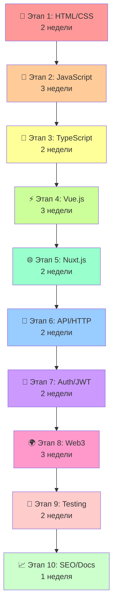

# Создание документации для индивидуального плана развития
_Exported on 10.06.2025 at 1:05:44 GMT+7 from Cursor (1.0.0)_

---

**User**

У меня есть идея. Я хочу создать документацию для ипр (индивидуальный план развития), но так чтобы так были технические задания. Чтобы материал закреплялся и можно было бы задать вопросы по коду. Можно сделать так, чтобы проект (репозиторий у сотрудника)  был один, но задания в нем каждый раз дополняли его.
Не нужно брать данный проект за основу! Нужно проанализировать требования в ИПР и придумать свой вариант.

Вот пример ипр для Junior:

"Навыки и обязанности сотрудника на позиции junior frontend разработчика

Обязанности:
Разработка и поддержка веб-приложений Junior Frontend Developer должен иметь понимание основ веб-разработки и способность создавать и поддерживать пользовательские интерфейсы с использованием HTML, CSS и JavaScript.

Работа с фронтенд-фреймворками: Junior Frontend Developer может быть ожидается, что он знаком с популярными фронтенд-фреймворками, такими как Vue.js, React или Angular, и способен создавать компоненты и взаимодействовать с API.


Улучшение пользовательского опыта: Junior Frontend Developer будет работать над улучшением пользовательского интерфейса и взаимодействия, оптимизацией производительности и обеспечением доступности веб-приложений.

Участие в командных проектах: Junior frontend разработчик будет работать в команде разработчиков и других заинтересованных сторон, таких как дизайнеры, QA-инженеры и менеджеры продукта. Они будут участвовать в планировании и обсуждении требований, а также взаимодействовать с другими членами команды для достижения общих целей.


Обязанности:
Отладка и исправление ошибок: Junior frontend разработчик будет отлаживать и исправлять ошибки, которые возникают в приложении, а также реагировать на отчеты об ошибках от пользователей и коллег.

Обучение и саморазвитие: Junior frontend разработчик будет стремиться к постоянному обучению и развитию своих навыков, изучать новые технологии и лучшие практики разработки программного обеспечения.

Соблюдение стандартов и процессов: Junior frontend разработчик будет соблюдать установленные стандарты и процессы разработки, такие как контроль версий кода, использование инструментов для автоматизации сборки и развертывания, а также тестирование кода.

Сотрудничество и коммуникация: Junior frontend разработчик будет активно сотрудничать с другими членами команды, обмениваться информацией и идеями, а также эффективно коммуницировать внутри и вне команды.

Отличительные черты:
Обучаемость и стремление к развитию: Junior frontend разработчик должен быть готов к обучению новым технологиям и инструментам, а также стремиться к развитию своих навыков и знаний в области разработки.

Командная работа: Junior frontend разработчик должен быть готов к работе в команде. Это включает умение эффективно коммуницировать с другими членами команды, сотрудничать и делиться знаниями для достижения общих целей проекта.

Ответственность и самоорганизация: Junior frontend разработчик должен быть ответственным и самоорганизованным. Это включает выполнение своих обязанностей в срок, а также аккуратное документирование и архивирование своей работы.

Проблемно-ориентированность: Junior frontend разработчик должен быть готов к решению сложных задач и преодолению технических преград. Это включает умение анализировать проблемы, искать эффективные решения и принимать инициативу в поиске ответов и ресурсов.


Отличительные черты:
Аналитическое мышление: Junior frontend разработчик должен иметь аналитические навыки, чтобы понимать требования проекта, анализировать проблемы и находить оптимальные решения. Это включает умение разбираться в сложных системах и процессах.

Качество кода: Junior frontend разработчик должен стремиться к написанию чистого, эффективного и поддерживаемого кода. Это включает использование лучших практик разработки, следование стандартам и методологиям, а также участие в ревью кода и обратной связи.

Коммуникация и общение: Junior frontend разработчик должен обладать хорошими навыками коммуникации и общения. Это включает умение ясно и понятно выражать свои мысли, задавать вопросы и просить помощи, а также внимательно слушать и учитывать мнения и предложения других, а также адекватно относиться к конструктивной критике

Технологии и навыки:
Языки программирования: Junior frontend разработчик должен иметь опыт работы с одним или несколькими языками программирования, такими как JavaScript, TypeScript.
Фреймворки и библиотеки: Junior frontend разработчик должен быть знаком с популярными фреймворками и библиотеками, используемыми для разработки frontend приложений. Например, в случае Vue это может быть Nuxt, а в случае React - Next. Знание и опыт работы с фреймворками поможет ускорить разработку и обеспечить согласованность кода.

HTML и CSS: Junior frontend разработчик должен иметь опыт работы с основами языка разметки HTML и каскадных таблиц стилей (CSS) необходимы для создания и стилизации веб-страниц.

Методология БЭМ: Junior frontend разработчик должен быть знаком с методологией БЭМ, которая помогает создавать модульные и масштабируемые структуры для веб-приложений. Понимание основ методологии БЭМ может быть полезным для организации кода и обеспечения его читаемости и повторного использования.

Технологии и навыки:
Верстка адаптивного дизайна: Понимание принципов и техник создания адаптивного дизайна, чтобы веб-приложения корректно отображались на разных устройствах и экранах.

Версионирование кода: Junior frontend разработчик должен быть знаком с системами контроля версий, такими как Git. Это включает умение создавать ветки, коммитить изменения, объединять ветки и решать конфликты слияния.

Умение писать асинхронный код: Junior frontend разработчик должен понимать и использовать колбеки и промисы для эффективной работы с асинхронными операциями в JavaScript.

Базовые знания оптимизации: Junior frontend разработчик должен быть знаком с основными методами оптимизации, такими как сжатие изображений, минификация и сжатие кода JavaScript и CSS, использование кэширования и оптимизация загрузки шрифтов.

Технологии и навыки:
Базовые знания протоколов HTTP: Junior frontend разработчик должен понимать основные принципов протокола HTTP, включая статусы ответов (например, 200 OK, 404 Not Found) и методы запросов (например, GET, POST, PUT, DELETE). Понимать различие между HTTP и WebSocket протоколами, их назначение и использование.

Хранилище данных: Junior frontend разработчик должен иметь опыт работы с механизмами хранения данных на стороне клиента, такими как localStorage, Cookies и sessionStorage, для сохранения состояния и обмена информацией между страницами.

Базовое знание блокчейн технологии: Junior frontend разработчик должен быть знаком с основными концепциями блокчейн технологии и базовыми принципами работы с библиотекой web3 и ethers.js  для взаимодействия с блокчейн сетями, такими как Ethereum.

JWT: Junior frontend разработчик должен иметь опыт работы с JSON Web Token (JWT) для аутентификации и авторизации пользователей в веб-приложениях.

Технологии и навыки:
Умение читать и понимать документацию: Junior frontend разработчик должен быть способен читать и понимать документацию по различным технологиям, фреймворкам, инструментам, а также проектную документацию. Это поможет ему осваивать новые технологии и использовать их эффективно.

Проблемно-ориентированность и решение проблем: Junior frontend  разработчик должен быть готов к решению сложных технических проблем и преодолению препятствий. Это включает умение анализировать проблемы, искать эффективные решения, использовать отладочные инструменты, а также общаться с коллегами и искать помощь при необходимости.

Коммуникация и совместная работа: Junior frontend разработчик должен иметь хорошие навыки коммуникации и совместной работы. Это включает умение четко и ясно выражать свои мысли, задавать вопросы, делиться идеями и обратной связью, а также эффективно работать в команде.

Самообразование и обучение: Junior frontend разработчик должен быть готов к непрерывному самообразованию и обучению. Технологии и требования в сфере разработки постоянно меняются, поэтому важно быть в курсе последних тенденций и развивать свои навыки.

Дополнительные технологии (Junior+):
Базовые знания Unit-тестирования: это процесс проверки отдельных компонентов или модулей программного обеспечения на соответствие ожидаемому поведению.
Jest и Vitest - это популярные JavaScript-фреймворки для написания и запуска юнит-тестов во frontend-приложениях.

Кросс-браузерность: это способность веб-страницы или веб-приложения работать в различных веб-браузерах без потери функциональности или внешнего вида.
Базовые знания ООП: методология программирования, основанная на использовании объектов, которые содержат состояние и поведение, а также взаимодействуют друг с другом.
Линтеры (ESLint):  это инструменты статического анализа кода, которые помогают обнаруживать и исправлять потенциальные проблемы, стилистические несоответствия и ошибки в коде.
SEO (Search Engine Optimization): это процесс оптимизации веб-страницы или веб-приложения для улучшения ее видимости и ранжирования в поисковых системах.

Общий технический план развития:
Основы языка программирования TypeScript:
Понимание основных концепций TypeScript, таких как типы, интерфейсы, классы, дженерики и утилитарные типы.
Применение TypeScript для разработки более безопасного и поддерживаемого кода.
Работа с инструментами разработки, такими как TypeScript compiler и TypeScript linter.
Понимание преимуществ использования TypeScript в разработке.
Ресурс: MDN JavaScript Guide, TypeScript Documentation

Основы Vue.js:
Понимание и использование основных понятий Vue.js, таких как:реактивность, шаблоны, директивы, компоненты, методы и вычисляемые свойства, роутинг, управление состоянием, жизненный цикл компонентов.
Ресурс: Vue.js introduction, Vue.js Tutorial

Фреймворк Nuxt.js:
Изучение архитектуры и принципов работы Nuxt.js.Понимание и использование основных понятий Vue.js, таких как:Universal (Isomorphic) Rendering, роутинг, шаблонизация, статическая генерация, управление состоянием, Middleware, глобальные компоненты, отладка, плагины.
Ресурс: Nuxt.JS Documentation

HTML и CSS: Понимание основных элементов и структуры HTML, таких как теги, атрибуты и значения. Умение создавать разметку для веб-страниц, включая заголовки, абзацы, списки, таблицы и формы. Знание основных тегов для вставки изображений, видео и аудио на веб-страницы. Понимание семантической разметки и использование соответствующих тегов для логической структуры контента. Умение создавать ссылки и гиперссылки для навигации по странице или между страницами.
Знание основных тегов для создания форм и обработки пользовательского ввода.Понимание и использование атрибутов и CSS-классов для стилизации HTML-элементов. Понимание основных концепций CSS, таких как селекторы, свойства и значения. Умение применять стили к HTML - элементам с использованием внутренних, внешних или встроенных таблиц стилей. Знание основных свойств CSS для изменения внешнего вида элементов, таких как цвет, шрифт, размеры, отступы и рамки.Понимание основной модели блочного и строчного форматирования элементов. Умение создавать селекторы для выбора определенных элементов или групп элементов на странице.Понимание медиа-запросов и адаптивного дизайна для создания отзывчивых веб-страниц. Знание HTML и CSS является основой для создания и стилизации веб-страниц.
Ресурс: Codecademy HTML, Codecademy CSS
Общий технический план развития:

Общий технический план развития:
Методология БЭМ:  это система именования и организации кода для разработки веб-интерфейсов. Основная идея БЭМ заключается в разделении компонентов веб-страницы на независимые и переиспользуемые блоки, элементы и модификаторы.
Блок (Block):  это независимый компонент веб-страницы, который имеет семантическое значение и может быть использован в различных контекстах. Блоки обычно представлены классами CSS и представляют собой автономные элементы интерфейса. Элемент (Element): это часть блока, которая не может быть использована вне этого блока. Элементы являются вложенными в блоки и представлены классами CSS, которые являются дочерними элементами блока.Модификатор (Modifier): это изменение визуального вида или поведения блока или элемента. Модификаторы позволяют создавать различные варианты блоков или элементов с использованием разных классов CSS. Именование классов: В методологии БЭМ используется специальное соглашение об именовании классов, которое помогает обеспечить ясность и предсказуемость структуры кода.БЭМ помогает создать четкую иерархию компонентов, что упрощает понимание кода и его поддержку.
Ресурс: BEM methodology

Общий технический план развития:
Верстка адаптивного дизайна: Умение создавать веб-страницы, которые оптимально отображаются на различных устройствах и экранах, включая настольные компьютеры, планшеты и мобильные устройства.Медиа-запросы (Media Queries): Медиа-запросы позволяют применять разные стили CSS в зависимости от характеристик устройства, таких как ширина экрана, ориентация и плотность пикселей. Они позволяют создавать различные макеты и поведение элементов в зависимости от размеров экрана.
Гибкая сетка (Flexible Grid): Использование гибкой сетки позволяет создавать адаптивные макеты, которые могут автоматически регулироваться и перераспределяться в зависимости от размеров экрана. Это позволяет элементам макета масштабироваться пропорционально и избегать переполнения контента на маленьких экранах.
Гибкие изображения (Flexible Images): Гибкие изображения позволяют изображениям масштабироваться пропорционально размерам экрана, чтобы они не выходили за пределы контейнера или не были слишком маленькими на маленьких экранах. Это обычно достигается с помощью использования относительных единиц измерения и CSS-свойств, таких как max-width: 100%.
Ресурс: MDN Web Docs

Общий технический план развития:
Системы контроля версий: умение создавать ветки, коммитить изменения, отправлять изменения, получать изменения, объединять ветки и решать конфликты слияния.
Ресурс: Learn git branching
Умение писать асинхронный код: Понимание и использование коллбеков (Callbacks), промисов (Promises) и асинхронных функций (Async/await). Они являются основными инструментами для работы с асинхронным кодом в JavaScript. Они позволяют контролировать поток выполнения, обрабатывать результаты операций и управлять ошибками.

Ресурс: MDN Web Docs
Базовые знания оптимизации: набор практик и техник, которые помогают улучшить производительность и быстродействие веб-приложений, таких как: оптимизация загрузки ресурсов, ленивая загрузка (Lazy loading), кодирование и сжатие файлов, оптимизация работы с DOM, асинхронная загрузка, кэширование данных, оптимизация анимаций, тестирование производительности.

Ресурс: Web.dev (Google)


Общий технический план развития:
Базовые знания протоколов HTTP: Junior frontend разработчик должен понимать основные аспекты протокола HTTP, такие как: Методы HTTP: GET, POST, PUT, DELETE и другие, которые указывают на тип операции, выполняемой на ресурсе. Понимание различий между этими методами и их использование в правильном контексте.Коды состояния HTTP: коды которые возвращаются сервером в ответ на запрос клиента. Понимание этих кодов состояния помогает разработчикам правильно обрабатывать ответы сервера.Заголовки HTTP: содержат дополнительную информацию о запросе или ответе, такую как тип контента, длина контента, информация аутентификации и другие.Cookies и сессии: используются для хранения и передачи данных между клиентом и сервером. 

CORS (Cross-Origin Resource Sharing): это механизм, который позволяет серверу указывать, какие домены имеют доступ к ресурсам на сервере. 
Инструменты разработчика в браузере:они позволяют анализировать и отлаживать HTTP-запросы и ответы, а также проверять заголовки и коды состояния.Ресурс: MDN Web Docs

Общий технический план развития:
Хранилище данных: Junior frontend разработчик должен иметь опыт работы с механизмами хранения данных на стороне клиента, такими как: Cookies: это небольшие текстовые файлы, которые хранятся на компьютере пользователя и используются для хранения информации о состоянии и предпочтениях пользователя.

Local Storage: позволяет хранить данные на стороне клиента без срока их истечения. Он предоставляет простой интерфейс для чтения, записи и удаления данных, которые сохраняются между сеансами работы с веб-приложением.

Session Storage: позволяет хранить данные на стороне клиента только в рамках текущей сессии работы с веб-приложением. Данные сохраняются до закрытия вкладки или окна браузера.

Cache API: позволяет сохранять запросы и ответы HTTP в кэше браузера. Он может быть использован для оффлайн доступа к данным или для ускорения загрузки ресурсов.

State Management Libraries: Существуют также сторонние библиотеки и фреймворки, такие как Redux, Vuex, MobX и другие, которые предоставляют расширенные возможности управления состоянием во frontend приложениях.
Ресурс: Cookies Web Storage Cache API

Общий технический план развития:
JWT: Junior frontend разработчик должен иметь опыт работы с JSON Web Token (JWT) для аутентификации и авторизации пользователей в веб-приложениях. Под работой с JWT во frontend подразумеваются:

Создание JWT: JWT обычно создается после успешной аутентификации пользователя. Для этого используется секретный ключ или приватный ключ, который используется для подписи токена и защиты от подделки.

Хранение и передача JWT: После создания JWT, он обычно сохраняется на клиентской стороне, например, в Local Storage или в памяти приложения. JWT затем может быть включен в заголовок запроса или передан через параметры URL или Cookies для авторизации запросов к серверу.

Верификация и декодирование JWT: JWT может быть верифицирован и декодирован с помощью публичного ключа или секретного ключа, чтобы проверить его подлинность и получить информацию, содержащуюся в токене.

Обработка и обновление JWT: JWT может быть использован для определения авторизации пользователя и доступа к определенным ресурсам или функциям в приложении. Также может потребоваться обновление JWT, например, при истечении срока действия токена или при изменении прав доступа пользователя.
Ресурс: Официальный сайт JWT Руководство по JWT

Общий технический план развития:
Блокчейн:
Изучение основных концепций блокчейна, включая децентрализацию, хэширование, цепочку блоков и консенсусные алгоритмы.
Понимание различных типов блокчейнов, включая публичные, приватные и консорциумные блокчейны.
Изучение платформ и протоколов блокчейна, таких как Ethereum, Hyperledger Fabric, Corda и других.
Изучение безопасности блокчейна и лучших практик разработки в блокчейн-среде.
Ресурсы: Ethereum Documentation, Bitcoin Documentation, Hyperledger Fabric Documentation,  Blockchain Best Practices

Общий технический план развития:
Децентрализованные файловые системы и инструменты работы с ними:
Понимание принципов децентрализованных файловых систем, которые позволяют распределенно хранить и обмениваться файлами без необходимости централизованного сервера.
Изучение различных децентрализованных файловых систем, таких как IPFS (InterPlanetary File System), Swarm, Filecoin и Pinata.
Практика работы с инструментами для работы с децентрализованными файловыми системами, включая загрузку, хранение и распространение файлов.
Ресурсы:
IPFS (InterPlanetary File System) - Протокол для распределенного хранения и обмена файлами.
Swarm - Децентрализованная файловая система, разработанная для интеграции с платформой Ethereum.
Filecoin - Децентрализованная сеть хранения данных, использующая протокол IPFS и криптовалюту FIL для стимулирования участия в сети.


Общий технический план развития:
Примеры инструментов для работы с децентрализованными файловыми системами:
Pinata - Облачный сервис для хранения и управления файлами на основе IPFS, предоставляющий простой API для работы с файлами.
IPFS Companion - Расширение для браузера, которое позволяет использовать IPFS для распределенного хранения и обмена файлами.
Textile - Инструментарий для разработки децентрализованных приложений с использованием IPFS.


Общий технический план развития:
DeFi (Decentralized Finance):
Изучение основных концепций DeFi, включая децентрализацию, смарт-контракты, децентрализованные биржи и децентрализованные финансовые приложения.
Базовое понимание вариантов использования децентрализованных финансовых продуктов, таких как кредитные пулы, стейкинг, обменные пулы и другие.
Изучение безопасности в DeFi и лучших практик разработки в децентрализованной финансовой среде.
Ресурсы:
DeFi Pulse - Платформа, которая отслеживает и предоставляет информацию о самых популярных DeFi проектах.
Uniswap - Децентрализованная биржа, работающая на основе смарт-контрактов Ethereum.
Compound - Протокол, позволяющий зарабатывать проценты на депозите и получать займы.
Aave - Протокол, предоставляющий возможность брать и предоставлять займы, а также получать проценты за хранение токенов.
DeFi (Decentralized Finance) - это понятие, описывающее использование блокчейна и смарт-контрактов для предоставления финансовых услуг без необходимости централизованных посредников. Изучение основ DeFi и различных платформ и протоколов поможет вам понять, как создавать и использовать децентрализованные финансовые продукты.

Общий технический план развития:
DAO (Decentralized Autonomous Organization):
Изучение концепции DAO и его основных принципов, включая децентрализацию управления, голосование и принятие решений на основе смарт-контрактов.
Понимание различных типов DAO, включая финансовые, государственные и сообщества разработчиков.
Изучение платформ и инструментов для создания и управления DAO, таких как Aragon, DAOstack и MolochDAO.
Практика участия в работе DAO и принятия решений через голосование.
Ресурсы:
Aragon - Платформа для создания и управления DAO.
DAOstack - Протокол для создания и управления гибридных DAO.
MolochDAO - DAO, ориентированный на финансирование проектов в области Ethereum.

Общий технический план развития:
Staking:                                                                                     Изучение концепции стейкинга и его роль в блокчейне, включая обеспечение безопасности сети и участие в протоколе консенсуса.Понимание различных типов стейкинга, включая делегированный стейкинг, пулы стейкинга и самостоятельный стейкинг.                                                                                    Изучение платформ и протоколов, которые поддерживают стейкинг, таких как Ethereum 2.0, Tezos и другие.
Практика участия в стейкинге и получения вознаграждений за участие в сети.
Ресурсы:
Ethereum 2.0 Documentation - Документация по Ethereum 2.0 и его стейкингу.
Tezos - Платформа, поддерживающая делегированный стейкинг.

Общий технический план развития:
IDO (Initial DEX Offering), ISO (Initial Staking Offering), INO (Initial NFT Offering):
Изучение концепций IDO, ISO и INO, которые являются новыми формами краудфандинга на базе блокчейна.
Понимание процесса проведения IDO, ISO и INO, включая создание и размещение токенов, установку цены и продажу инвесторам.
Изучение платформ и протоколов, которые поддерживают проведение IDO, ISO и INO, таких как Polkastarter, Binance Launchpad и другие.
Практика участия в IDO, ISO и INO, как инвестор или проект, который планирует провести краудфандинг.
Ресурсы:
Polkastarter - Платформа для проведения IDO и ISO. - Binance Launchpad - Платформа для проведения IDO на Binance. - OpenSea - Платформа для проведения INO и торговли NFT.

Общий технический план развития:
On-Chain/Cross-Chain Bridge:
Изучение концепции мостов в блокчейне и их роль в установлении связи и обмене активами между различными блокчейн сетями.Базовое понимание механизма передачи активов или информации между различными протоколами или слоями внутри одной блокчейн сети и между различными блокчейн сетями
Ресурсы: Статья о мостах

Общий технический план развития:
Стандарты блокчейна:
Изучение основных стандартов и политик блокчейна, включая протоколы согласования, форматы данных и правила сети.
Понимание различных стандартов блокчейна, таких как ERC-20, ERC-721, ERC-1155, BRC-20, BIP и другие.
Изучение политик, связанных с блокчейном, включая консенсусные алгоритмы, правила голосования и управления сетью.
Практика соблюдения стандартов и политик блокчейна при разработке и взаимодействии с блокчейн-системами.
Ресурсы:
Ethereum Improvement Proposals (EIPs) - Репозиторий, содержащий предложения по улучшению Ethereum и его стандарты.
Bitcoin Improvement Proposals (BIPs) - Репозиторий, содержащий предложения по улучшению Bitcoin и его стандарты.

Общий технический план развития:
Интеграция с блокчейном и работа с Web3 и Ethers:
 Изучение основ работы с блокчейном и протоколом Web3.
Изучение библиотеки Ethers для взаимодействия с Ethereum совместимыми блокчейнами.
Практика создания и взаимодействия с смарт-контрактами на блокчейне Ethereum с использованием библиотек Web3 и Ethers.
Изучение лучших практик и безопасности при работе с блокчейном.

Ресурс: Web3.js Documentation, Ethers.js Documentation

 Интеграция с блокчейном и работа с Web3 и Ethers,js открывает возможности для разработки децентрализованных приложений и взаимодействия с смарт-контрактами. Изучение этих технологий поможет вам создавать приложения, которые могут взаимодействовать с блокчейном и использовать возможности децентрализованных систем.

Общий технический план развития:
Управление версиями с помощью Git и Git Flow:
 Изучение основ Git: инициализация репозитория, фиксация изменений, создание веток, слияние веток и разрешение конфликтов.
Понимание концепции Git Flow и его применение в разработке программного обеспечения.
Работа с удаленными репозиториями, такими как GitHub или GitLab.
Ресурс: Git Documentation, Git Flow Cheat Sheet, Learn git branching 
Git является распространенной системой контроля версий, а Git Flow - это методология работы с Git, которая предоставляет набор правил для организации работы с ветками и релизами внутри проекта. Понимание Git и Git Flow поможет вам эффективно управлять версиями и сотрудничать с другими разработчиками.

Общий технический план развития:
Соглашение о коммитах (Commit Convention):
Изучение и применение соглашения о коммитах, такого как Conventional Commits.
Создание информативных коммит-сообщений с использованием заголовка, тела и футера.
Понимание преимуществ использования соглашения о коммитах для лучшей читаемости и отслеживаемости изменений.
Ресурс: Conventional Commits
Соглашение о коммитах помогает стандартизировать формат и структуру коммит-сообщений, что упрощает работу с историей изменений, автоматическое формирование релизов и генерацию изменений в CHANGELOG.

Обучение и саморазвитие:
Активное изучение новых технологий и инструментов, связанных с блокчейн-разработкой и Nuxt.js.
Участие в профессиональных сообществах, форумах и митапах для обмена знаниями и опытом с другими разработчиками.
Ресурс: Medium, Dev.to


Общий технический план развития:
Создание и ведение технической документации с помощью Typedoc, JSDoc, Compodoc и README:
Изучение инструментов для автоматической генерации документации из кода, таких как Typedoc для TypeScript, JSDoc для JavaScript и Compodoc для Angular/NestJS проектов.
Практика написания докстрингов и аннотаций для описания кода и его использования. 
Примеры: Typedoc example, JSDoc example, Compodoc example
Создание и обновление README файлов, содержащих общую информацию о проекте, инструкции по установке и использованию, а также примеры кода.
Примеры: README Template, README Best Practices
Ресурс: Typedoc, JSDoc, Compodoc
Использование инструментов для автоматической генерации документации поможет сохранить документацию актуальной и упростит процесс ее создания. Также README файлы являются важной частью проекта, предоставляя информацию и инструкции по использованию для других разработчиков и пользователей.

Общий технический план развития (Junior+):
Базовые знания Unit-тестирования: Понимание популярных фреймворков и библиотек тестирования, таких как Jest. Знание основных функций и возможностей этих инструментов для создания, выполнения и анализа результатов тестов.
Понимание синтаксиса и методов для определения тестовых случаев (test cases), представления ожидаемых результатов и проведения проверок.

Понимание использования моков (mocks) и заменителей (mocks) для создания имитаций зависимостей или объектов, которые требуются для выполнения теста.
Знание методов организации тестов, таких как группировка тестов по модулям или компонентам, их структурирование и метаданные.
Понимание процесса интеграции тестов в рабочий процесс разработки, включая автоматическое выполнение тестов при изменении кода, интеграцию с системами непрерывной интеграции и развертывание тестовых окружений.
Ресурс: Jest

Общий технический план развития (Junior+):
Кросс-браузерность: понимание и умение учитывать различия в поведении и поддержке веб-браузерами при разработке веб-приложений. Это включает следующие аспекты:
Понимание основных различий в поведении и поддержке различных браузеров, таких как Chrome, Firefox, Safari, Edge и других.
Знание основных особенностей и различий в реализации стандартов веб-технологий (HTML, CSS, JavaScript) между браузерами.

Умение учитывать особенности старых версий браузеров, которые могут не поддерживать некоторые новые возможности или иметь баги и ошибки.

Умение использовать полифиллы (polyfills) и шимы (shims) для обеспечения поддержки новых возможностей в старых версиях браузеров.
Знание популярных полифиллов и шимов, таких как Babel или Core.js, и их использование в проекте.
Понимание необходимости градуирования (graceful degradation) функциональности, чтобы веб-приложение работало хотя бы в базовом виде в старых или не поддерживаемых браузерах.
Знание методов и подходов к градуированию функциональности в зависимости от возможностей браузера.

Общий технический план развития (Junior+):
Базовые знания ООП: подразумевается понимание основных концепций и принципов ООП, а также их применение при разработке веб-приложений. Вот несколько ключевых аспектов базовых знаний ООП во frontend:

Понимание понятия класса как шаблона для создания объектов и создание классов для представления конкретных сущностей в приложении.
Знание основных концепций, таких как наследование, инкапсуляция, полиморфизм и абстракция.
Понимание использования свойств для хранения данных и методов для выполнения операций над этими данными в контексте классов.
Знание различных типов доступа к свойствам и методам, таких как публичный, приватный и защищенный доступ.
Понимание наследования и его использования для создания иерархий классов и переиспользования кода.
Знание концепции полиморфизма и его применение для работы с объектами разных классов через общий интерфейс.

Понимание организации кода с помощью модулей и использование пространств имен для изоляции функциональности и предотвращения конфликтов имен.

Ресурс: TypeScript Deep Dive - это онлайн-книга, которая предоставляет подробное руководство по TypeScript. Она охватывает различные аспекты TypeScript, включая ООП.

Общий технический план развития (Junior+):
Линтеры (ESLint):  знание и использование инструмента ESLint для статического анализа кода во время разработки веб-приложений.

Умение устанавливать и настраивать ESLint в проекте.
Знание о различных способах установки ESLint (локально или глобально) и конфигурации правил.
Понимание основных правил, предоставляемых ESLint, и их влияние на стиль кодирования и согласованность. Настройка правил в соответствии с требованиями проекта и команды разработчиков.

Умение создавать и изменять файлы конфигурации ESLint, такие как .eslintrc или eslint.config.js. Знание о различных опциях конфигурации, включая расширение настроек и настройки правил.

Знание о том, как интегрировать ESLint с инструментами разработки, такими как редакторы кода (VS Code, Sublime Text, etc.) или сборщики (Webpack, Babel, etc.). Умение настроить автоматическое исправление ошибок и предупреждений ESLint в процессе разработки.

Умение анализировать и исправлять ошибки и предупреждения, выданные ESLint. Знание о том, как обновлять и поддерживать конфигурации и правила ESLint в проекте.

Ресурс: Инструкции и примеры по установке, настройке и использованию ESLint.

Общий технический план развития (Junior+):
SEO (Search Engine Optimization):  понимание основных принципов и методов оптимизации веб-страниц для улучшения их видимости и ранжирования в поисковых системах.

Знание о том, как исследовать и выбирать ключевые слова и фразы, связанные с контентом веб-страницы. Умение интегрировать ключевые слова и фразы в заголовки, мета-теги, текстовый контент и URL страницы.

Умение создавать информативные и уникальные заголовки (title) для каждой страницы. Понимание использования мета-тегов (meta tags), таких как мета-описание (meta description) и мета-ключевые слова (meta keywords), для предоставления поисковым системам дополнительной информации о странице.

Понимание важности структурированного контента с использованием заголовков (h1, h2, h3 и т.д.) и параграфов. Умение использовать ключевые слова в заголовках и текстовом контенте, чтобы помочь поисковым системам понять и проиндексировать содержимое страницы.

Ресурс: Руководство Google по начальному уровню оптимизации для поисковых систем (SEO) предоставляет основные принципы и рекомендации от Google по оптимизации веб-страниц.

Общий технический план развития (Junior+):
SEO (Search Engine Optimization):  

Знание о том, как создавать человекочитаемые URL-адреса, содержащие ключевые слова, связанные с контентом страницы. Умение использовать поддерживаемые символы и избегать специальных символов в URL-адресах.

Понимание важности оптимизации изображений и мультимедиа для улучшения производительности страницы. Знание о том, как использовать атрибуты alt и title для изображений, чтобы предоставить описательный текст и улучшить доступность.

Понимание важности быстрой загрузки веб-страниц для улучшения пользовательского опыта и ранжирования поисковых систем.
Знание о том, как оптимизировать размер изображений, минифицировать и сжимать файлы CSS и JavaScript, и использовать кэширование.

Понимание важности мобильной оптимизации и адаптивного дизайна для улучшения показателей ранжирования в поисковых системах.
Умение

Ресурс: HubSpot - бесплатный курс от HubSpot предоставляет практическую информацию о том, как оптимизировать веб-страницы для поисковых систем.

Вопросы для самопроверки:
Верстка: HTML, FORM, DOM.
Что такое HTML и какие основные элементы используются для создания веб-страницы?

Как связывать CSS стили с HTML элементами?

Как создать гиперссылку в HTML?

Что такое семантическая верстка и почему она важна?

Какие инструменты и техники можно использовать для проверки и отладки HTML кода?

Как создать HTML форму и какие элементы формы вы знаете?

Что такое валидация формы и какие типы валидации можно использовать?

Как добавить пользовательскую валидацию в HTML форму?

Какие принципы и практики следует соблюдать при верстке веб-страниц?

Что такое резиновая и адаптивная верстка и какая разница между ними?

Какие методы можно использовать для оптимизации загрузки веб-страницы?

Какие инструменты и технологии помогают улучшить производительность и доступность веб-страниц?

Верстка: Препроцессоры, адаптив, Семантика.
Что такое препроцессор CSS и для чего он используется?
В чем разница между SASS и SCSS?
Какие основные функции и возможности предоставляет SASS/SCSS по сравнению с обычным CSS?
Какие инструменты и технологии используются для компиляции SASS/SCSS в обычный CSS?
Какие основные функции и возможности препроцессоров CSS вы использовали в проектах?
Какие преимущества препроцессоров CSS вы видите в сравнении с обычным CSS?
Что такое адаптивная верстка и почему она важна для веб-разработки?
Какие подходы можно использовать для создания адаптивной верстки?
Какие основные техники и инструменты вы знаете для создания адаптивного дизайна?
Какие медиа-запросы вы использовали для адаптивной верстки и как они работают?
Какие лучшие практики следует применять при создании адаптивной верстки?
Что такое семантическая верстка и почему она важна для веб-разработки?
Какие основные элементы HTML используются для создания семантической верстки?
Какие лучшие практики следует применять при создании семантической верстки?
Какие инструменты и ресурсы вы используете для проверки семантической верстки?
Вопросы для самопроверки:

Верстка: CSS анимации, методология BEM.

Что такое CSS анимации и как они работают?

Какие основные свойства и ключевые кадры используются для создания CSS анимаций?

Какие типы анимаций вы знаете в CSS и в каких случаях их применение может быть полезным?

Какие функции и свойства CSS вы используете для управления временем и длительностью анимаций?

Какие лучшие практики следует применять при создании CSS анимаций?

Что такое методология BEM и зачем она используется в веб-разработке?

Какие основные принципы и правила BEM вы знаете?

Какие преимущества методологии BEM вы видите в сравнении с другими подходами к организации CSS-кода?

Какие инструменты и ресурсы вы используете для работы с методологией BEM?

Какие лучшие практики следует применять при использовании методологии BEM?
Вопросы для самопроверки:

Основы языка программирования  JavaScript:

Что такое замыкания (Closures) в JavaScript и как они работают?

Как работает контекст (this) в JavaScript и какие могут быть значения this в разных ситуациях?

Что такое hoisting в JavaScript и как он влияет на порядок выполнения кода?

Какие лучшие практики следует применять при использовании замыканий, контекста и hoisting в JavaScript?

Какие основные типы данных поддерживает JavaScript?

Какие основные операторы и выражения вы используете в JavaScript?

Что такое функции в JavaScript и как их можно определять?

Как работает область видимости переменных в JavaScript?

Каким образом можно работать с объектами в JavaScript?

Для чего используется оператор "+" в записи (+decimal)?

Как пройти по всем ключам объекта?

Что такое тернарный оператор?
Вопросы для самопроверки:

Основы языка программирования  JavaScript:

Деструктуризация что это? 

Для чего используется оператор "..."?

Что такое асинхронный код и почему он важен в JavaScript?

Как работает асинхронность в JavaScript и какие инструменты вы используете для работы с асинхронным кодом?

Какие проблемы может вызывать использование колбеков (callbacks) для работы с асинхронным кодом?

Что такое промисы (promises) в JavaScript и как они позволяют более удобно работать с асинхронным кодом?

Как создать промис в JavaScript и какие методы доступны для работы с ним?
Что такое асинхронные функции (async/await) и как они упрощают написание асинхронного кода?

Как обрабатывать ошибки при работе с промисами и  при использовании асинхронных функций (async/await)?

Какие методы доступны для комбинирования промисов и выполнения последовательных или параллельных операций?
Вопросы для самопроверки:

Основы языка программирования TypeScript:

Какие примитивные типы данных поддерживает TypeScript?

Какие значения могут быть у типа "enum" в TypeScript и как его можно использовать?

Что такое кортежи (tuples) в TypeScript и как их можно определять и использовать?

Что такое интерфейсы (interfaces) в TypeScript и как их можно определять и использовать?

Какие различия между интерфейсами и типами (types) в TypeScript?

Что такое алиасы типов (type aliases) в TypeScript и как их можно использовать?

Каким образом можно работать с опциональными и необязательными полями в TypeScript?

Каким образом можно работать с объединенными типами (union types) и пересечениями типов (intersection types) в TypeScript?

Вопросы для самопроверки:

Вопросы для самопроверки:
Основы языка программирования TypeScript:

Чем отличается статическая типизация в TypeScript от динамической типизации в JavaScript? Какие преимущества и недостатки каждого подхода?

Какие механизмы обеспечивают статическую типизацию в TypeScript? Расскажите о типах данных, аннотациях типов и проверке типов.

Какие основные конструкции и возможности языка TypeScript помогают улучшить разработку по сравнению с JavaScript? Например, расскажите о классах, интерфейсах, декораторах и модулях.

Что такое компиляция TypeScript и какие этапы она включает? Какие инструменты и настройки используются при компиляции TypeScript-кода?

Как можно интегрировать TypeScript в проект, использующий JavaScript? Какие шаги и инструменты потребуются для этого?

Какие популярные проекты и фреймворки используют TypeScript для разработки? Какие преимущества TypeScript они получают и как это влияет на их работу?



Вопросы для самопроверки:
Основы языка программирования TypeScript:
Опишите отличия интерфейсов от типов в TypeScript.

Какие утилитарные типы существуют ? Их отличия и варианты применения.
Можно ли использовать асинхронный метод внутри конструктора класса? Если да, то зачем и в каких случаях это необходимо?Каким образом можно реализовать перегрузку функций в TypeScript?Какие сущности можно объявить с помощью declare в TypeScript?

Как declare отличается от обычного объявления переменных, функций и классов в TypeScript?
Как declare может помочь TypeScript в работе с JavaScript-кодом, который не имеет типизации?Что такое декораторы в TypeScript и для чего они используются?


Git - Базовые навыки:
Что такое система контроля версий (Version Control System) и для чего она используется?

Как создать новый репозиторий (repository) в Git?

Как добавить файлы в индекс (stage) с помощью команды git add?

Как создать коммит (commit) с сохранением изменений в репозитории с помощью команды git commit?

Как отправить изменения в удаленный репозиторий с помощью команды git push?

Как получить изменения из удаленного репозитория с помощью команды git pull?

Как создать новую ветку (branch) с помощью команды git checkout -b?

Как переключиться на другую ветку с помощью команды git checkout?

Как проверить состояние репозитория с помощью команды git status?

Вопросы для самопроверки:

Базовые знания протоколов HTTP и WebSocket:
Что такое протокол HTTP и для чего он используется?

Какие основные методы запросов (HTTP methods) поддерживает протокол HTTP и какие операции они выполняют?

Какие основные статусы ответов (HTTP status codes) вы знаете и что они обозначают?

Что такое заголовки (HTTP headers) в протоколе HTTP и как они используются?

Какие основные типы содержимого (content types) поддерживает протокол HTTP?

Что такое кеширование (caching) в протоколе HTTP и как оно работает?

Как происходит аутентификация (authentication) и авторизация (authorization) в протоколе HTTP?

Что такое сессии (sessions) и куки (cookies) в протоколе HTTP и как они используются для отслеживания состояния клиента?

Какие инструменты и ресурсы вы используете для работы с протоколом HTTP?


Вопросы для самопроверки:

Базовые знания протоколов HTTP и WebSocket:
Что такое протокол WebSocket и для чего он используется в API?

Какие основные различия между протоколом HTTP и WebSocket?

Когда следует использовать протокол HTTP и когда протокол WebSocket в API?

Какие инструменты и ресурсы вы используете для работы с протоколами HTTP и WebSocket?

Как устанавливается соединение по протоколу WebSocket и какие рукопожатия (handshakes) происходят между клиентом и сервером?

Какие преимущества имеет использование протокола WebSocket в сравнении с другими методами обмена данными?

Как происходит передача данных по протоколу WebSocket и какие типы сообщений поддерживаются?

Как реализована обработка ошибок и закрытие соединения в протоколе WebSocket?

Вопросы для самопроверки:

Дебаг и отладка:
Что такое дебаг и зачем он нужен в frontend разработке?

Какие инструменты для дебага и отладки вы использовали в своей работе?

Как работает отладчик (debugger) в браузере и какие возможности он предоставляет?

Какие методы и техники вы используете для идентификации и исправления ошибок в frontend коде?

Какие типичные проблемы и ошибки возникают при разработке frontend приложений и как их дебажить?

Какие инструменты и ресурсы вы используете для изучения и совершенствования навыков дебага и отладки во frontend?

Какие методы и техники вы используете для профилирования и оптимизации производительности frontend приложений?


Вопросы для самопроверки:

Хранилище данных:
Что такое LocalStorage, sessionStorage, Cookies и Cache API? 

Как они используются в веб-разработке?
Какие методы доступа и манипуляции данными они предоставляют?

В чем разница между LocalStorage и sessionStorage и когда следует использовать каждый из них?

Что такое кэширование (caching) и как его можно использовать с помощью Cache API?

Какие преимущества и ограничения существуют при использовании LocalStorage, sessionStorage, Cookies и Cache API?

Какие инструменты и ресурсы вы используете для работы с LocalStorage, sessionStorage, Cookies и Cache API?

Какие типы хранят в себе?

Сколько они все живут?

Какими объемами памяти они обладают?

Вопросы для самопроверки:

JWT:
Что такое JWT и для чего он используется в веб-разработке?

Как выглядит структура JWT и из каких компонентов он состоит?

Какие преимущества имеет использование JWT в сравнении с другими 
методами аутентификации и авторизации?

Какие типы данных можно хранить в полезной нагрузке (payload) JWT?

Какие методы и библиотеки вы использовали для работы с JWT в своих проектах?

Как можно обеспечить безопасность JWT и предотвратить подделку или изменение токена?

Как вы реализовывали аутентификацию и авторизацию с использованием JWT во frontend проектах?

Для чего используется RefreshToken?

Для чего используется AccessToken?

Какие механизмы вы используете для хранения JWT в клиентской стороне?
Вопросы для самопроверки:

Vue & Nuxt:
Что такое Vue.js и какие основные преимущества он предоставляет для разработки веб-приложений?

Что такое Nuxt.js и для чего он используется в разработке приложений на Vue.js?

Какие основные отличия между Vue.js и Nuxt.js?

Как вы организуете компонентную архитектуру при разработке с использованием Vue.js и Nuxt.js?

Какие инструменты и пакеты вы используете для управления состоянием приложения в Vue.js и Nuxt.js?

Какие методы и техники вы используете для обработки событий и взаимодействия между компонентами в Vue.js и Nuxt.js?

Как вы работаете с маршрутизацией и созданием маршрутов в Nuxt.js?

Как вы управляете стилями и созданием пользовательского интерфейса в Vue.js и Nuxt.js?


Вопросы для самопроверки:

Vue & Nuxt:
Как можно передать данные в компонент?

Как передать кусок html  в компонент?

Как сообщить что-либо родительскому компоненту?

Как сделать динамический компонент в верстке?
(т.е. чтобы можно было менять компоненты, приведите примеры)

Чем отличается computed от methods?

В чем разница между v-if и v-show?

Как реализовать двустороннюю привязку к переменным?

Назовите хуки жизненного цикла компонента в Vue.js? в правильном порядке и расскажите про каждый из хуков

в чем разница между created и mounted?

Вопросы для самопроверки:

Vue & Nuxt:
В чем смысл компонентной верстки?

На каком шаблоне проектирования основан Vue?

что такое  MVVM?

Что такое Vuex ?

Какие сущности используются в сторе и сколько их?

Через какое ключевое слово обращаются к мутациям?

Через какое ключевое слово обращаются к экшенам?

Для чего нужен стор?

Можно ли сделать геттер с входным параметром?

Вопросы для самопроверки:

Базовое знание блокчейн, web3 и ethers.js:
Что такое Metamask?

Что такое провайдер в web3?

Как получить адрес подключенного кошелька?

Что такое аби и где его брать?

Как вызвать функцию смарт контракта?

Какие типы методов на контрактах бывают и в чем их разница?

Чем allowance отличается от approve?
В какой последовательности нужно вызывать методы 
allowance, approve, transfer?

В чем разница между transfer и transferFrom?

Что такое блокчейн?

Каковы преимущества блокчейна?

Каковы недостатки блокчейна?
Вопросы для самопроверки:

Базовое знание блокчейн, web3 и ethers.js:
Что такое блоки в технологии блокчейн?

Как создаются блоки?

Могут ли блоки быть удалены из блокчейна?

Могут ли данные, хранящиеся в блоке, быть изменены после записи? Если так, то почему?

Что такое нода в блокчейне?

Что такое Web3.js и какие функции она предоставляет для работы с Ethereum?

Что такое ethers.js и в чем ее отличие от Web3.js?

Как установить и настроить ethers.js для работы с Ethereum?

Как отправить транзакцию на Ethereum с использованием ethers.js?

Каким образом можно взаимодействовать с контрактами на Ethereum с помощью ethers.js?

Как получить информацию о блоке или транзакции с использованием ethers.js?

Вопросы для самопроверки:

Вопросы для самопроверки:
Блокчейн:

Что такое блокчейн и как он работает? 

Как работать со  смарт-контрактами в блокчейне? 

Как обеспечить масштабируемость и производительность в блокчейне?

Как использовать блокчейн для различных приложений и отраслей? 

Децентрализованные файловые системы и инструменты работы с ними:

Что такое децентрализованные файловые системы и как они работают?

Какие инструменты и протоколы существуют для работы с децентрализованными файловыми системами?

Как использовать децентрализованные файловые системы в приложениях? 

Вопросы для самопроверки:
DeFi (Decentralized Finance):

Что такое DeFi и какая роль у него в финансовой индустрии?
 Расскажите о концепции децентрализованных финансовых приложений, возможностях кредитования, обмена активами и других финансовых операций на блокчейне.

Какие инструменты и протоколы существуют в DeFi? 
 Расскажите о таких инструментах, как Compound, Aave, Uniswap, MakerDAO и о протоколах, таких как Ethereum и Polkadot, которые позволяют создавать децентрализованные финансовые приложения.

Как использовать DeFi в своих приложениях?
 Расскажите о возможностях интеграции DeFi-протоколов в свои приложения, включая доступ к ликвидности, автоматизацию финансовых операций и создание собственных финансовых продуктов.

Как обеспечить безопасность и аудит в DeFi?
 Расскажите о возможностях аудита умных контрактов, анализа безопасности и использования мультиподписи для обеспечения безопасности в DeFi-приложениях.


Вопросы для самопроверки:
DAO (Decentralized Autonomous Organization):

Что такое DAO и как оно работает? 
 Расскажите о концепции децентрализованных автономных организаций, принятии решений на основе консенсуса и управлении с помощью умных контрактов.

Как создать свою собственную DAO? 
 Расскажите о необходимых шагах, таких как разработка умных контрактов, создание голосований и управление финансами в рамках DAO.
Какие инструменты и платформы существуют для работы с DAO?
  Расскажите о таких инструментах, как Aragon, DAOstack, MolochDAO и о платформах, таких как Ethereum, которые позволяют создавать и управлять DAO.


Вопросы для самопроверки:
Staking:

Что такое стейкинг и как он работает? 
 Расскажите о концепции блокчейн-стейкинга, вознаграждениях за участие в сети и роли участников в поддержке криптовалютного протокола.

Какие блокчейны поддерживают стейкинг? 
 Расскажите о популярных блокчейны, которые предлагают возможность стейкинга, таких как Ethereum 2.0, BSC, Polkadot, Tezos и другие.

Как начать стейкинг? 
 Расскажите о шагах, которые нужно выполнить, чтобы начать участвовать в стейкинге, таких как выбор подходящего кошелька, делегирование монет, участие в сети или установка специального программного обеспечения.

Какие преимущества и риски связаны со стейкингом? 
 Расскажите о возможности получения пассивного дохода, повышении безопасности сети, а также о рисках, связанных с потерей монет или низкой доходностью при неудачном стейкинге.

Как выбрать подходящую платформу или сервис для стейкинга?
 Расскажите о различных платформах и сервисах, которые предлагают возможность стейкинга, и о факторах, которые следует учитывать при выборе, таких как надежность, комиссии и вознаграждения.


Вопросы для самопроверки:
IDO (Initial DEX Offering):

Что такое IDO и как он отличается от других форм первичного размещения токенов? 
 Расскажите об IDO как способе продажи токенов на децентрализованных биржах (DEX) с использованием ликвидности пулов и о преимуществах IDO по сравнению с другими методами, такими как ICO (Initial Coin Offering).

Как происходит процесс IDO? 
 Расскажите о шагах, которые нужно выполнить для проведения IDO, включая создание ликвидности пула, установку цены токена, проведение продажи и распределение токенов покупателям.

Какие платформы и протоколы поддерживают IDO? 
 Расскажите о популярных платформах и протоколах, таких как Uniswap, SushiSwap, PancakeSwap и о возможностях проведения IDO на них.

Какие факторы следует учитывать при участии в IDO?
 Расскажите о рисках и возможностях, связанных с участием в IDO, и о том, как проводить исследование проекта, анализировать ликвидность и оценивать потенциальную доходность.


Вопросы для самопроверки:
ISO (Initial Staking Offering):

Что такое ISO и как он отличается от других форм первичного размещения токенов? 
 Расскажите о концепции ISO, где токены предлагаются в обмен на стейкинг или держание определенного количества других токенов, и о преимуществах ISO по сравнению с другими методами, такими как ICO или IDO.

Как происходит процесс ISO? 
 Расскажите о шагах, которые нужно выполнить для проведения ISO, включая установку условий стейкинга, участие в стейкинге или держание токенов и получение новых токенов в качестве вознаграждения.

Какие платформы и протоколы поддерживают ISO? 
 Расскажите о популярных платформах и протоколах, которые предлагают возможность проведения ISO, и о том, какие условия и вознаграждения могут быть доступны для участников ISO.

Какие факторы следует учитывать при участии в ISO? 
 Расскажите о рисках и возможностях, связанных с участием в ISO, и о том, как проводить исследование проекта, анализировать условия стейкинга и оценивать потенциальную доходность.


Вопросы для самопроверки:
INO (Initial NFT Offering):

Что такое INO и как он отличается от других форм первичного размещения токенов? 
 Расскажите о концепции INO, где токены предлагаются в обмен на NFT (невзаимозаменяемые токены), и о преимуществах INO по сравнению с другими методами, такими как ICO, IDO или ISO.

Как происходит процесс INO?
 Расскажите о шагах, которые нужно выполнить для проведения INO, включая создание NFT, определение условий предложения и распределения токенов, а также проведение продажи NFT.

Какие платформы и протоколы поддерживают INO?
 Расскажите о популярных платформах и протоколах, которые предлагают возможность проведения INO, и о том, какие функциональности и возможности они предоставляют для создания и продажи NFT.


Вопросы для самопроверки:
Стандарты блокчейна:

Что такое стандарты блокчейна и зачем они нужны? 
 Расскажите о роли стандартов в блокчейне и о том, как они обеспечивают совместимость и интероперабельность между различными блокчейнами и приложениями.

Какие наиболее известные стандарты блокчейна существуют?
 Расскажите о популярных стандартах, таких как ERC-20 (стандарт токена Ethereum), ERC-721 (стандарт NFT Ethereum), BIP (Bitcoin Improvement Proposal) и другие, и объясните их основные функции и возможности.

Как можно создать свой собственный стандарт блокчейна?
 Расскажите о процессе разработки и документирования стандартов, включая спецификацию протокола, методы взаимодействия и общие правила для приложений, работающих на блокчейне.


Вопросы для самопроверки:
Интеграция с блокчейном и работа с Web3 и Ethers:

Что такое Web3 и Ethers?
 Расскажите о библиотеках и инструментах, которые предоставляют возможности для взаимодействия с блокчейном, таких как чтение и запись данных, выполнение транзакций и работы с умными контрактами.

Как можно интегрировать блокчейн в свое приложение? 
 Расскажите о различных способах интеграции, таких как использование Web3.js для взаимодействия с Ethereum, подключение к узлу блокчейна через JSON-RPC API или использование готовых инструментов и платформ, которые предоставляют удобный интерфейс для работы с блокчейном.

Какие возможности предоставляют Web3 и Ethers для работы с умными контрактами?
 Расскажите о возможностях чтения и записи данных в умные контракты, выполнения методов и получения результатов, а также о проверке состояния и событий, связанных с умными контрактами.

Как обеспечить безопасность при работе с блокчейном?
 Расскажите о мероприятиях по обеспечению безопасности, таких как проверка подписей, контроль доступа, обработка ошибок и защита от атак, при разработке приложений, связанных с блокчейном.


Вопросы для самопроверки:
Соглашение о коммитах (Commit Convention):

Что такое соглашение о коммитах и почему оно важно в разработке программного обеспечения?

Какие основные элементы входят в соглашение о коммитах, например, формат сообщений коммитов или использование ключевых слов?

Какие инструменты и плагины существуют для облегчения соблюдения соглашения о коммитах, например, Commitizen или Git Commit Template?

Какие лучшие практики следует использовать при написании сообщений коммитов, чтобы они были информативными и легко читаемыми?

Как соглашение о коммитах может помочь в управлении историей изменений в коде и обеспечении удобства сопровождения проекта?

Какие преимущества можно получить от применения соглашения о коммитах в командной разработке, таких как улучшение совместной работы и упрощение ревью кода?


Вопросы для самопроверки:
Создание и ведение технической документации с помощью Typedoc, JSDoc, Compodoc и README:

Какие лучшие практики следует использовать при создании и ведении технической документации, чтобы она была понятной, полезной и легко обновляемой?

Как можно организовать документацию проекта, чтобы обеспечить удобный доступ к различным разделам и функциям?

Как можно автоматизировать процесс генерации и обновления документации, чтобы сэкономить время и снизить вероятность ошибок при ручном обновлении?

Как можно интегрировать документацию в процесс разработки, чтобы разработчики могли легко получать доступ к необходимой информации и следовать документированным стандартам и рекомендациям?

Как можно обеспечить актуальность и точность документации, особенно при внесении изменений в проект или его компоненты?


Базовые знания Unit-тестирования:

Что такое юнит-тестирование и зачем оно нужно в разработке программного обеспечения?

Какие основные компоненты включает в себя тестовый сценарий (test case)?

Какие основные функции и методы предоставляет Jest для написания и выполнения тестов?

Какие способы определения и организации тестовых наборов (test suites) в Jest?

Какие методы и функции используются для определения ожидаемого поведения (expected behavior) и проверки результатов тестов в Jest?

Какие специальные функции или методы предоставляет Jest для проверки различных типов данных и состояний в тестах?

Как можно создать фейковые объекты (mocks) и имитировать внешние зависимости в Jest?

Как можно избежать повторения кода в тестовых сценариях и обеспечить его читаемость и поддерживаемость?

Как можно измерять покрытие кода тестами с помощью Jest?

Вопросы для самопроверки (Junior+):

Кросс-браузерность:

Что такое кросс-браузерность и почему она важна в разработке веб-приложений?

Какие основные проблемы могут возникать при разработке кросс-браузерных приложений?

Как вы тестируете и обеспечиваете кросс-браузерность ваших frontend проектов?

Какие инструменты и ресурсы вы используете для проверки совместимости вашего кода с различными браузерами?

Как вы обрабатываете различия в поддержке HTML, CSS и JavaScript функций между разными браузерами?

Как вы используете префиксы CSS и полифиллы для обеспечения кросс-браузерной поддержки?

Как вы обрабатываете ситуации, когда некоторые браузеры не поддерживают определенные функции или свойства?

Как вы управляете и поддерживаете кросс-браузерную совместимость в ходе разработки и обновления проектов?


Вопросы для самопроверки (Junior+):

Вопросы для самопроверки (Junior+):

Базовые знания ООП:

Что такое объектно-ориентированное программирование (ООП), и какие его основные принципы?

Какие ключевые понятия в ООП, такие как класс, объект, наследование, инкапсуляция и полиморфизм?

Чем класс отличается от объекта?

Что такое абстракция в контексте ООП и почему она важна?

Что такое наследование, и какие его преимущества и недостатки?

Какие основные виды отношений между классами существуют в ООП (например, ассоциация, композиция, агрегация) и как они используются?

Что такое полиморфизм и как он реализуется в ООП?

Что такое конструктор и деструктор класса и Зачем они нужны?

Какие модификаторы доступа существуют в ООП, и что они означают?

Что такое интерфейс в ООП, и как он отличается от абстрактного класса?

Какие применения ООП вы видите в реальных проектах или задачах разработки программного обеспечения?


Вопросы для самопроверки (Junior+):

Линтеры (ESLint):

Что такое линтеры и зачем они используются в разработке программного обеспечения?

Какие основные функции предоставляет ESLint?

Каким образом настраивается и настраивался ESLint в ваших проектах?

Какие правила и конфигурации включаете в свой проект для использования ESLint?

Какие основные типы ошибок или проблем можно обнаружить с помощью ESLint?

Как вы управляете и поддерживаете правила и конфигурации ESLint в ходе разработки и обновления проектов?

Как ESLint интегрируется в ваш рабочий процесс разработки? 


Вопросы для самопроверки (Junior+):

SEO (Search Engine Optimization):

Какие основные факторы SEO следует учитывать при разработке frontend для веб-сайта?Какие мета-теги важны для SEO, и как они могут быть оптимизированы?Какие методы и техники оптимизации изображений вы знаете?

Как влияет скорость загрузки страницы на SEO, и какие практики можно использовать для ускорения загрузки?

Что такое микроразметка (microdata) и как они используются для улучшения SEO на frontend?

Как обеспечить правильное использование канонических ссылок (canonical tags) для предотвращения дублирования контента?

Как улучшить мобильную дружественность (mobile-friendliness) веб-сайта с точки зрения SEO на frontend?

Как влияют асинхронные (async) и отложенные (defer) загрузки скриптов на SEO и производительность?

Как использовать robots.txt и sitemap.xml для контроля индексации страниц поисковыми системами?


Литература для прочтения:
"Clean Code: A Handbook of Agile Software Craftsmanship" by Robert C. Martin - Эта книга описывает принципы и практики написания чистого и поддерживаемого кода, что является важным навыком для разработчика.

"Designing Data-Intensive Applications: The Big Ideas Behind Reliable, Scalable, and Maintainable Systems" by Martin Kleppmann - В этой книге рассматриваются архитектурные принципы и техники, которые помогут вам создать надежные, масштабируемые и легко поддерживаемые системы.

"Refactoring: Improving the Design of Existing Code" by Martin Fowler - Эта книга описывает различные приемы и подходы к рефакторингу, то есть изменению кода с целью улучшения его дизайна и поддерживаемости.


Литература для прочтения:
"Domain-Driven Design: Tackling Complexity in the Heart of Software" by Eric Evans - В этой книге рассматривается методология разработки программного обеспечения, которая помогает вам разработать модель предметной области, которая отражает бизнес-логику вашего приложения.

"The Pragmatic Programmer: Your Journey to Mastery" by Andrew Hunt and David Thomas - Эта книга предоставляет практические советы и рекомендации по разработке программного обеспечения, которые помогут вам стать более эффективным и продуктивным разработчиком.

"The Innovator's Dilemma: When New Technologies Cause Great Firms to Fail" by Clayton M. Christensen
Эта книга исследует причины, по которым успешные компании терпят неудачу из-за неправильного реагирования на новые технологии, и предлагает стратегии для эффективного инновационного развития.
"

---

**Cursor**

Отличная идея! Создам концепцию прогрессивного обучающего проекта на основе анализа ИПР. 

Создам концепцию прогрессивного проекта **"Crypto Learning Hub"** - образовательной платформы о криптовалютах и блокчейне.

```mdc
# Crypto Learning Hub - Прогрессивный ИПР Проект

## 🎯 Концепция

**Crypto Learning Hub** - образовательная платформа о криптовалютах и блокчейне, которая развивается поэтапно вместе с навыками разработчика. Каждый этап добавляет новую функциональность и изучает определенные технологии из ИПР.

## 📋 Структура развития проекта

### Этап 1: HTML/CSS Основы (1-2 недели)
**Цель**: Создать статичный лендинг с информацией о криптовалютах

**Технологии**: HTML5, CSS3, Flexbox, Grid
**Методология**: BEM

**Задания**:
1. Создать главную страницу с hero-секцией
2. Добавить секцию "Популярные криптовалюты" 
3. Создать страницы "О нас", "Контакты"
4. Реализовать адаптивную верстку
5. Добавить CSS анимации для карточек криптовалют

**Структура файлов**:
```
crypto-learning-hub/
├── index.html
├── about.html
├── contact.html
├── assets/
│   ├── css/
│   │   ├── main.css
│   │   ├── components/
│   │   └── layouts/
│   ├── images/
│   └── icons/
└── README.md
```

**Вопросы для самопроверки**:
- Объясните использование BEM в названиях классов
- Почему используется semantic HTML?
- Как работают CSS Grid и Flexbox в макете?

---

### Этап 2: JavaScript Базовый (2-3 недели)
**Цель**: Добавить интерактивность и динамическое содержимое

**Технологии**: Vanilla JavaScript, DOM API, Event Handling
**Новые концепции**: Асинхронность, Promise, Fetch API

**Задания**:
1. Создать калькулятор криптовалют
2. Добавить фильтрацию списка криптовалют
3. Реализовать модальные окна для детальной информации
4. Добавить темную/светлую тему
5. Интегрировать бесплатное API для получения курсов (CoinGecko)

**Новые файлы**:
```
├── assets/
│   ├── js/
│   │   ├── main.js
│   │   ├── calculator.js
│   │   ├── theme-switcher.js
│   │   └── crypto-api.js
```

**Вопросы для самопроверки**:
- Как работают замыкания в калькуляторе?
- Объясните разницу между Promise и async/await
- Как обрабатываются ошибки API запросов?

---

### Этап 3: TypeScript + Улучшенная архитектура (2-3 недели)
**Цель**: Перевести проект на TypeScript и улучшить архитектуру

**Технологии**: TypeScript, Module System, OOP
**Новые концепции**: Интерфейсы, Типы, Классы

**Задания**:
1. Мигрировать весь JavaScript код на TypeScript
2. Создать интерфейсы для API данных
3. Реализовать классы для Cryptocurrency, Portfolio
4. Добавить валидацию форм с типизацией
5. Создать простой портфолио-трекер

**Новые файлы**:
```
├── src/
│   ├── types/
│   │   ├── cryptocurrency.ts
│   │   └── portfolio.ts
│   ├── classes/
│   │   ├── Portfolio.ts
│   │   └── CryptoCalculator.ts
│   ├── utils/
│   └── api/
├── tsconfig.json
└── package.json
```

**Вопросы для самопроверки**:
- Объясните разницу между interface и type
- Как работает наследование в TypeScript?
- Зачем нужны утилитарные типы?

---

### Этап 4: Vue.js Компоненты (3-4 недели)
**Цель**: Переписать приложение на Vue.js с компонентной архитектурой

**Технологии**: Vue 3, Composition API, Single File Components
**Новые концепции**: Реактивность, Компоненты, Props/Emit

**Задания**:
1. Мигрировать на Vue.js с Composition API
2. Создать компоненты: CryptoCard, Calculator, Portfolio
3. Реализовать state management с composables
4. Добавить анимации переходов Vue
5. Создать переиспользуемые UI компоненты

**Структура компонентов**:
```
├── src/
│   ├── components/
│   │   ├── common/
│   │   │   ├── BaseButton.vue
│   │   │   ├── BaseModal.vue
│   │   │   └── BaseCard.vue
│   │   ├── crypto/
│   │   │   ├── CryptoCard.vue
│   │   │   ├── CryptoList.vue
│   │   │   └── CryptoCalculator.vue
│   │   └── portfolio/
│   │       ├── PortfolioTracker.vue
│   │       └── PortfolioChart.vue
│   ├── composables/
│   │   ├── useCrypto.ts
│   │   ├── usePortfolio.ts
│   │   └── useTheme.ts
│   └── types/
```

**Вопросы для самопроверки**:
- Объясните жизненный цикл Vue компонента
- Как работает реактивность в Vue 3?
- В чем разница между computed и methods?

---

### Этап 5: Nuxt.js + Роутинг (3-4 недели)
**Цель**: Превратить SPA в полноценное SSR приложение

**Технологии**: Nuxt 3, SSR/SSG, File-based routing
**Новые концепции**: Server-side rendering, Meta tags, Middleware

**Задания**:
1. Мигрировать на Nuxt.js
2. Создать страницы: главная, портфолио, обучение, новости
3. Реализовать dynamic routes для криптовалют
4. Добавить SEO оптимизацию с meta tags
5. Создать middleware для аналитики

**Структура страниц**:
```
├── pages/
│   ├── index.vue
│   ├── portfolio.vue
│   ├── learn/
│   │   ├── index.vue
│   │   └── [slug].vue
│   ├── crypto/
│   │   └── [id].vue
│   └── news.vue
├── layouts/
│   ├── default.vue
│   └── empty.vue
├── middleware/
└── server/
```

**Вопросы для самопроверки**:
- В чем разница между SSR и SPA?
- Как работает file-based routing в Nuxt?
- Что такое middleware и когда его использовать?

---

### Этап 6: API + HTTP/WebSocket (3-4 недели)
**Цель**: Создать backend API и real-time функциональность

**Технологии**: Nuxt Server API, WebSocket, HTTP methods
**Новые концепции**: REST API, Real-time data, Caching

**Задания**:
1. Создать server API routes в Nuxt
2. Реализовать CRUD для портфолио
3. Добавить WebSocket для real-time курсов
4. Создать систему кэширования
5. Добавить обработку ошибок и retry logic

**Server API**:
```
├── server/
│   ├── api/
│   │   ├── crypto/
│   │   │   ├── [id].get.ts
│   │   │   └── prices.get.ts
│   │   ├── portfolio/
│   │   │   ├── index.get.ts
│   │   │   ├── index.post.ts
│   │   │   └── [id].delete.ts
│   │   └── websocket.ts
├── composables/
│   ├── useWebSocket.ts
│   └── useApi.ts
```

**Вопросы для самопроверки**:
- Объясните HTTP методы и их назначение
- Как работают WebSocket соединения?
- Что такое CORS и как его настроить?

---

### Этап 7: Аутентификация + JWT (2-3 недели)
**Цель**: Добавить систему пользователей и авторизации

**Технологии**: JWT, Cookies, LocalStorage, Session management
**Новые концепции**: Authentication, Authorization, Security

**Задания**:
1. Создать систему регистрации/входа
2. Реализовать JWT токены (access + refresh)
3. Добавить middleware для защищенных маршрутов
4. Создать личный кабинет пользователя
5. Реализовать восстановление пароля

**Новые компоненты**:
```
├── components/
│   ├── auth/
│   │   ├── LoginForm.vue
│   │   ├── RegisterForm.vue
│   │   └── ResetPasswordForm.vue
├── middleware/
│   ├── auth.ts
│   └── guest.ts
├── server/
│   ├── api/
│   │   ├── auth/
│   │   │   ├── login.post.ts
│   │   │   ├── register.post.ts
│   │   │   ├── refresh.post.ts
│   │   │   └── logout.post.ts
```

**Вопросы для самопроверки**:
- Как устроены JWT токены?
- В чем разница между localStorage и cookies?
- Как защитить приложение от XSS и CSRF атак?

---

### Этап 8: Web3 + Blockchain (4-5 недель)
**Цель**: Интегрировать блокчейн функциональность

**Технологии**: Web3.js/Ethers.js, MetaMask, Smart contracts
**Новые концепции**: Blockchain, Wallets, DeFi, NFT

**Задания**:
1. Добавить подключение MetaMask
2. Показать реальные балансы токенов пользователя
3. Создать функцию swap через Uniswap API
4. Добавить раздел с NFT коллекциями
5. Реализовать стейкинг симулятор

**Web3 интеграция**:
```
├── composables/
│   ├── useWeb3.ts
│   ├── useWallet.ts
│   ├── useTokens.ts
│   └── useNFT.ts
├── components/
│   ├── web3/
│   │   ├── WalletConnect.vue
│   │   ├── TokenBalance.vue
│   │   ├── SwapInterface.vue
│   │   └── NFTGallery.vue
├── utils/
│   ├── web3.ts
│   └── contracts.ts
```

**Вопросы для самопроверки**:
- Что такое Web3 provider?
- Как работают смарт-контракты?
- Объясните разницу между approve и transfer

---

### Этап 9: Тестирование + CI/CD (3-4 недели)
**Цель**: Добавить тестирование и автоматизацию

**Технологии**: Vitest, Playwright, GitHub Actions, Docker
**Новые концепции**: Unit testing, E2E testing, CI/CD

**Задания**:
1. Написать unit тесты для composables
2. Создать компонентные тесты с Vue Test Utils
3. Добавить E2E тесты с Playwright
4. Настроить GitHub Actions для CI/CD
5. Контейнеризировать приложение с Docker

**Тестирование**:
```
├── tests/
│   ├── unit/
│   │   ├── composables/
│   │   └── utils/
│   ├── components/
│   └── e2e/
├── .github/
│   └── workflows/
│       ├── ci.yml
│       └── deploy.yml
├── Dockerfile
└── docker-compose.yml
```

**Вопросы для самопроверки**:
- В чем разница между unit и integration тестами?
- Как работают моки в тестировании?
- Что такое CI/CD pipeline?

---

### Этап 10: SEO + Документация (2-3 недели)
**Цель**: Оптимизировать для поисковиков и создать документацию

**Технологии**: SEO optimization, TypeDoc, Storybook
**Новые концепции**: SEO, Technical documentation, Component library

**Задания**:
1. Оптимизировать мета-теги и структурированные данные
2. Добавить sitemap.xml и robots.txt
3. Создать документацию с TypeDoc
4. Настроить Storybook для компонентов
5. Написать README и contribution guide

**Документация**:
```
├── docs/
│   ├── api/
│   ├── components/
│   └── guides/
├── .storybook/
├── storybook-static/
└── typedoc/
```

**Вопросы для самопроверки**:
- Какие SEO факторы влияют на ranking?
- Как создать хорошую техническую документацию?
- Зачем нужна компонентная библиотека?

---

## 🎯 Методология обучения

### Код-ревью процесс
Каждый этап включает:
1. **Техническое задание** с четкими требованиями
2. **Примеры кода** для изучения паттернов
3. **Вопросы для самопроверки** по теории
4. **Практические задачи** с возрастающей сложностью
5. **Код-ревью чеклист** для самоконтроля

### Формат заданий
```markdown
## Задание X.Y: Название

### 🎯 Цель
Что нужно достичь

### 📋 Требования
- [ ] Функциональные требования
- [ ] Технические требования  
- [ ] Критерии качества

### 💡 Подсказки
Ссылки на документацию и примеры

### ❓ Вопросы для изучения
1. Теоретический вопрос 1
2. Практический вопрос 2

### 🔍 Критерии оценки
Чеклист для самопроверки
```

### Git Flow
- `main` - продакшн версия
- `develop` - основная ветка разработки  
- `feature/stage-X-Y` - ветки для каждого задания
- `hotfix/*` - исправления

### Документация прогресса
- **Learning Log** - дневник обучения с вопросами/ответами
- **Code Review Notes** - заметки по код-ревью
- **Technical Decisions** - документирование решений
- **Performance Metrics** - метрики производительности

---

## 🚀 Преимущества подхода

1. **Прогрессивность**: Каждый этап строится на предыдущем
2. **Практичность**: Реальный проект с реальными задачами  
3. **Полнота**: Покрывает весь ИПР junior разработчика
4. **Актуальность**: Современные технологии и подходы
5. **Масштабируемость**: Легко добавить новые этапы

## 📊 Метрики прогресса

- Количество пройденных этапов
- Покрытие кода тестами  
- Performance metrics (Lighthouse)
- Количество решенных вопросов
- Качество кода (ESLint, TypeScript)

Этот подход обеспечивает структурированное обучение с постоянным закреплением материала через практику и возможностью задавать вопросы по конкретному коду проекта.
```

Теперь создам пример детального технического задания для первого этапа:

```mdc
# Этап 1: HTML/CSS Основы - Детальные задания

## Задание 1.1: Создание главной страницы

### 🎯 Цель
Создать семантичную главную страницу с hero-секцией для Crypto Learning Hub

### 📋 Требования

#### Функциональные требования:
- [ ] Hero-секция с заголовком и описанием проекта
- [ ] Секция "Популярные криптовалюты" с карточками (минимум 5 валют)
- [ ] Навигационное меню с ссылками на другие страницы
- [ ] Footer с основной информацией

#### Технические требования:
- [ ] Использовать семантические HTML5 теги
- [ ] Применить методологию BEM для CSS классов
- [ ] Адаптивная верстка для desktop, tablet, mobile
- [ ] Валидный HTML и CSS код

#### Критерии качества:
- [ ] Pixel Perfect по макету (отклонение не более 2px)
- [ ] Кроссбраузерность (Chrome, Firefox, Safari, Edge)
- [ ] Доступность (accessibility) - корректные alt атрибуты, ARIA-метки
- [ ] Оптимизированные изображения (WebP с fallback)

### 💡 Подсказки

**HTML структура:**
```html
<!DOCTYPE html>
<html lang="ru">
<head>
  <meta charset="UTF-8">
  <meta name="viewport" content="width=device-width, initial-scale=1.0">
  <title>Crypto Learning Hub</title>
  <link rel="stylesheet" href="assets/css/main.css">
</head>
<body>
  <header class="header">
    <nav class="header__nav">...</nav>
  </header>
  
  <main class="main">
    <section class="hero">...</section>
    <section class="crypto-list">...</section>
  </main>
  
  <footer class="footer">...</footer>
</body>
</html>
```

**BEM пример:**
```css
.crypto-card {
  /* Блок */
}

.crypto-card__title {
  /* Элемент */
}

.crypto-card__title--large {
  /* Модификатор */
}
```

**Flexbox/Grid пример:**
```css
.crypto-list {
  display: grid;
  grid-template-columns: repeat(auto-fit, minmax(300px, 1fr));
  gap: 2rem;
}
```

### ❓ Вопросы для изучения

#### Теоретические вопросы:
1. **Семантика HTML**: Объясните разницу между `<article>`, `<section>` и `<div>`. Когда использовать каждый?
2. **BEM методология**: Почему BEM помогает поддерживать CSS? Приведите примеры хороших и плохих названий классов.
3. **Accessibility**: Какие атрибуты помогают screen readers понять структуру страницы?

#### Практические вопросы:
1. **CSS Grid vs Flexbox**: В каких случаях использовать Grid, а в каких Flexbox для layout?
2. **Responsive Design**: Как определить breakpoints для адаптивности?
3. **Performance**: Почему важно оптимизировать изображения и как это делать?

### 🔍 Критерии оценки

#### HTML (25 баллов):
- [ ] **Семантичность** (5): Корректное использование semantic HTML5 тегов
- [ ] **Валидность** (5): Код проходит HTML валидатор W3C
- [ ] **Структура** (5): Логичная иерархия элементов
- [ ] **Доступность** (5): Alt атрибуты, ARIA-метки, правильные heading levels
- [ ] **SEO-готовность** (5): Meta теги, заголовки, структурированность

#### CSS (35 баллов):
- [ ] **BEM методология** (10): Корректные названия классов по BEM
- [ ] **Адаптивность** (10): Работает на всех устройствах
- [ ] **Layout** (10): Правильное использование Flexbox/Grid
- [ ] **Кроссбраузерность** (5): Тестирование в разных браузерах

#### Качество кода (25 баллов):
- [ ] **Читаемость** (10): Понятный и структурированный код
- [ ] **Переиспользуемость** (10): Модульная CSS архитектура
- [ ] **Производительность** (5): Оптимизированные ресурсы

#### Соответствие дизайну (15 баллов):
- [ ] **Pixel Perfect** (10): Точность воспроизведения макета
- [ ] **Типографика** (5): Корректные шрифты и размеры

### 📚 Ресурсы для изучения

**HTML/CSS:**
- [MDN HTML Reference](https://developer.mozilla.org/en-US/docs/Web/HTML)
- [CSS Grid Garden](https://cssgridgarden.com/) - интерактивная игра
- [Flexbox Froggy](https://flexboxfroggy.com/) - изучение Flexbox

**BEM:**
- [BEM Methodology](https://bem.info/methodology/)
- [BEM Cheat Sheet](https://9elements.com/bem-cheat-sheet/)

**Accessibility:**
- [WebAIM Checklist](https://webaim.org/checklist/)
- [WAVE Web Accessibility Evaluator](https://wave.webaim.org/)

### 🎨 Макет для верстки

```
┌─────────────────────────────────────────┐
│               HEADER                    │
│  [Logo] Navigation Menu                 │
├─────────────────────────────────────────┤
│                                         │
│              HERO SECTION               │
│         Crypto Learning Hub             │
│      Изучайте криптовалюты легко        │
│            [CTA Button]                 │
│                                         │
├─────────────────────────────────────────┤
│          ПОПУЛЯРНЫЕ КРИПТОВАЛЮТЫ        │
│                                         │
│  ┌─────┐  ┌─────┐  ┌─────┐  ┌─────┐     │
│  │ BTC │  │ ETH │  │ ADA │  │ DOT │     │
│  │$42k │  │$2.5k│  │$0.5 │  │$6.2 │     │
│  │+2.1%│  │-1.3%│  │+5.2%│  │+0.8%│     │
│  └─────┘  └─────┘  └─────┘  └─────┘     │
│                                         │
├─────────────────────────────────────────┤
│                FOOTER                   │
│           © 2024 Crypto Hub             │
└─────────────────────────────────────────┘
```

### 🚀 Дополнительные задачи (бонус)

Для углубленного изучения:

1. **CSS Custom Properties**: Использовать CSS переменные для цветовой схемы
2. **CSS Animation**: Добавить hover эффекты для карточек
3. **Critical CSS**: Выделить критический CSS для быстрой загрузки
4. **Dark Mode**: Реализовать переключение темы через CSS

### 🔄 Процесс выполнения

1. **Планирование** (30 мин):
   - Изучить макет и требования
   - Создать план структуры HTML
   - Определить CSS архитектуру

2. **Разработка** (4-6 часов):
   - Создать HTML структуру
   - Написать базовые стили
   - Реализовать адаптивность
   - Тестировать в браузерах

3. **Тестирование** (1 час):
   - Проверить валидность кода
   - Тестировать на разных устройствах
   - Проверить accessibility

4. **Документация** (30 мин):
   - Обновить README
   - Добавить комментарии в код
   - Создать CHANGELOG

### 📝 Формат сдачи

1. **Коммит в Git** с сообщением: `feat: add main page layout (stage-1.1)`
2. **Pull Request** с описанием изменений
3. **Демо ссылка** на GitHub Pages или Netlify
4. **Самоанализ** в виде комментариев в PR

### 🎯 Критические ошибки (автоматический фейл)

- Невалидный HTML код
- Нарушения accessibility (отсутствие alt у изображений)
- Неработающая адаптивность на мобильных
- Нарушение BEM методологии в более чем 50% классов

---

## Задание 1.2: Создание страниц "О нас" и "Контакты"

### 🎯 Цель
Создать дополнительные страницы с формами и контентом

### 📋 Требования

#### Страница "О нас":
- [ ] Hero секция с информацией о проекте
- [ ] Секция "Наша команда" с карточками участников
- [ ] Секция "Наша миссия" с описанием целей
- [ ] Breadcrumbs навигация

#### Страница "Контакты":
- [ ] Контактная информация (адрес, телефон, email)
- [ ] Форма обратной связи с валидацией
- [ ] Интеграция карты (iframe Google Maps)
- [ ] Социальные сети

#### Технические требования:
- [ ] Переиспользование компонентов с главной страницы
- [ ] Консистентный дизайн
- [ ] Валидация HTML форм
- [ ] Accessibility для форм

### 💡 Подсказки

**Форма с валидацией:**
```html
<form class="contact-form" novalidate>
  <div class="form-group">
    <label for="name" class="form-group__label">
      Имя *
    </label>
    <input 
      type="text" 
      id="name" 
      class="form-group__input" 
      required 
      aria-describedby="name-error"
    >
    <span id="name-error" class="form-group__error" aria-live="polite">
    </span>
  </div>
</form>
```

**CSS для состояний формы:**
```css
.form-group__input:invalid {
  border-color: var(--color-error);
}

.form-group__input:valid {
  border-color: var(--color-success);
}

.form-group__error {
  color: var(--color-error);
  font-size: 0.875rem;
  display: none;
}

.form-group__input:invalid ~ .form-group__error {
  display: block;
}
```

### ❓ Вопросы для изучения

1. **HTML Forms**: Какие типы input существуют и когда их использовать?
2. **Validation**: В чем разница между HTML5 валидацией и JavaScript валидацией?
3. **Accessibility Forms**: Как правильно связать label с input? Зачем нужен aria-describedby?
4. **UX Forms**: Какие принципы UX применимы к формам?

### 🔍 Критерии оценки

- [ ] **Навигация** (10): Работающие ссылки между страницами
- [ ] **Формы** (20): Корректная HTML5 валидация
- [ ] **Контент** (15): Осмысленный и структурированный контент
- [ ] **Консистентность** (15): Единый стиль с главной страницей

---

## Задание 1.3: CSS анимации и интерактивность

### 🎯 Цель
Добавить CSS анимации и hover эффекты для улучшения UX

### 📋 Требования

- [ ] Hover эффекты для карточек криптовалют
- [ ] Анимация появления элементов при прокрутке
- [ ] Плавные переходы между состояниями
- [ ] Анимированная загрузка (skeleton/spinner)

### 💡 Подсказки

**CSS Transitions:**
```css
.crypto-card {
  transition: transform 0.3s ease, box-shadow 0.3s ease;
}

.crypto-card:hover {
  transform: translateY(-8px);
  box-shadow: 0 12px 24px rgba(0, 0, 0, 0.15);
}
```

**CSS Animations:**
```css
@keyframes fadeInUp {
  from {
    opacity: 0;
    transform: translateY(30px);
  }
  to {
    opacity: 1;
    transform: translateY(0);
  }
}

.crypto-card {
  animation: fadeInUp 0.6s ease forwards;
}
```

### ❓ Вопросы для изучения

1. **Performance**: Какие CSS свойства можно анимировать без потери производительности?
2. **Easing**: Какие функции easing существуют и когда их использовать?
3. **Accessibility**: Как учесть пользователей с `prefers-reduced-motion`?

### 🔍 Критерии оценки

- [ ] **Плавность** (15): 60fps анимации без лагов
- [ ] **UX** (10): Анимации улучшают восприятие
- [ ] **Accessibility** (10): Уважение prefers-reduced-motion
- [ ] **Код** (10): Оптимизированные CSS анимации

---

## 📊 Общая оценка этапа 1

| Критерий | Баллы | Описание |
|----------|-------|----------|
| HTML семантика | 25 | Корректность и структурированность |
| CSS/BEM | 35 | Методология и качество стилей |
| Адаптивность | 20 | Работа на всех устройствах |
| Accessibility | 20 | Доступность для всех пользователей |
| **Итого** | **100** | Минимум 70 для перехода к этапу 2 |

### 🎯 Следующий этап

После успешного завершения этапа 1 переходим к **Этапу 2: JavaScript Базовый**, где добавим интерактивность к созданным страницам.
```

Теперь создам пример шаблона для дневника обучения и самоанализа:

```mdc
# Learning Log - Дневник обучения

## 📅 Общая информация

- **Сотрудник**: [Имя Фамилия]
- **Позиция**: Junior Frontend Developer
- **Наставник**: [Имя наставника]
- **Дата начала**: [дата]
- **Текущий этап**: [номер этапа]

---

## 📊 Прогресс по этапам

| Этап | Статус | Дата начала | Дата завершения | Оценка | Комментарии |
|------|--------|-------------|-----------------|--------|-------------|
| 1. HTML/CSS | ✅ | 01.01.2024 | 15.01.2024 | 85/100 | Хорошо с BEM, нужно больше практики с Grid |
| 2. JavaScript | 🔄 | 16.01.2024 | - | - | В процессе |
| 3. TypeScript | ⏳ | - | - | - | Запланировано |

**Легенда**: ✅ Завершено | 🔄 В процессе | ⏳ Запланировано | ❌ Заблокировано

---

## 📋 Запись этапа

### Этап 1: HTML/CSS Основы
**Период**: 01.01.2024 - 15.01.2024

#### 🎯 Задачи этапа
- [x] Задание 1.1: Создание главной страницы
- [x] Задание 1.2: Страницы "О нас" и "Контакты"  
- [x] Задание 1.3: CSS анимации

#### 📚 Изученные концепции

##### HTML/CSS
- **Семантический HTML**: Понял важность использования правильных тегов
- **BEM методология**: Освоил принципы именования классов
- **CSS Grid/Flexbox**: Разобрался когда использовать каждый подход
- **Accessibility**: Изучил основы доступности

##### Новые знания
```html
<!-- До: неправильная структура -->
<div class="card">
  <div class="title">Bitcoin</div>
  <div class="price">$42,000</div>
</div>

<!-- После: семантичная структура с BEM -->
<article class="crypto-card">
  <h3 class="crypto-card__title">Bitcoin</h3>
  <span class="crypto-card__price">$42,000</span>
</article>
```

#### ❓ Вопросы и ответы

**Q: Когда использовать CSS Grid, а когда Flexbox?**
A: Grid для двумерных макетов (строки + столбцы), Flexbox для одномерных (либо строка, либо столбец). Grid лучше для общего layout страницы, Flexbox для компонентов.

**Q: Почему BEM важна для больших проектов?**
A: BEM предотвращает конфликты CSS, делает код предсказуемым и облегчает поддержку. Каждый класс имеет четкую область применения.

**Q: Как обеспечить accessibility?**
A: Использовать семантические теги, alt атрибуты для изображений, правильную иерархию заголовков, ARIA-метки, фокусные состояния.

#### 🚀 Достижения
- ✅ Создал полностью адаптивный лендинг
- ✅ Освоил BEM методологию  
- ✅ Реализовал accessibility требования
- ✅ Научился оптимизировать изображения

#### 😅 Сложности и решения

**Проблема**: Сложно было понять когда использовать Grid vs Flexbox
**Решение**: Создал шпаргалку с примерами использования, попрактиковался на CSS Grid Garden

**Проблема**: BEM казался избыточным для маленьких компонентов
**Решение**: Понял что BEM — это инвестиция в будущее, когда проект вырастет

**Проблема**: Accessibility требования казались сложными
**Решение**: Использовал WAVE инструмент для проверки, изучил реальные кейсы

#### 📝 Код-ревью фидбек

**От наставника**:
- ✅ Отличная семантическая структура
- ✅ Правильное применение BEM
- ⚠️ Нужно улучшить: производительность CSS (много дублирования)
- ⚠️ Предложение: изучить CSS custom properties для цветовой схемы

**Мои заметки**:
- Создать CSS переменные для цветов и отступов
- Оптимизировать селекторы (убрать глубокую вложенность)
- Добавить CSS комментарии для больших блоков

#### 🎯 Цели на следующий этап
1. Применить полученные знания HTML/CSS при добавлении JavaScript
2. Изучить современные подходы к работе с DOM
3. Понять принципы асинхронного программирования

---

### Этап 2: JavaScript Базовый
**Период**: 16.01.2024 - [в процессе]

#### 🎯 Задачи этапа
- [ ] Задание 2.1: Калькулятор криптовалют
- [ ] Задание 2.2: Фильтрация и поиск
- [ ] Задание 2.3: API интеграция
- [ ] Задание 2.4: Модальные окна
- [ ] Задание 2.5: Переключение темы

#### 📚 Ежедневные записи

##### День 1 (16.01.2024)
**Изучено**: 
- Основы работы с DOM API
- Event listeners и делегирование событий
- Основы функций и область видимости

**Практика**:
```javascript
// Изучил делегирование событий
document.addEventListener('click', (e) => {
  if (e.target.matches('.crypto-card')) {
    console.log('Clicked crypto card:', e.target.dataset.id);
  }
});
```

**Вопросы**:
- Чем отличается `let`, `const`, `var`?
- Как работает hoisting?

##### День 2 (17.01.2024)
**Изучено**:
- Async/await vs Promises vs Callbacks
- Fetch API для работы с CoinGecko API
- Обработка ошибок с try/catch

**Практика**:
```javascript
async function fetchCryptoData() {
  try {
    const response = await fetch('https://api.coingecko.com/api/v3/simple/price?ids=bitcoin&vs_currencies=usd');
    const data = await response.json();
    return data;
  } catch (error) {
    console.error('Error fetching crypto data:', error);
  }
}
```

**Проблема**: Не понимал разницу между Promise и async/await
**Решение**: Переписал один и тот же код тремя способами (callback, promise, async/await)

##### День 3 (18.01.2024)
**Изучено**:
- Объекты и массивы в JavaScript
- Методы массивов: map, filter, reduce
- Деструктуризация

**Практика**:
```javascript
// До
const cryptos = data.map(function(crypto) {
  return {
    name: crypto.name,
    price: crypto.current_price,
    change: crypto.price_change_percentage_24h
  };
});

// После (с деструктуризацией)
const cryptos = data.map(({ name, current_price: price, price_change_percentage_24h: change }) => ({
  name,
  price,
  change
}));
```

#### ❓ Новые вопросы для изучения
1. Как работают замыкания и зачем они нужны?
2. Что такое Event Loop в JavaScript?
3. Как правильно обрабатывать асинхронные ошибки?

---

## 🔍 Самоанализ и рефлексия

### Что получается хорошо:
- Быстро схватываю новые концепции
- Люблю разбираться в деталях
- Хорошо структурирую код
- Активно задаю вопросы

### Области для улучшения:
- Иногда застреваю в деталях вместо общей картины
- Нужно больше практики с debugging
- Стоит улучшить навыки чтения документации
- Больше экспериментировать с кодом

### Методы обучения, которые работают:
- ✅ **Практическое программирование**: Лучше запоминаю когда сразу применяю
- ✅ **Ведение заметок**: Помогает структурировать знания
- ✅ **Объяснение другим**: Когда объясняю коллеге, сам лучше понимаю
- ✅ **Итеративный подход**: Сначала простое решение, потом улучшаю

### Методы, которые не работают:
- ❌ **Только теория**: Без практики быстро забываю
- ❌ **Длинные сессии**: После 2-3 часов концентрация падает
- ❌ **Многозадачность**: Лучше фокусироваться на одной теме

---

## 📚 Ресурсы и материалы

### Полезные ссылки по этапам:

#### HTML/CSS:
- [MDN CSS Reference](https://developer.mozilla.org/en-US/docs/Web/CSS) - основной справочник
- [CSS Grid Garden](https://cssgridgarden.com/) - интерактивное изучение Grid
- [BEM by Example](https://sparkbox.com/foundry/bem_by_example) - практические примеры BEM

#### JavaScript:
- [JavaScript.info](https://javascript.info/) - подробное руководство
- [MDN JavaScript Guide](https://developer.mozilla.org/en-US/docs/Web/JavaScript/Guide)
- [You Don't Know JS](https://github.com/getify/You-Dont-Know-JS) - глубокое изучение JS

### Инструменты:
- [VSCode Extensions](url) - список полезных расширений
- [Chrome DevTools](url) - гайд по отладке
- [Git Commands Cheat Sheet](url) - шпаргалка по Git

---

## 🎯 Планы и цели

### Краткосрочные (1-2 недели):
- [ ] Завершить этап 2 (JavaScript базовый)
- [ ] Улучшить скорость набора кода
- [ ] Изучить Chrome DevTools для отладки

### Среднесрочные (1-2 месяца):
- [ ] Освоить TypeScript
- [ ] Изучить Vue.js основы
- [ ] Создать первый реальный проект

### Долгосрочные (3-6 месяцев):
- [ ] Стать уверенным junior разработчиком
- [ ] Изучить блокчейн технологии
- [ ] Начать ментор других джунов

---

## 📞 Вопросы к наставнику

### Текущие вопросы:
1. Какие паттерны JavaScript стоит изучить в первую очередь?
2. Как лучше структурировать файлы в JavaScript проекте?
3. Когда стоит переходить к фреймворкам?

### Запросы на код-ревью:
- [ ] Проверить архитектуру CSS в проекте
- [ ] Посмотреть JavaScript код калькулятора
- [ ] Обсудить подход к обработке ошибок

---

## 📈 Метрики прогресса

### Объективные метрики:
- **Завершенные этапы**: 1/10
- **Время на этап**: 14 дней (план: 14 дней) ✅
- **Качество кода**: 85/100
- **Покрытие вопросов**: 95% (38/40 вопросов изучено)

### Субъективные оценки (1-10):
- **Уверенность в HTML/CSS**: 8/10
- **Понимание JavaScript**: 6/10 (растет)
- **Готовность к работе в команде**: 7/10
- **Мотивация к обучению**: 9/10

### График роста:
```
Уверенность в коде:
Неделя 1: ████░░░░░░ (4/10)
Неделя 2: ███████░░░ (7/10)
Неделя 3: ████████░░ (8/10)
```

---

*Последнее обновление: [дата]*
```

Отлично! Я создал комплексную концепцию прогрессивного ИПР проекта **"Crypto Learning Hub"**. Вот краткое резюме созданной системы:

## 🎯 Ключевые особенности концепции:

### 1. **Прогрессивная структура (10 этапов)**
- Каждый этап строится на предыдущем
- Покрывает все навыки из ИПР 
- От статичного HTML до полноценного Web3 приложения

### 2. **Практический проект** 
- Единый репозиторий, который эволюционирует
- Реальная тематика (криптовалюты и блокчейн)
- Возможность задавать вопросы по конкретному коду

### 3. **Детальные технические задания**
- Четкие требования и критерии оценки
- Примеры кода и подсказки
- Вопросы для самопроверки
- Ресурсы для изучения

### 4. **Система отслеживания прогресса**
- Дневник обучения с рефлексией
- Метрики прогресса (объективные и субъективные)
- Документирование сложностей и решений

### 5. **Методология обучения**
- Код-ревью процесс
- Git Flow для управления версиями  
- Формат заданий с четкой структурой
- Критерии оценки и автоматический фейл

## 🚀 Преимущества подхода:

1. **Структурированность** - четкий план развития
2. **Практичность** - реальный проект, а не абстрактные задания
3. **Полнота** - покрывает весь ИПР junior разработчика
4. **Масштабируемость** - легко добавлять новые этапы
5. **Отслеживаемость** - прозрачные метрики прогресса

Этот подход превращает ИПР из списка требований в живой, развивающийся проект, где каждый навык изучается в контексте реального приложения. Сотрудник получает не только знания, но и готовый проект в портфолио.

---

**User**

Супер, можешь создать технические задания для каждого этапа?

---

**Cursor**

Конечно! Создам детальные технические задания для каждого этапа. Начну с этапов 2-10:

Создам технические задания для всех этапов отдельными файлами:

```mdc
# Этап 2: JavaScript Базовый - Технические задания

## Задание 2.1: Калькулятор криптовалют

### 🎯 Цель
Создать интерактивный калькулятор для конвертации криптовалют

### 📋 Требования

#### Функциональные требования:
- [ ] Конвертация между USD, BTC, ETH, ADA, DOT
- [ ] Поле ввода суммы с валидацией
- [ ] Выпадающие списки выбора валют
- [ ] Автоматический расчет при изменении значений
- [ ] Отображение текущих курсов

#### Технические требования:
- [ ] Vanilla JavaScript (ES6+)
- [ ] Работа с DOM API
- [ ] Event listeners для интерактивности
- [ ] Валидация пользовательского ввода
- [ ] Обработка ошибок

### 💡 Подсказки

**HTML структура:**
```html
<section class="calculator">
  <div class="calculator__input-group">
    <input type="number" class="calculator__amount" id="fromAmount" min="0" step="0.01">
    <select class="calculator__currency" id="fromCurrency">
      <option value="usd">USD</option>
      <option value="btc">BTC</option>
    </select>
  </div>
  
  <button class="calculator__swap" id="swapCurrencies">⇄</button>
  
  <div class="calculator__input-group">
    <input type="number" class="calculator__amount" id="toAmount" readonly>
    <select class="calculator__currency" id="toCurrency">
      <option value="btc">BTC</option>
      <option value="usd">USD</option>
    </select>
  </div>
</section>
```

**JavaScript основы:**
```javascript
class CryptoCalculator {
  constructor(containerId) {
    this.container = document.getElementById(containerId);
    this.rates = {};
    this.init();
  }

  init() {
    this.bindEvents();
    this.loadRates();
  }

  bindEvents() {
    const fromAmount = this.container.querySelector('#fromAmount');
    const fromCurrency = this.container.querySelector('#fromCurrency');
    
    fromAmount.addEventListener('input', (e) => this.calculate());
    fromCurrency.addEventListener('change', (e) => this.calculate());
  }

  calculate() {
    // Логика расчета
  }
}
```

### ❓ Вопросы для изучения

1. **Event Handling**: Какие события можно слушать у input элементов?
2. **DOM Manipulation**: Как правильно получать и устанавливать значения элементов?
3. **Data Validation**: Как валидировать числовой ввод в JavaScript?
4. **Error Handling**: Как обрабатывать ошибки при работе с пользовательским вводом?

### 🔍 Критерии оценки

- [ ] **Функциональность** (30): Все расчеты работают корректно
- [ ] **UX** (20): Удобный и интуитивный интерфейс
- [ ] **Валидация** (20): Правильная обработка некорректного ввода
- [ ] **Код** (30): Чистый, читаемый JavaScript

---

## Задание 2.2: Фильтрация и поиск криптовалют

### 🎯 Цель
Добавить поиск и фильтрацию в список криптовалют

### 📋 Требования

#### Функциональные требования:
- [ ] Поиск по названию криптовалюты
- [ ] Фильтр по изменению цены (рост/падение)
- [ ] Сортировка по цене, названию, изменению
- [ ] Сброс всех фильтров
- [ ] Подсветка найденного текста

#### Технические требования:
- [ ] Реал-тайм поиск при наборе
- [ ] Debounce для оптимизации
- [ ] Работа с массивами (filter, sort, map)
- [ ] Манипуляция DOM для отображения результатов

### 💡 Подсказки

**Debounce функция:**
```javascript
function debounce(func, wait) {
  let timeout;
  return function executedFunction(...args) {
    const later = () => {
      clearTimeout(timeout);
      func(...args);
    };
    clearTimeout(timeout);
    timeout = setTimeout(later, wait);
  };
}

// Использование
const debouncedSearch = debounce(performSearch, 300);
searchInput.addEventListener('input', debouncedSearch);
```

**Фильтрация данных:**
```javascript
class CryptoFilter {
  constructor(data) {
    this.originalData = data;
    this.filteredData = [...data];
  }

  search(query) {
    this.filteredData = this.originalData.filter(crypto => 
      crypto.name.toLowerCase().includes(query.toLowerCase())
    );
    return this;
  }

  filterByTrend(trend) {
    if (trend === 'up') {
      this.filteredData = this.filteredData.filter(crypto => crypto.change > 0);
    } else if (trend === 'down') {
      this.filteredData = this.filteredData.filter(crypto => crypto.change < 0);
    }
    return this;
  }

  sortBy(field, direction = 'asc') {
    this.filteredData.sort((a, b) => {
      if (direction === 'asc') {
        return a[field] > b[field] ? 1 : -1;
      } else {
        return a[field] < b[field] ? 1 : -1;
      }
    });
    return this;
  }

  getResults() {
    return this.filteredData;
  }
}
```

### ❓ Вопросы для изучения

1. **Array Methods**: Чем отличаются filter, map, reduce? Когда использовать каждый?
2. **Performance**: Почему нужен debounce и как он работает?
3. **String Methods**: Какие методы строк полезны для поиска?
4. **Sorting**: Как работает функция сравнения в Array.sort()?

---

## Задание 2.3: API интеграция с CoinGecko

### 🎯 Цель
Интегрировать реальное API для получения данных о криптовалютах

### 📋 Требования

#### Функциональные требования:
- [ ] Загрузка данных с CoinGecko API
- [ ] Отображение состояния загрузки
- [ ] Обработка ошибок сети
- [ ] Кэширование данных на стороне клиента
- [ ] Автообновление данных каждые 30 секунд

#### Технические требования:
- [ ] Использование Fetch API
- [ ] Async/await для асинхронных операций
- [ ] Try/catch для обработки ошибок
- [ ] LocalStorage для кэширования
- [ ] SetInterval для автообновления

### 💡 Подсказки

**API Service класс:**
```javascript
class CoinGeckoAPI {
  constructor() {
    this.baseURL = 'https://api.coingecko.com/api/v3';
    this.cache = new Map();
    this.cacheExpiry = 5 * 60 * 1000; // 5 минут
  }

  async fetchCryptoData() {
    const cacheKey = 'crypto-data';
    const cached = this.getFromCache(cacheKey);
    
    if (cached) {
      return cached;
    }

    try {
      const response = await fetch(`${this.baseURL}/coins/markets?vs_currency=usd&order=market_cap_desc&per_page=10&page=1`);
      
      if (!response.ok) {
        throw new Error(`HTTP error! status: ${response.status}`);
      }
      
      const data = await response.json();
      this.setCache(cacheKey, data);
      return data;
    } catch (error) {
      console.error('Error fetching crypto data:', error);
      throw error;
    }
  }

  getFromCache(key) {
    const cached = this.cache.get(key);
    if (cached && Date.now() - cached.timestamp < this.cacheExpiry) {
      return cached.data;
    }
    this.cache.delete(key);
    return null;
  }

  setCache(key, data) {
    this.cache.set(key, {
      data,
      timestamp: Date.now()
    });
  }
}
```

**Loading состояния:**
```javascript
class LoadingManager {
  constructor() {
    this.isLoading = false;
    this.loadingElement = document.querySelector('.loading');
  }

  show() {
    this.isLoading = true;
    this.loadingElement.classList.add('loading--visible');
  }

  hide() {
    this.isLoading = false;
    this.loadingElement.classList.remove('loading--visible');
  }

  async withLoading(asyncFunction) {
    try {
      this.show();
      const result = await asyncFunction();
      return result;
    } finally {
      this.hide();
    }
  }
}
```

### ❓ Вопросы для изучения

1. **Async Programming**: В чем разница между Promise и async/await?
2. **HTTP**: Какие HTTP статусы существуют и что они означают?
3. **Error Handling**: Как правильно обрабатывать ошибки в async функциях?
4. **Caching**: Зачем нужно кэширование и какие стратегии существуют?

---

## Задание 2.4: Модальные окна

### 🎯 Цель
Создать систему модальных окон для детальной информации

### 📋 Требования

#### Функциональные требования:
- [ ] Модальное окно с детальной информацией о криптовалюте
- [ ] Закрытие по клику вне модального окна
- [ ] Закрытие по клавише Escape
- [ ] Блокировка скролла страницы при открытом модальном окне
- [ ] Анимации открытия/закрытия

#### Технические требования:
- [ ] Event delegation для открытия модальных окон
- [ ] Управление focus для accessibility
- [ ] Шаблонизация контента модального окна
- [ ] Очистка event listeners при закрытии

### 💡 Подсказки

**Modal класс:**
```javascript
class Modal {
  constructor() {
    this.modal = null;
    this.isOpen = false;
    this.focusableElements = 'button, [href], input, select, textarea, [tabindex]:not([tabindex="-1"])';
    this.init();
  }

  init() {
    this.createModal();
    this.bindEvents();
  }

  createModal() {
    this.modal = document.createElement('div');
    this.modal.className = 'modal';
    this.modal.innerHTML = `
      <div class="modal__backdrop"></div>
      <div class="modal__content">
        <button class="modal__close" aria-label="Закрыть">✕</button>
        <div class="modal__body"></div>
      </div>
    `;
    document.body.appendChild(this.modal);
  }

  bindEvents() {
    // Закрытие по клику на backdrop
    this.modal.addEventListener('click', (e) => {
      if (e.target.classList.contains('modal__backdrop')) {
        this.close();
      }
    });

    // Закрытие по Escape
    document.addEventListener('keydown', (e) => {
      if (e.key === 'Escape' && this.isOpen) {
        this.close();
      }
    });
  }

  open(content) {
    this.modal.querySelector('.modal__body').innerHTML = content;
    this.modal.classList.add('modal--open');
    document.body.classList.add('modal-open');
    this.isOpen = true;
    this.trapFocus();
  }

  close() {
    this.modal.classList.remove('modal--open');
    document.body.classList.remove('modal-open');
    this.isOpen = false;
  }

  trapFocus() {
    const focusableContent = this.modal.querySelectorAll(this.focusableElements);
    const firstFocusableElement = focusableContent[0];
    const lastFocusableElement = focusableContent[focusableContent.length - 1];

    firstFocusableElement.focus();

    this.modal.addEventListener('keydown', (e) => {
      if (e.key === 'Tab') {
        if (e.shiftKey) {
          if (document.activeElement === firstFocusableElement) {
            lastFocusableElement.focus();
            e.preventDefault();
          }
        } else {
          if (document.activeElement === lastFocusableElement) {
            firstFocusableElement.focus();
            e.preventDefault();
          }
        }
      }
    });
  }
}
```

### ❓ Вопросы для изучения

1. **Event Bubbling**: Как работает всплытие событий и event delegation?
2. **Accessibility**: Что такое focus trap и зачем он нужен?
3. **DOM Manipulation**: Как создавать элементы программно?
4. **CSS Classes**: Как управлять классами через JavaScript?

---

## Задание 2.5: Переключение темы

### 🎯 Цель
Реализовать переключение между светлой и темной темами

### 📋 Требования

#### Функциональные требования:
- [ ] Переключатель темы в header
- [ ] Сохранение выбранной темы в localStorage
- [ ] Применение темы при загрузке страницы
- [ ] Учет системных предпочтений пользователя
- [ ] Плавная анимация перехода между темами

#### Технические требования:
- [ ] CSS custom properties для цветовой схемы
- [ ] localStorage API для сохранения
- [ ] matchMedia API для определения системной темы
- [ ] Event listeners для переключателя

### 💡 Подсказки

**CSS Variables:**
```css
:root {
  --color-bg: #ffffff;
  --color-text: #333333;
  --color-primary: #007bff;
  --color-card-bg: #f8f9fa;
}

[data-theme="dark"] {
  --color-bg: #1a1a1a;
  --color-text: #ffffff;
  --color-primary: #4dabf7;
  --color-card-bg: #2d2d2d;
}

body {
  background-color: var(--color-bg);
  color: var(--color-text);
  transition: background-color 0.3s ease, color 0.3s ease;
}
```

**Theme Manager:**
```javascript
class ThemeManager {
  constructor() {
    this.currentTheme = null;
    this.init();
  }

  init() {
    this.currentTheme = this.getInitialTheme();
    this.applyTheme(this.currentTheme);
    this.bindEvents();
  }

  getInitialTheme() {
    // Проверяем localStorage
    const saved = localStorage.getItem('theme');
    if (saved) return saved;

    // Проверяем системные предпочтения
    if (window.matchMedia('(prefers-color-scheme: dark)').matches) {
      return 'dark';
    }

    return 'light';
  }

  applyTheme(theme) {
    document.documentElement.setAttribute('data-theme', theme);
    localStorage.setItem('theme', theme);
    this.currentTheme = theme;
    this.updateToggleButton();
  }

  toggle() {
    const newTheme = this.currentTheme === 'light' ? 'dark' : 'light';
    this.applyTheme(newTheme);
  }

  bindEvents() {
    const toggle = document.querySelector('.theme-toggle');
    toggle.addEventListener('click', () => this.toggle());

    // Слушаем изменения системной темы
    window.matchMedia('(prefers-color-scheme: dark)').addListener((e) => {
      if (!localStorage.getItem('theme')) {
        this.applyTheme(e.matches ? 'dark' : 'light');
      }
    });
  }

  updateToggleButton() {
    const toggle = document.querySelector('.theme-toggle');
    toggle.setAttribute('aria-label', 
      `Переключить на ${this.currentTheme === 'light' ? 'темную' : 'светлую'} тему`
    );
    toggle.textContent = this.currentTheme === 'light' ? '🌙' : '☀️';
  }
}
```

### ❓ Вопросы для изучения

1. **CSS Variables**: Как работают CSS custom properties и какие у них преимущества?
2. **LocalStorage**: Что можно хранить в localStorage и какие есть ограничения?
3. **Media Queries**: Как определить системные предпочтения пользователя?
4. **Accessibility**: Как сделать переключатель темы доступным?

---

## 📊 Общая оценка этапа 2

| Критерий | Баллы | Описание |
|----------|-------|----------|
| JavaScript основы | 30 | Работа с DOM, события, функции |
| Асинхронность | 25 | Fetch API, Promise, async/await |
| Архитектура кода | 25 | Классы, модули, чистый код |
| UX/Интерактивность | 20 | Удобство использования |
| **Итого** | **100** | Минимум 70 для перехода к этапу 3 |

### 🎯 Следующий этап

После завершения этапа 2 переходим к **Этапу 3: TypeScript + Улучшенная архитектура**.
```

```mdc
# Этап 3: TypeScript + Улучшенная архитектура - Технические задания

## Задание 3.1: Миграция на TypeScript

### 🎯 Цель
Перевести существующий JavaScript код на TypeScript с правильной типизацией

### 📋 Требования

#### Функциональные требования:
- [ ] Мигрировать все JS файлы в TS
- [ ] Настроить TypeScript конфигурацию
- [ ] Создать типы для всех данных
- [ ] Добавить интерфейсы для API ответов
- [ ] Настроить сборку с TypeScript

#### Технические требования:
- [ ] Строгая типизация (strict: true)
- [ ] Отсутствие any типов
- [ ] Правильные типы для DOM элементов
- [ ] Generic типы где необходимо
- [ ] Настройка ESLint для TypeScript

### 💡 Подсказки

**tsconfig.json:**
```json
{
  "compilerOptions": {
    "target": "ES2020",
    "module": "ESNext",
    "moduleResolution": "node",
    "strict": true,
    "noImplicitAny": true,
    "strictNullChecks": true,
    "strictFunctionTypes": true,
    "noImplicitReturns": true,
    "noImplicitThis": true,
    "noUnusedLocals": true,
    "noUnusedParameters": true,
    "exactOptionalPropertyTypes": true,
    "lib": ["ES2020", "DOM", "DOM.Iterable"],
    "outDir": "./dist",
    "rootDir": "./src",
    "declaration": true,
    "declarationMap": true,
    "sourceMap": true
  },
  "include": ["src/**/*"],
  "exclude": ["node_modules", "dist"]
}
```

**Типы для API:**
```typescript
// types/crypto.ts
export interface CryptoCurrency {
  id: string;
  symbol: string;
  name: string;
  image: string;
  current_price: number;
  price_change_percentage_24h: number;
  market_cap: number;
  total_volume: number;
  last_updated: string;
}

export interface CoinGeckoResponse {
  data: CryptoCurrency[];
  status: {
    timestamp: string;
    error_code: number;
    error_message: string | null;
  };
}

export type SortField = 'name' | 'current_price' | 'price_change_percentage_24h';
export type SortDirection = 'asc' | 'desc';
export type CurrencyCode = 'usd' | 'btc' | 'eth' | 'ada' | 'dot';

export interface CalculatorState {
  fromAmount: number;
  fromCurrency: CurrencyCode;
  toAmount: number;
  toCurrency: CurrencyCode;
  rates: Record<CurrencyCode, number>;
}
```

**Типизированные классы:**
```typescript
// utils/api.ts
class CoinGeckoAPI {
  private readonly baseURL = 'https://api.coingecko.com/api/v3';
  private readonly cache = new Map<string, { data: unknown; timestamp: number }>();
  private readonly cacheExpiry = 5 * 60 * 1000;

  async fetchCryptoData(): Promise<CryptoCurrency[]> {
    const cacheKey = 'crypto-data';
    const cached = this.getFromCache<CryptoCurrency[]>(cacheKey);
    
    if (cached) {
      return cached;
    }

    try {
      const response = await fetch(
        `${this.baseURL}/coins/markets?vs_currency=usd&order=market_cap_desc&per_page=10&page=1`
      );
      
      if (!response.ok) {
        throw new APIError(`HTTP error! status: ${response.status}`, response.status);
      }
      
      const data: CryptoCurrency[] = await response.json();
      this.setCache(cacheKey, data);
      return data;
    } catch (error) {
      if (error instanceof APIError) {
        throw error;
      }
      throw new APIError('Network error occurred', 0);
    }
  }

  private getFromCache<T>(key: string): T | null {
    const cached = this.cache.get(key);
    if (cached && Date.now() - cached.timestamp < this.cacheExpiry) {
      return cached.data as T;
    }
    this.cache.delete(key);
    return null;
  }

  private setCache(key: string, data: unknown): void {
    this.cache.set(key, {
      data,
      timestamp: Date.now()
    });
  }
}

class APIError extends Error {
  constructor(message: string, public statusCode: number) {
    super(message);
    this.name = 'APIError';
  }
}
```

### ❓ Вопросы для изучения

1. **Type vs Interface**: Когда использовать type, а когда interface?
2. **Generics**: Что такое дженерики и как их применять?
3. **Utility Types**: Какие встроенные утилитарные типы существуют?
4. **Type Guards**: Как создавать type guards для проверки типов?

### 🔍 Критерии оценки

- [ ] **Типизация** (40): Все данные имеют типы, отсутствие any
- [ ] **Архитектура** (30): Правильная структура типов и интерфейсов
- [ ] **Конфигурация** (20): Настройка TypeScript и инструментов
- [ ] **Безопасность типов** (10): Строгая типизация, обработка ошибок

---

## Задание 3.2: Система классов и ООП

### 🎯 Цель
Создать объектно-ориентированную архитектуру приложения

### 📋 Требования

#### Функциональные требования:
- [ ] Класс Portfolio для управления портфелем
- [ ] Класс CryptoCalculator для расчетов
- [ ] Абстракция для различных источников данных
- [ ] Система событий между компонентами
- [ ] Валидация данных с помощью классов

#### Технические требования:
- [ ] Использование наследования и композиции
- [ ] Инкапсуляция с private/protected полями
- [ ] Статические методы и свойства
- [ ] Декораторы для методов (опционально)
- [ ] Соблюдение SOLID принципов

### 💡 Подсказки

**Абстрактный базовый класс:**
```typescript
// classes/DataSource.ts
abstract class DataSource<T> {
  protected cache = new Map<string, { data: T; timestamp: number }>();
  protected abstract cacheExpiry: number;

  abstract fetchData(): Promise<T>;

  protected getCachedData(key: string): T | null {
    const cached = this.cache.get(key);
    if (cached && Date.now() - cached.timestamp < this.cacheExpiry) {
      return cached.data;
    }
    this.cache.delete(key);
    return null;
  }

  protected setCachedData(key: string, data: T): void {
    this.cache.set(key, { data, timestamp: Date.now() });
  }
}

// classes/CoinGeckoDataSource.ts
class CoinGeckoDataSource extends DataSource<CryptoCurrency[]> {
  protected cacheExpiry = 5 * 60 * 1000;
  private readonly baseURL = 'https://api.coingecko.com/api/v3';

  async fetchData(): Promise<CryptoCurrency[]> {
    const cacheKey = 'coingecko-data';
    const cached = this.getCachedData(cacheKey);
    
    if (cached) {
      return cached;
    }

    const response = await fetch(`${this.baseURL}/coins/markets?vs_currency=usd&order=market_cap_desc&per_page=10&page=1`);
    const data: CryptoCurrency[] = await response.json();
    
    this.setCachedData(cacheKey, data);
    return data;
  }
}
```

**Portfolio класс:**
```typescript
// classes/Portfolio.ts
interface PortfolioItem {
  id: string;
  symbol: string;
  amount: number;
  purchasePrice: number;
  currentPrice: number;
}

interface PortfolioSummary {
  totalValue: number;
  totalInvested: number;
  totalGainLoss: number;
  totalGainLossPercentage: number;
}

class Portfolio {
  private items: Map<string, PortfolioItem> = new Map();
  private eventEmitter = new EventTarget();

  addItem(item: Omit<PortfolioItem, 'currentPrice'>): void {
    const portfolioItem: PortfolioItem = {
      ...item,
      currentPrice: 0 // Будет обновлено при следующем обновлении цен
    };
    
    this.items.set(item.id, portfolioItem);
    this.emitChange();
  }

  removeItem(id: string): boolean {
    const removed = this.items.delete(id);
    if (removed) {
      this.emitChange();
    }
    return removed;
  }

  updatePrices(prices: Record<string, number>): void {
    let hasChanges = false;
    
    for (const [id, item] of this.items.entries()) {
      if (prices[item.symbol] !== undefined) {
        item.currentPrice = prices[item.symbol];
        hasChanges = true;
      }
    }
    
    if (hasChanges) {
      this.emitChange();
    }
  }

  getItems(): PortfolioItem[] {
    return Array.from(this.items.values());
  }

  getSummary(): PortfolioSummary {
    let totalValue = 0;
    let totalInvested = 0;
    
    for (const item of this.items.values()) {
      totalValue += item.amount * item.currentPrice;
      totalInvested += item.amount * item.purchasePrice;
    }
    
    const totalGainLoss = totalValue - totalInvested;
    const totalGainLossPercentage = totalInvested > 0 ? (totalGainLoss / totalInvested) * 100 : 0;
    
    return {
      totalValue,
      totalInvested,
      totalGainLoss,
      totalGainLossPercentage
    };
  }

  private emitChange(): void {
    this.eventEmitter.dispatchEvent(new CustomEvent('change', {
      detail: { portfolio: this }
    }));
  }

  addEventListener(type: 'change', listener: EventListener): void {
    this.eventEmitter.addEventListener(type, listener);
  }

  removeEventListener(type: 'change', listener: EventListener): void {
    this.eventEmitter.removeEventListener(type, listener);
  }
}
```

**Валидация:**
```typescript
// classes/Validator.ts
class ValidationError extends Error {
  constructor(message: string, public field: string) {
    super(message);
    this.name = 'ValidationError';
  }
}

class PortfolioValidator {
  static validateItem(item: Partial<PortfolioItem>): asserts item is PortfolioItem {
    if (!item.id || typeof item.id !== 'string') {
      throw new ValidationError('ID обязателен и должен быть строкой', 'id');
    }
    
    if (!item.symbol || typeof item.symbol !== 'string') {
      throw new ValidationError('Символ обязателен и должен быть строкой', 'symbol');
    }
    
    if (typeof item.amount !== 'number' || item.amount <= 0) {
      throw new ValidationError('Количество должно быть положительным числом', 'amount');
    }
    
    if (typeof item.purchasePrice !== 'number' || item.purchasePrice <= 0) {
      throw new ValidationError('Цена покупки должна быть положительным числом', 'purchasePrice');
    }
  }
}
```

### ❓ Вопросы для изучения

1. **OOP Principles**: Объясните принципы SOLID и как их применять?
2. **Inheritance vs Composition**: Когда использовать наследование, а когда композицию?
3. **Access Modifiers**: Чем отличаются public, private, protected в TypeScript?
4. **Event System**: Как реализовать систему событий между классами?

---

## Задание 3.3: Система управления состоянием

### 🎯 Цель
Создать простую систему управления состоянием приложения

### 📋 Требования

#### Функциональные требования:
- [ ] Централизованное хранение состояния
- [ ] Подписка на изменения состояния
- [ ] Immutable обновления состояния
- [ ] Middleware для логирования
- [ ] Persist состояния в localStorage

#### Технические требования:
- [ ] Типизированное состояние
- [ ] Actions для изменения состояния
- [ ] Selectors для получения данных
- [ ] Async actions для API вызовов

### 💡 Подсказки

**State Store:**
```typescript
// store/types.ts
interface AppState {
  crypto: {
    list: CryptoCurrency[];
    loading: boolean;
    error: string | null;
    lastUpdated: number | null;
  };
  portfolio: {
    items: PortfolioItem[];
    summary: PortfolioSummary | null;
  };
  ui: {
    theme: 'light' | 'dark';
    modal: {
      isOpen: boolean;
      content: string | null;
    };
  };
}

type StateListener<T = AppState> = (state: T) => void;
type StateSelector<T> = (state: AppState) => T;

// store/Store.ts
class Store<TState = AppState> {
  private state: TState;
  private listeners: Set<StateListener<TState>> = new Set();
  private middleware: Array<(action: Action, state: TState) => void> = [];

  constructor(initialState: TState) {
    this.state = initialState;
  }

  getState(): TState {
    return this.state;
  }

  subscribe(listener: StateListener<TState>): () => void {
    this.listeners.add(listener);
    
    return () => {
      this.listeners.delete(listener);
    };
  }

  dispatch(action: Action): void {
    // Применяем middleware
    this.middleware.forEach(mw => mw(action, this.state));
    
    // Обновляем состояние
    this.state = this.reducer(this.state, action);
    
    // Уведомляем подписчиков
    this.listeners.forEach(listener => listener(this.state));
  }

  addMiddleware(middleware: (action: Action, state: TState) => void): void {
    this.middleware.push(middleware);
  }

  select<T>(selector: StateSelector<T>): T {
    return selector(this.state as AppState);
  }

  private reducer(state: TState, action: Action): TState {
    // Реализация reducer логики
    return state;
  }
}
```

**Actions:**
```typescript
// store/actions.ts
interface Action {
  type: string;
  payload?: unknown;
}

// Crypto actions
const cryptoActions = {
  FETCH_CRYPTO_START: 'FETCH_CRYPTO_START',
  FETCH_CRYPTO_SUCCESS: 'FETCH_CRYPTO_SUCCESS',
  FETCH_CRYPTO_ERROR: 'FETCH_CRYPTO_ERROR',
} as const;

interface FetchCryptoStartAction {
  type: typeof cryptoActions.FETCH_CRYPTO_START;
}

interface FetchCryptoSuccessAction {
  type: typeof cryptoActions.FETCH_CRYPTO_SUCCESS;
  payload: CryptoCurrency[];
}

interface FetchCryptoErrorAction {
  type: typeof cryptoActions.FETCH_CRYPTO_ERROR;
  payload: string;
}

type CryptoAction = FetchCryptoStartAction | FetchCryptoSuccessAction | FetchCryptoErrorAction;

// Action creators
const createCryptoActions = (store: Store) => ({
  fetchCrypto: async (): Promise<void> => {
    store.dispatch({ type: cryptoActions.FETCH_CRYPTO_START });
    
    try {
      const api = new CoinGeckoDataSource();
      const data = await api.fetchData();
      
      store.dispatch({
        type: cryptoActions.FETCH_CRYPTO_SUCCESS,
        payload: data
      });
    } catch (error) {
      store.dispatch({
        type: cryptoActions.FETCH_CRYPTO_ERROR,
        payload: error instanceof Error ? error.message : 'Unknown error'
      });
    }
  }
});
```

### ❓ Вопросы для изучения

1. **State Management**: Зачем нужно централизованное управление состоянием?
2. **Immutability**: Почему важна неизменяемость состояния?
3. **Observer Pattern**: Как работает паттерн Observer в системе подписок?
4. **Middleware**: Что такое middleware и как его использовать?

---

## 📊 Общая оценка этапа 3

| Критерий | Баллы | Описание |
|----------|-------|----------|
| TypeScript типизация | 35 | Правильные типы, интерфейсы, generics |
| ООП архитектура | 30 | Классы, наследование, инкапсуляция |
| Управление состоянием | 25 | Store, actions, selectors |
| Качество кода | 10 | Clean code, SOLID принципы |
| **Итого** | **100** | Минимум 70 для перехода к этапу 4 |

### 🎯 Следующий этап

После завершения этапа 3 переходим к **Этапу 4: Vue.js Компоненты**.
```

Продолжу создавать технические задания для остальных этапов:

```mdc
# Этап 4: Vue.js Компоненты - Технические задания

## Задание 4.1: Миграция на Vue.js

### 🎯 Цель
Переписать приложение на Vue.js с использованием Composition API

### 📋 Требования

#### Функциональные требования:
- [ ] Мигрировать все HTML/JS компоненты в Vue SFC
- [ ] Использовать Composition API для логики
- [ ] Создать систему компонентов
- [ ] Настроить Vue Router для навигации
- [ ] Добавить TypeScript поддержку для Vue

#### Технические требования:
- [ ] Single File Components (.vue)
- [ ] Script setup синтаксис
- [ ] Композаблы для переиспользуемой логики
- [ ] Props и emits с типизацией
- [ ] Vite для сборки проекта

### 💡 Подсказки

**Vite конфигурация:**
```typescript
// vite.config.ts
import { defineConfig } from 'vite'
import vue from '@vitejs/plugin-vue'
import { fileURLToPath, URL } from 'node:url'

export default defineConfig({
  plugins: [vue()],
  resolve: {
    alias: {
      '@': fileURLToPath(new URL('./src', import.meta.url))
    }
  },
  server: {
    port: 3000
  }
})
```

**Базовый компонент:**
```vue
<!-- components/CryptoCard.vue -->
<script setup lang="ts">
interface Props {
  crypto: CryptoCurrency
  showDetails?: boolean
}

interface Emits {
  click: [crypto: CryptoCurrency]
}

const props = withDefaults(defineProps<Props>(), {
  showDetails: false
})

const emit = defineEmits<Emits>()

const formattedPrice = computed(() => {
  return new Intl.NumberFormat('en-US', {
    style: 'currency',
    currency: 'USD'
  }).format(props.crypto.current_price)
})

const priceChangeClass = computed(() => {
  return props.crypto.price_change_percentage_24h >= 0 
    ? 'crypto-card__change--positive' 
    : 'crypto-card__change--negative'
})

function handleClick() {
  emit('click', props.crypto)
}
</script>

<template>
  <article class="crypto-card" @click="handleClick">
    <div class="crypto-card__header">
      
      <div>
        <h3 class="crypto-card__name">{{ crypto.name }}</h3>
        <span class="crypto-card__symbol">{{ crypto.symbol.toUpperCase() }}</span>
      </div>
    </div>
    
    <div class="crypto-card__price">
      {{ formattedPrice }}
    </div>
    
    <div :class="['crypto-card__change', priceChangeClass]">
      {{ crypto.price_change_percentage_24h.toFixed(2) }}%
    </div>
    
    <div v-if="showDetails" class="crypto-card__details">
      <div class="crypto-card__market-cap">
        Market Cap: {{ formatLargeNumber(crypto.market_cap) }}
      </div>
    </div>
  </article>
</template>

<style scoped>
.crypto-card {
  background: var(--color-card-bg);
  border-radius: 12px;
  padding: 1.5rem;
  cursor: pointer;
  transition: transform 0.2s ease, box-shadow 0.2s ease;
}

.crypto-card:hover {
  transform: translateY(-4px);
  box-shadow: 0 8px 25px rgba(0, 0, 0, 0.1);
}

.crypto-card__header {
  display: flex;
  align-items: center;
  gap: 1rem;
  margin-bottom: 1rem;
}

.crypto-card__image {
  width: 40px;
  height: 40px;
  border-radius: 50%;
}

.crypto-card__name {
  margin: 0;
  font-size: 1.1rem;
  font-weight: 600;
}

.crypto-card__symbol {
  color: var(--color-text-secondary);
  font-size: 0.9rem;
}

.crypto-card__price {
  font-size: 1.25rem;
  font-weight: 700;
  margin-bottom: 0.5rem;
}

.crypto-card__change {
  font-weight: 600;
  font-size: 0.9rem;
}

.crypto-card__change--positive {
  color: var(--color-success);
}

.crypto-card__change--negative {
  color: var(--color-error);
}
</style>
```

**Композабл для API:**
```typescript
// composables/useCrypto.ts
export const useCrypto = () => {
  const cryptoList = ref<CryptoCurrency[]>([])
  const loading = ref(false)
  const error = ref<string | null>(null)

  const api = new CoinGeckoDataSource()

  const fetchCrypto = async (): Promise<void> => {
    loading.value = true
    error.value = null
    
    try {
      const data = await api.fetchData()
      cryptoList.value = data
    } catch (err) {
      error.value = err instanceof Error ? err.message : 'Unknown error'
      console.error('Error fetching crypto data:', err)
    } finally {
      loading.value = false
    }
  }

  const findCrypto = (id: string): CryptoCurrency | undefined => {
    return cryptoList.value.find(crypto => crypto.id === id)
  }

  const sortCrypto = (field: SortField, direction: SortDirection = 'asc') => {
    cryptoList.value.sort((a, b) => {
      const aValue = a[field]
      const bValue = b[field]
      
      if (direction === 'asc') {
        return aValue > bValue ? 1 : -1
      } else {
        return aValue < bValue ? 1 : -1
      }
    })
  }

  const filterCrypto = (searchQuery: string) => {
    return computed(() => {
      if (!searchQuery) return cryptoList.value
      
      return cryptoList.value.filter(crypto =>
        crypto.name.toLowerCase().includes(searchQuery.toLowerCase()) ||
        crypto.symbol.toLowerCase().includes(searchQuery.toLowerCase())
      )
    })
  }

  return {
    cryptoList: readonly(cryptoList),
    loading: readonly(loading),
    error: readonly(error),
    fetchCrypto,
    findCrypto,
    sortCrypto,
    filterCrypto
  }
}
```

### ❓ Вопросы для изучения

1. **Composition API**: Чем отличается Composition API от Options API?
2. **Reactivity**: Как работает реактивность в Vue 3?
3. **Composables**: Как создавать переиспользуемые композаблы?
4. **SFC**: Что такое Single File Components и их преимущества?

### 🔍 Критерии оценки

- [ ] **Vue компоненты** (30): Правильная структура SFC
- [ ] **Composition API** (25): Использование ref, computed, watch
- [ ] **TypeScript интеграция** (25): Типизация props, emits
- [ ] **Композаблы** (20): Переиспользуемая логика

---

## Задание 4.2: Система UI компонентов

### 🎯 Цель
Создать переиспользуемые UI компоненты

### 📋 Требования

#### Функциональные требования:
- [ ] BaseButton с различными вариантами
- [ ] BaseInput с валидацией
- [ ] BaseModal для модальных окон
- [ ] BaseLoader для состояний загрузки
- [ ] BaseToast для уведомлений

#### Технические требования:
- [ ] Props с default значениями
- [ ] Slots для гибкости
- [ ] События для взаимодействия
- [ ] CSS переменные для кастомизации
- [ ] Accessibility атрибуты

### 💡 Подсказки

**BaseButton компонент:**
```vue
<!-- components/base/BaseButton.vue -->
<script setup lang="ts">
type ButtonVariant = 'primary' | 'secondary' | 'danger' | 'ghost'
type ButtonSize = 'small' | 'medium' | 'large'

interface Props {
  variant?: ButtonVariant
  size?: ButtonSize
  disabled?: boolean
  loading?: boolean
  type?: 'button' | 'submit' | 'reset'
  href?: string
  target?: string
}

const props = withDefaults(defineProps<Props>(), {
  variant: 'primary',
  size: 'medium',
  disabled: false,
  loading: false,
  type: 'button'
})

const emit = defineEmits<{
  click: [event: MouseEvent]
}>()

const buttonClass = computed(() => [
  'base-button',
  `base-button--${props.variant}`,
  `base-button--${props.size}`,
  {
    'base-button--disabled': props.disabled,
    'base-button--loading': props.loading
  }
])

const isDisabled = computed(() => props.disabled || props.loading)

function handleClick(event: MouseEvent) {
  if (!isDisabled.value) {
    emit('click', event)
  }
}
</script>

<template>
  <component
    :is="href ? 'a' : 'button'"
    :class="buttonClass"
    :disabled="isDisabled"
    :href="href"
    :target="target"
    :type="!href ? type : undefined"
    @click="handleClick"
  >
    <span v-if="loading" class="base-button__spinner" aria-hidden="true">
      <BaseSpinner size="small" />
    </span>
    
    <span :class="{ 'base-button__content--hidden': loading }">
      <slot />
    </span>
  </component>
</template>

<style scoped>
.base-button {
  display: inline-flex;
  align-items: center;
  justify-content: center;
  gap: 0.5rem;
  border: none;
  border-radius: 8px;
  font-weight: 600;
  text-decoration: none;
  cursor: pointer;
  transition: all 0.2s ease;
  position: relative;
  white-space: nowrap;
}

.base-button:focus-visible {
  outline: 2px solid var(--color-primary);
  outline-offset: 2px;
}

/* Sizes */
.base-button--small {
  padding: 0.5rem 1rem;
  font-size: 0.875rem;
}

.base-button--medium {
  padding: 0.75rem 1.5rem;
  font-size: 1rem;
}

.base-button--large {
  padding: 1rem 2rem;
  font-size: 1.125rem;
}

/* Variants */
.base-button--primary {
  background: var(--color-primary);
  color: white;
}

.base-button--primary:hover:not(.base-button--disabled) {
  background: var(--color-primary-dark);
}

.base-button--secondary {
  background: var(--color-gray-100);
  color: var(--color-gray-900);
  border: 1px solid var(--color-gray-300);
}

.base-button--danger {
  background: var(--color-danger);
  color: white;
}

.base-button--ghost {
  background: transparent;
  color: var(--color-primary);
}

.base-button--disabled {
  opacity: 0.6;
  cursor: not-allowed;
}

.base-button__content--hidden {
  opacity: 0;
}

.base-button__spinner {
  position: absolute;
}
</style>
```

**BaseInput компонент:**
```vue
<!-- components/base/BaseInput.vue -->
<script setup lang="ts">
interface Props {
  modelValue: string | number
  type?: 'text' | 'email' | 'password' | 'number' | 'tel'
  label?: string
  placeholder?: string
  disabled?: boolean
  required?: boolean
  error?: string
  hint?: string
  id?: string
}

const props = withDefaults(defineProps<Props>(), {
  type: 'text',
  disabled: false,
  required: false
})

const emit = defineEmits<{
  'update:modelValue': [value: string | number]
  blur: [event: FocusEvent]
  focus: [event: FocusEvent]
}>()

const inputId = props.id || `input-${Math.random().toString(36).substr(2, 9)}`
const hasError = computed(() => !!props.error)

function updateValue(event: Event) {
  const target = event.target as HTMLInputElement
  const value = props.type === 'number' ? Number(target.value) : target.value
  emit('update:modelValue', value)
}
</script>

<template>
  <div class="base-input">
    <label 
      v-if="label" 
      :for="inputId" 
      class="base-input__label"
    >
      {{ label }}
      <span v-if="required" class="base-input__required">*</span>
    </label>
    
    <div class="base-input__wrapper">
      <input
        :id="inputId"
        :type="type"
        :value="modelValue"
        :placeholder="placeholder"
        :disabled="disabled"
        :required="required"
        :class="[
          'base-input__field',
          { 'base-input__field--error': hasError }
        ]"
        :aria-describedby="error ? `${inputId}-error` : hint ? `${inputId}-hint` : undefined"
        :aria-invalid="hasError"
        @input="updateValue"
        @blur="emit('blur', $event)"
        @focus="emit('focus', $event)"
      >
    </div>
    
    <div v-if="error" :id="`${inputId}-error`" class="base-input__error">
      {{ error }}
    </div>
    
    <div v-else-if="hint" :id="`${inputId}-hint`" class="base-input__hint">
      {{ hint }}
    </div>
  </div>
</template>

<style scoped>
.base-input {
  display: flex;
  flex-direction: column;
  gap: 0.5rem;
}

.base-input__label {
  font-weight: 500;
  color: var(--color-text);
}

.base-input__required {
  color: var(--color-danger);
}

.base-input__field {
  padding: 0.75rem;
  border: 2px solid var(--color-gray-300);
  border-radius: 8px;
  font-size: 1rem;
  transition: border-color 0.2s ease;
}

.base-input__field:focus {
  outline: none;
  border-color: var(--color-primary);
}

.base-input__field--error {
  border-color: var(--color-danger);
}

.base-input__field:disabled {
  background: var(--color-gray-100);
  cursor: not-allowed;
}

.base-input__error {
  color: var(--color-danger);
  font-size: 0.875rem;
}

.base-input__hint {
  color: var(--color-text-secondary);
  font-size: 0.875rem;
}
</style>
```

### ❓ Вопросы для изучения

1. **Props Validation**: Как создавать валидацию для props?
2. **Slots**: Когда использовать slots и named slots?
3. **v-model**: Как создать custom компонент с v-model?
4. **Accessibility**: Как обеспечить доступность в компонентах?

---

## Задание 4.3: Продвинутые возможности Vue

### 🎯 Цель
Изучить продвинутые возможности Vue.js

### 📋 Требования

#### Функциональные требования:
- [ ] Анимации и переходы между состояниями
- [ ] Директивы для повторного использования логики
- [ ] Provide/Inject для передачи данных
- [ ] Teleport для модальных окон
- [ ] Suspense для асинхронных компонентов

#### Технические требования:
- [ ] Transition компоненты для анимаций
- [ ] Custom директивы с хуками
- [ ] Правильное использование provide/inject
- [ ] Оптимизация рендеринга

### 💡 Подсказки

**Анимации:**
```vue
<!-- CryptoList.vue -->
<template>
  <TransitionGroup
    name="crypto-list"
    tag="div"
    class="crypto-list"
  >
    <CryptoCard
      v-for="crypto in cryptoList"
      :key="crypto.id"
      :crypto="crypto"
      @click="selectCrypto"
    />
  </TransitionGroup>
</template>

<style>
.crypto-list-enter-active,
.crypto-list-leave-active {
  transition: all 0.3s ease;
}

.crypto-list-enter-from {
  opacity: 0;
  transform: translateY(30px);
}

.crypto-list-leave-to {
  opacity: 0;
  transform: translateX(-30px);
}

.crypto-list-move {
  transition: transform 0.3s ease;
}
</style>
```

**Custom директива:**
```typescript
// directives/clickOutside.ts
interface ClickOutsideElement extends HTMLElement {
  clickOutsideEvent?: (event: Event) => void
}

export const clickOutside = {
  beforeMount(el: ClickOutsideElement, binding: any) {
    el.clickOutsideEvent = (event: Event) => {
      if (!(el === event.target || el.contains(event.target as Node))) {
        binding.value()
      }
    }
    document.addEventListener('click', el.clickOutsideEvent)
  },
  
  unmounted(el: ClickOutsideElement) {
    if (el.clickOutsideEvent) {
      document.removeEventListener('click', el.clickOutsideEvent)
    }
  }
}
```

**Provide/Inject:**
```typescript
// composables/useTheme.ts
const themeSymbol = Symbol('theme')

export const useThemeProvider = () => {
  const theme = ref<'light' | 'dark'>('light')
  
  const toggleTheme = () => {
    theme.value = theme.value === 'light' ? 'dark' : 'light'
  }
  
  provide(themeSymbol, {
    theme: readonly(theme),
    toggleTheme
  })
  
  return { theme, toggleTheme }
}

export const useTheme = () => {
  const themeContext = inject(themeSymbol)
  
  if (!themeContext) {
    throw new Error('useTheme must be used within theme provider')
  }
  
  return themeContext
}
```

### ❓ Вопросы для изучения

1. **Performance**: Как оптимизировать рендеринг Vue компонентов?
2. **Transitions**: Какие виды переходов доступны в Vue?
3. **Directives**: Когда создавать custom директивы?
4. **Dependency Injection**: Как работает provide/inject?

---

## 📊 Общая оценка этапа 4

| Критерий | Баллы | Описание |
|----------|-------|----------|
| Vue.js компоненты | 30 | SFC, Composition API, реактивность |
| UI система | 25 | Переиспользуемые компоненты |
| TypeScript интеграция | 25 | Типизация Vue компонентов |
| Продвинутые возможности | 20 | Анимации, директивы, provide/inject |
| **Итого** | **100** | Минимум 70 для перехода к этапу 5 |

### 🎯 Следующий этап

После завершения этапа 4 переходим к **Этапу 5: Nuxt.js + Роутинг**.
```

```mdc
# Этап 5: Nuxt.js + Роутинг - Технические задания

## Задание 5.1: Миграция на Nuxt.js

### 🎯 Цель
Перевести Vue.js проект на Nuxt.js с SSR и файловым роутингом

### 📋 Требования

#### Функциональные требования:
- [ ] Настроить Nuxt.js проект
- [ ] Мигрировать компоненты в Nuxt структуру
- [ ] Создать страницы с файловым роутингом
- [ ] Настроить layouts для разных типов страниц
- [ ] Добавить middleware для защищенных маршрутов

#### Технические требования:
- [ ] SSR для улучшения SEO
- [ ] Автоимпорт компонентов и композаблов
- [ ] TypeScript настройка для Nuxt
- [ ] Оптимизация bundle размера

### 💡 Подсказки

**nuxt.config.ts:**
```typescript
export default defineNuxtConfig({
  devtools: { enabled: true },
  
  modules: [
    '@nuxtjs/tailwindcss',
    '@pinia/nuxt',
    '@vueuse/nuxt'
  ],
  
  typescript: {
    strict: true,
    typeCheck: true
  },
  
  css: ['~/assets/scss/main.scss'],
  
  app: {
    head: {
      title: 'Crypto Learning Hub',
      meta: [
        { name: 'description', content: 'Learn about cryptocurrency and blockchain technology' },
        { name: 'viewport', content: 'width=device-width, initial-scale=1' }
      ]
    }
  },
  
  runtimeConfig: {
    apiSecret: '', // Private key (server-side only)
    public: {
      apiBase: process.env.API_BASE_URL || 'https://api.coingecko.com/api/v3'
    }
  },
  
  nitro: {
    compressPublicAssets: true
  }
})
```

**Файловая структура страниц:**
```
pages/
├── index.vue                    # /
├── about.vue                    # /about
├── crypto/
│   ├── index.vue               # /crypto
│   ├── [id].vue                # /crypto/bitcoin
│   └── compare.vue             # /crypto/compare
├── portfolio/
│   ├── index.vue               # /portfolio
│   └── analytics.vue           # /portfolio/analytics
└── auth/
    ├── login.vue               # /auth/login
    └── register.vue            # /auth/register
```

**Layout структура:**
```vue
<!-- layouts/default.vue -->
<template>
  <div class="layout">
    <AppHeader />
    
    <main class="layout__main">
      <slot />
    </main>
    
    <AppFooter />
  </div>
</template>

<style scoped>
.layout {
  min-height: 100vh;
  display: flex;
  flex-direction: column;
}

.layout__main {
  flex: 1;
  padding: 2rem;
}
</style>
```

**Страница с параметрами:**
```vue
<!-- pages/crypto/[id].vue -->
<script setup lang="ts">
interface CryptoDetailPageData {
  crypto: CryptoCurrency
  priceHistory: PriceHistoryItem[]
  marketData: MarketData
}

const route = useRoute()
const cryptoId = route.params.id as string

// Server-side data fetching
const { data: cryptoData, pending, error } = await useFetch<CryptoDetailPageData>(
  `/api/crypto/${cryptoId}`,
  {
    key: `crypto-${cryptoId}`,
    server: true
  }
)

// SEO meta tags
useSeoMeta({
  title: () => cryptoData.value ? `${cryptoData.value.crypto.name} - Crypto Learning Hub` : 'Loading...',
  description: () => cryptoData.value 
    ? `Learn about ${cryptoData.value.crypto.name} (${cryptoData.value.crypto.symbol.toUpperCase()}). Current price: $${cryptoData.value.crypto.current_price}`
    : 'Loading cryptocurrency information...',
  ogTitle: () => cryptoData.value?.crypto.name,
  ogDescription: () => `Current price: $${cryptoData.value?.crypto.current_price}`,
  ogImage: () => cryptoData.value?.crypto.image
})

// Error handling
if (error.value) {
  throw createError({
    statusCode: 404,
    statusMessage: 'Cryptocurrency not found'
  })
}

// Breadcrumbs
const breadcrumbs = computed(() => [
  { name: 'Home', path: '/' },
  { name: 'Cryptocurrencies', path: '/crypto' },
  { name: cryptoData.value?.crypto.name || 'Loading...', path: route.path }
])
</script>

<template>
  <div class="crypto-detail">
    <div v-if="pending" class="crypto-detail__loading">
      <BaseSpinner size="large" />
      <p>Loading cryptocurrency information...</p>
    </div>
    
    <div v-else-if="cryptoData" class="crypto-detail__content">
      <BreadcrumbNavigation :items="breadcrumbs" />
      
      <CryptoDetailHeader :crypto="cryptoData.crypto" />
      
      <div class="crypto-detail__grid">
        <CryptoPriceChart 
          :price-history="cryptoData.priceHistory"
          class="crypto-detail__chart"
        />
        
        <CryptoMarketData 
          :market-data="cryptoData.marketData"
          class="crypto-detail__market"
        />
      </div>
      
      <CryptoDescription :crypto="cryptoData.crypto" />
    </div>
  </div>
</template>
```

### ❓ Вопросы для изучения

1. **SSR vs SPA**: В чем различия и когда использовать каждый подход?
2. **File-based Routing**: Как работает файловый роутинг в Nuxt?
3. **Data Fetching**: Чем отличаются useFetch, useAsyncData, $fetch?
4. **SEO**: Как оптимизировать Nuxt приложение для поисковых систем?

### 🔍 Критерии оценки

- [ ] **Nuxt настройка** (25): Правильная конфигурация проекта
- [ ] **Роутинг** (25): Файловая структура, динамические маршруты
- [ ] **SSR** (25): Серверный рендеринг, SEO оптимизация
- [ ] **Data Fetching** (25): Правильное использование useFetch

---

## Задание 5.2: Серверные API маршруты

### 🎯 Цель
Создать API эндпоинты на сервере Nuxt

### 📋 Требования

#### Функциональные требования:
- [ ] API маршруты для криптовалют
- [ ] Маршруты для портфолио операций
- [ ] Аутентификация API
- [ ] Кэширование ответов
- [ ] Обработка ошибок

#### Технические требования:
- [ ] RESTful API дизайн
- [ ] Валидация входящих данных
- [ ] Rate limiting
- [ ] CORS настройка
- [ ] API документация

### 💡 Подсказки

**API маршрут для криптовалют:**
```typescript
// server/api/crypto/index.get.ts
export default defineEventHandler(async (event) => {
  const query = getQuery(event)
  const { page = 1, limit = 10, sort = 'market_cap_desc' } = query
  
  try {
    // Кэширование
    const cacheKey = `crypto-list-${page}-${limit}-${sort}`
    const cached = await storage.getItem(cacheKey)
    
    if (cached) {
      return cached
    }
    
    // Fetch from external API
    const response = await $fetch<CryptoCurrency[]>('https://api.coingecko.com/api/v3/coins/markets', {
      query: {
        vs_currency: 'usd',
        order: sort,
        per_page: limit,
        page,
        sparkline: false
      }
    })
    
    // Transform data
    const transformedData = response.map(crypto => ({
      id: crypto.id,
      symbol: crypto.symbol,
      name: crypto.name,
      image: crypto.image,
      current_price: crypto.current_price,
      price_change_percentage_24h: crypto.price_change_percentage_24h,
      market_cap: crypto.market_cap,
      total_volume: crypto.total_volume
    }))
    
    // Cache for 5 minutes
    await storage.setItem(cacheKey, transformedData, { ttl: 300 })
    
    return transformedData
  } catch (error) {
    throw createError({
      statusCode: 500,
      statusMessage: 'Failed to fetch cryptocurrency data'
    })
  }
})
```

**API маршрут с параметрами:**
```typescript
// server/api/crypto/[id].get.ts
export default defineEventHandler(async (event) => {
  const cryptoId = getRouterParam(event, 'id')
  
  if (!cryptoId) {
    throw createError({
      statusCode: 400,
      statusMessage: 'Cryptocurrency ID is required'
    })
  }
  
  try {
    const [cryptoData, priceHistory] = await Promise.all([
      $fetch(`https://api.coingecko.com/api/v3/coins/${cryptoId}`),
      $fetch(`https://api.coingecko.com/api/v3/coins/${cryptoId}/market_chart`, {
        query: { vs_currency: 'usd', days: 30 }
      })
    ])
    
    return {
      crypto: {
        id: cryptoData.id,
        symbol: cryptoData.symbol,
        name: cryptoData.name,
        description: cryptoData.description?.en,
        image: cryptoData.image?.large,
        current_price: cryptoData.market_data?.current_price?.usd,
        market_cap: cryptoData.market_data?.market_cap?.usd,
        total_volume: cryptoData.market_data?.total_volume?.usd,
        price_change_percentage_24h: cryptoData.market_data?.price_change_percentage_24h
      },
      priceHistory: priceHistory.prices.map(([timestamp, price]: [number, number]) => ({
        timestamp,
        price
      })),
      marketData: {
        marketCap: cryptoData.market_data?.market_cap?.usd,
        volume24h: cryptoData.market_data?.total_volume?.usd,
        circulatingSupply: cryptoData.market_data?.circulating_supply,
        maxSupply: cryptoData.market_data?.max_supply
      }
    }
  } catch (error) {
    throw createError({
      statusCode: 404,
      statusMessage: 'Cryptocurrency not found'
    })
  }
})
```

**Middleware для аутентификации:**
```typescript
// server/api/portfolio/index.post.ts
export default defineEventHandler(async (event) => {
  // Проверка аутентификации
  const token = getCookie(event, 'auth-token') || getHeader(event, 'authorization')
  
  if (!token) {
    throw createError({
      statusCode: 401,
      statusMessage: 'Authentication required'
    })
  }
  
  // Валидация токена
  const user = await validateAuthToken(token)
  if (!user) {
    throw createError({
      statusCode: 401,
      statusMessage: 'Invalid token'
    })
  }
  
  // Валидация тела запроса
  const body = await readBody(event)
  const validationResult = portfolioItemSchema.safeParse(body)
  
  if (!validationResult.success) {
    throw createError({
      statusCode: 400,
      statusMessage: 'Invalid request data',
      data: validationResult.error.issues
    })
  }
  
  try {
    // Создание записи в портфолио
    const portfolioItem = await createPortfolioItem(user.id, validationResult.data)
    
    return {
      success: true,
      data: portfolioItem
    }
  } catch (error) {
    throw createError({
      statusCode: 500,
      statusMessage: 'Failed to create portfolio item'
    })
  }
})
```

### ❓ Вопросы для изучения

1. **Server Routes**: Как организовать серверные маршруты в Nuxt?
2. **Caching**: Какие стратегии кэширования доступны?
3. **Validation**: Как валидировать данные на сервере?
4. **Error Handling**: Как правильно обрабатывать ошибки в API?

---

## Задание 5.3: Middleware и навигационные хуки

### 🎯 Цель
Реализовать middleware для контроля доступа и навигации

### 📋 Требования

#### Функциональные требования:
- [ ] Auth middleware для защищенных страниц
- [ ] Guest middleware для гостевых страниц
- [ ] Admin middleware для административных функций
- [ ] Loading состояния при навигации
- [ ] Breadcrumbs навигация

#### Технические требования:
- [ ] Типизированные middleware
- [ ] Redirect логика
- [ ] Глобальные и именованные middleware
- [ ] Обработка ошибок навигации

### 💡 Подсказки

**Auth middleware:**
```typescript
// middleware/auth.ts
export default defineNuxtRouteMiddleware((to) => {
  const { user, isAuthenticated } = useAuth()
  
  if (!isAuthenticated.value) {
    return navigateTo('/auth/login', {
      query: { redirect: to.fullPath }
    })
  }
})
```

**Композабл для аутентификации:**
```typescript
// composables/useAuth.ts
interface User {
  id: string
  email: string
  name: string
  role: 'user' | 'admin'
}

export const useAuth = () => {
  const user = useState<User | null>('auth.user', () => null)
  
  const isAuthenticated = computed(() => !!user.value)
  const isAdmin = computed(() => user.value?.role === 'admin')
  
  const login = async (credentials: LoginCredentials) => {
    const { data } = await $fetch<{ user: User; token: string }>('/api/auth/login', {
      method: 'POST',
      body: credentials
    })
    
    user.value = data.user
    
    // Set auth cookie
    const authCookie = useCookie('auth-token', {
      default: () => '',
      httpOnly: true,
      secure: true,
      sameSite: 'strict',
      maxAge: 60 * 60 * 24 * 7 // 7 days
    })
    
    authCookie.value = data.token
    
    return data.user
  }
  
  const logout = async () => {
    await $fetch('/api/auth/logout', { method: 'POST' })
    
    user.value = null
    
    const authCookie = useCookie('auth-token')
    authCookie.value = ''
    
    await navigateTo('/auth/login')
  }
  
  const checkAuth = async () => {
    try {
      const data = await $fetch<{ user: User }>('/api/auth/me')
      user.value = data.user
    } catch (error) {
      user.value = null
    }
  }
  
  return {
    user: readonly(user),
    isAuthenticated,
    isAdmin,
    login,
    logout,
    checkAuth
  }
}
```

**Plugin для инициализации аутентификации:**
```typescript
// plugins/auth.client.ts
export default defineNuxtPlugin(async () => {
  const { checkAuth } = useAuth()
  
  // Check authentication status on app initialization
  await checkAuth()
})
```

### ❓ Вопросы для изучения

1. **Middleware Types**: Какие типы middleware существуют в Nuxt?
2. **Navigation Guards**: Как контролировать навигацию в приложении?
3. **State Management**: Как управлять глобальным состоянием в Nuxt?
4. **Cookies**: Как работать с cookies в Nuxt для аутентификации?

---

## 📊 Общая оценка этапа 5

| Критерий | Баллы | Описание |
|----------|-------|----------|
| Nuxt.js архитектура | 30 | Layouts, pages, роутинг |
| Server API | 25 | API маршруты, обработка данных |
| Middleware | 25 | Аутентификация, навигационные хуки |
| SSR/SEO | 20 | Серверный рендеринг, оптимизация |
| **Итого** | **100** | Минимум 70 для перехода к этапу 6 |

### 🎯 Следующий этап

После завершения этапа 5 переходим к **Этапу 6: API + HTTP клиент**.
```

Продолжу создавать остальные этапы:

```mdc
# Этап 6: API + HTTP клиент - Технические задания

## Задание 6.1: Продвинутая работа с HTTP

### 🎯 Цель
Создать профессиональную систему работы с API

### 📋 Требования

#### Функциональные требования:
- [ ] HTTP клиент с перехватчиками (interceptors)
- [ ] Автоматическая обработка ошибок
- [ ] Retry механизм для неудачных запросов
- [ ] Request/Response трансформация
- [ ] Загрузка файлов с progress

#### Технические требования:
- [ ] TypeScript типизация для всех API методов
- [ ] Централизованная обработка ошибок
- [ ] Кэширование запросов
- [ ] AbortController для отмены запросов
- [ ] Rate limiting

### 💡 Подсказки

**HTTP клиент:**
```typescript
// utils/httpClient.ts
interface RequestConfig extends RequestInit {
  url: string
  timeout?: number
  retry?: number
  cache?: boolean
  cacheTTL?: number
}

interface ErrorResponse {
  message: string
  code: string
  details?: unknown
}

class HttpClient {
  private baseURL: string
  private defaultHeaders: Record<string, string>
  private interceptors: {
    request: Array<(config: RequestConfig) => RequestConfig | Promise<RequestConfig>>
    response: Array<(response: Response) => Response | Promise<Response>>
    error: Array<(error: Error) => Error | Promise<Error>>
  }
  private cache = new Map<string, { data: unknown; expiry: number }>()

  constructor(baseURL: string) {
    this.baseURL = baseURL
    this.defaultHeaders = {
      'Content-Type': 'application/json'
    }
    this.interceptors = {
      request: [],
      response: [],
      error: []
    }
  }

  // Перехватчики
  addRequestInterceptor(interceptor: (config: RequestConfig) => RequestConfig | Promise<RequestConfig>) {
    this.interceptors.request.push(interceptor)
  }

  addResponseInterceptor(interceptor: (response: Response) => Response | Promise<Response>) {
    this.interceptors.response.push(interceptor)
  }

  addErrorInterceptor(interceptor: (error: Error) => Error | Promise<Error>) {
    this.interceptors.error.push(interceptor)
  }

  // Основной метод запроса
  async request<T>(config: RequestConfig): Promise<T> {
    let processedConfig = { ...config }
    
    // Применяем request interceptors
    for (const interceptor of this.interceptors.request) {
      processedConfig = await interceptor(processedConfig)
    }

    // Проверяем кэш
    if (processedConfig.cache) {
      const cached = this.getCachedData<T>(processedConfig.url)
      if (cached) return cached
    }

    const url = processedConfig.url.startsWith('http') 
      ? processedConfig.url 
      : `${this.baseURL}${processedConfig.url}`

    const requestInit: RequestInit = {
      method: processedConfig.method || 'GET',
      headers: {
        ...this.defaultHeaders,
        ...processedConfig.headers
      },
      body: processedConfig.body,
      signal: this.createAbortSignal(processedConfig.timeout)
    }

    try {
      let response = await this.fetchWithRetry(url, requestInit, processedConfig.retry || 0)
      
      // Применяем response interceptors
      for (const interceptor of this.interceptors.response) {
        response = await interceptor(response)
      }

      if (!response.ok) {
        throw new HttpError(
          `HTTP ${response.status}: ${response.statusText}`,
          response.status,
          await this.parseErrorResponse(response)
        )
      }

      const data = await this.parseResponse<T>(response)
      
      // Кэшируем результат
      if (processedConfig.cache) {
        this.setCachedData(processedConfig.url, data, processedConfig.cacheTTL)
      }

      return data
    } catch (error) {
      let processedError = error as Error
      
      // Применяем error interceptors
      for (const interceptor of this.interceptors.error) {
        processedError = await interceptor(processedError)
      }
      
      throw processedError
    }
  }

  // Convenience methods
  get<T>(url: string, config?: Partial<RequestConfig>): Promise<T> {
    return this.request<T>({ ...config, url, method: 'GET' })
  }

  post<T>(url: string, data?: unknown, config?: Partial<RequestConfig>): Promise<T> {
    return this.request<T>({
      ...config,
      url,
      method: 'POST',
      body: JSON.stringify(data)
    })
  }

  put<T>(url: string, data?: unknown, config?: Partial<RequestConfig>): Promise<T> {
    return this.request<T>({
      ...config,
      url,
      method: 'PUT',
      body: JSON.stringify(data)
    })
  }

  delete<T>(url: string, config?: Partial<RequestConfig>): Promise<T> {
    return this.request<T>({ ...config, url, method: 'DELETE' })
  }

  // Загрузка файлов с прогрессом
  async upload<T>(
    url: string, 
    file: File, 
    onProgress?: (progress: number) => void
  ): Promise<T> {
    return new Promise((resolve, reject) => {
      const xhr = new XMLHttpRequest()
      const formData = new FormData()
      formData.append('file', file)

      xhr.upload.addEventListener('progress', (event) => {
        if (event.lengthComputable && onProgress) {
          const progress = (event.loaded / event.total) * 100
          onProgress(progress)
        }
      })

      xhr.addEventListener('load', () => {
        if (xhr.status >= 200 && xhr.status < 300) {
          try {
            const data = JSON.parse(xhr.responseText)
            resolve(data)
          } catch {
            resolve(xhr.responseText as T)
          }
        } else {
          reject(new HttpError(`Upload failed: ${xhr.statusText}`, xhr.status))
        }
      })

      xhr.addEventListener('error', () => {
        reject(new Error('Upload failed'))
      })

      const fullUrl = url.startsWith('http') ? url : `${this.baseURL}${url}`
      xhr.open('POST', fullUrl)
      
      // Добавляем заголовки (кроме Content-Type для FormData)
      Object.entries(this.defaultHeaders).forEach(([key, value]) => {
        if (key.toLowerCase() !== 'content-type') {
          xhr.setRequestHeader(key, value)
        }
      })

      xhr.send(formData)
    })
  }

  // Приватные методы
  private async fetchWithRetry(
    url: string, 
    init: RequestInit, 
    retries: number
  ): Promise<Response> {
    try {
      return await fetch(url, init)
    } catch (error) {
      if (retries > 0 && this.isRetryableError(error)) {
        await this.delay(1000 * (4 - retries)) // Exponential backoff
        return this.fetchWithRetry(url, init, retries - 1)
      }
      throw error
    }
  }

  private isRetryableError(error: unknown): boolean {
    if (error instanceof TypeError && error.message.includes('fetch')) {
      return true // Network error
    }
    return false
  }

  private delay(ms: number): Promise<void> {
    return new Promise(resolve => setTimeout(resolve, ms))
  }

  private createAbortSignal(timeout = 30000): AbortSignal {
    const controller = new AbortController()
    setTimeout(() => controller.abort(), timeout)
    return controller.signal
  }

  private async parseResponse<T>(response: Response): Promise<T> {
    const contentType = response.headers.get('content-type')
    
    if (contentType?.includes('application/json')) {
      return response.json()
    }
    
    if (contentType?.includes('text/')) {
      return response.text() as T
    }
    
    return response.blob() as T
  }

  private async parseErrorResponse(response: Response): Promise<ErrorResponse> {
    try {
      return await response.json()
    } catch {
      return {
        message: response.statusText,
        code: response.status.toString()
      }
    }
  }

  private getCachedData<T>(key: string): T | null {
    const cached = this.cache.get(key)
    if (cached && Date.now() < cached.expiry) {
      return cached.data as T
    }
    this.cache.delete(key)
    return null
  }

  private setCachedData(key: string, data: unknown, ttl = 300000): void {
    this.cache.set(key, {
      data,
      expiry: Date.now() + ttl
    })
  }
}

class HttpError extends Error {
  constructor(
    message: string,
    public status: number,
    public details?: ErrorResponse
  ) {
    super(message)
    this.name = 'HttpError'
  }
}

// Экспорт настроенного клиента
export const apiClient = new HttpClient('/api')

// Настройка перехватчиков
apiClient.addRequestInterceptor(async (config) => {
  const authToken = useCookie('auth-token')
  if (authToken.value) {
    config.headers = {
      ...config.headers,
      Authorization: `Bearer ${authToken.value}`
    }
  }
  return config
})

apiClient.addErrorInterceptor(async (error) => {
  if (error instanceof HttpError && error.status === 401) {
    // Redirect to login
    await navigateTo('/auth/login')
  }
  return error
})
```

### ❓ Вопросы для изучения

1. **Interceptors**: Как работают перехватчики и зачем они нужны?
2. **Error Handling**: Какие стратегии обработки ошибок HTTP существуют?
3. **Caching**: Когда использовать кэширование HTTP запросов?
4. **AbortController**: Как отменять HTTP запросы?

### 🔍 Критерии оценки

- [ ] **HTTP Client** (30): Полнофункциональный клиент с перехватчиками
- [ ] **Error Handling** (25): Централизованная обработка ошибок
- [ ] **Caching** (20): Эффективное кэширование
- [ ] **TypeScript** (25): Полная типизация API методов

---

## Задание 6.2: API слой с Repository паттерном

### 🎯 Цель
Создать архитектурный слой для работы с API

### 📋 Требования

#### Функциональные требования:
- [ ] Repository классы для каждой сущности
- [ ] DTO (Data Transfer Objects) для API
- [ ] Маппинг между DTO и доменными объектами
- [ ] Абстракция для различных API источников
- [ ] Offline режим с синхронизацией

#### Технические требования:
- [ ] Интерфейсы для всех репозиториев
- [ ] Dependency Injection
- [ ] Validation для входящих/исходящих данных
- [ ] Serialization/Deserialization

### 💡 Подсказки

**DTO и маппинг:**
```typescript
// types/dto.ts
export interface CryptoCurrencyDTO {
  id: string
  symbol: string
  name: string
  image: string
  current_price: number
  market_cap: number
  market_cap_rank: number
  fully_diluted_valuation: number | null
  total_volume: number
  high_24h: number
  low_24h: number
  price_change_24h: number
  price_change_percentage_24h: number
  market_cap_change_24h: number
  market_cap_change_percentage_24h: number
  circulating_supply: number
  total_supply: number | null
  max_supply: number | null
  ath: number
  ath_change_percentage: number
  ath_date: string
  atl: number
  atl_change_percentage: number
  atl_date: string
  last_updated: string
}

// mappers/cryptoMapper.ts
export class CryptoMapper {
  static toDomain(dto: CryptoCurrencyDTO): CryptoCurrency {
    return {
      id: dto.id,
      symbol: dto.symbol,
      name: dto.name,
      image: dto.image,
      currentPrice: dto.current_price,
      priceChangePercentage24h: dto.price_change_percentage_24h,
      marketCap: dto.market_cap,
      totalVolume: dto.total_volume,
      lastUpdated: new Date(dto.last_updated)
    }
  }

  static fromDomain(crypto: CryptoCurrency): CryptoCurrencyDTO {
    return {
      id: crypto.id,
      symbol: crypto.symbol,
      name: crypto.name,
      image: crypto.image,
      current_price: crypto.currentPrice,
      price_change_percentage_24h: crypto.priceChangePercentage24h,
      market_cap: crypto.marketCap,
      total_volume: crypto.totalVolume,
      last_updated: crypto.lastUpdated.toISOString(),
      // ... остальные поля с default значениями
      market_cap_rank: 0,
      fully_diluted_valuation: null,
      high_24h: 0,
      low_24h: 0,
      price_change_24h: 0,
      market_cap_change_24h: 0,
      market_cap_change_percentage_24h: 0,
      circulating_supply: 0,
      total_supply: null,
      max_supply: null,
      ath: 0,
      ath_change_percentage: 0,
      ath_date: '',
      atl: 0,
      atl_change_percentage: 0,
      atl_date: ''
    }
  }

  static toDomainList(dtos: CryptoCurrencyDTO[]): CryptoCurrency[] {
    return dtos.map(this.toDomain)
  }
}
```

**Repository интерфейс и реализация:**
```typescript
// repositories/interfaces/ICryptoRepository.ts
export interface ICryptoRepository {
  getAll(params?: GetCryptoParams): Promise<CryptoCurrency[]>
  getById(id: string): Promise<CryptoCurrency | null>
  search(query: string): Promise<CryptoCurrency[]>
  getPriceHistory(id: string, days: number): Promise<PriceHistoryItem[]>
  getMarketData(id: string): Promise<MarketData>
}

export interface GetCryptoParams {
  page?: number
  limit?: number
  sortBy?: SortField
  sortDirection?: SortDirection
  category?: string
}

// repositories/CoinGeckoCryptoRepository.ts
export class CoinGeckoCryptoRepository implements ICryptoRepository {
  constructor(
    private httpClient: HttpClient,
    private cache: ICacheService
  ) {}

  async getAll(params: GetCryptoParams = {}): Promise<CryptoCurrency[]> {
    const {
      page = 1,
      limit = 10,
      sortBy = 'market_cap_desc',
      category
    } = params

    const cacheKey = `crypto-list-${JSON.stringify(params)}`
    
    // Попытка получить из кэша
    const cached = await this.cache.get<CryptoCurrency[]>(cacheKey)
    if (cached) return cached

    try {
      const response = await this.httpClient.get<CryptoCurrencyDTO[]>('/coins/markets', {
        cache: true,
        cacheTTL: 300000, // 5 минут
        query: {
          vs_currency: 'usd',
          order: sortBy,
          per_page: limit,
          page,
          category,
          sparkline: false
        }
      })

      const cryptos = CryptoMapper.toDomainList(response)
      
      // Кэшируем результат
      await this.cache.set(cacheKey, cryptos, 300) // 5 минут
      
      return cryptos
    } catch (error) {
      throw new RepositoryError('Failed to fetch cryptocurrencies', error)
    }
  }

  async getById(id: string): Promise<CryptoCurrency | null> {
    if (!id) {
      throw new ValidationError('ID is required')
    }

    const cacheKey = `crypto-${id}`
    const cached = await this.cache.get<CryptoCurrency>(cacheKey)
    if (cached) return cached

    try {
      const response = await this.httpClient.get<CryptoCurrencyDTO>(`/coins/${id}`)
      const crypto = CryptoMapper.toDomain(response)
      
      await this.cache.set(cacheKey, crypto, 300)
      
      return crypto
    } catch (error) {
      if (error instanceof HttpError && error.status === 404) {
        return null
      }
      throw new RepositoryError(`Failed to fetch cryptocurrency ${id}`, error)
    }
  }

  async search(query: string): Promise<CryptoCurrency[]> {
    if (!query || query.length < 2) {
      return []
    }

    try {
      const response = await this.httpClient.get<{ coins: CryptoCurrencyDTO[] }>('/search', {
        query: { query }
      })

      return CryptoMapper.toDomainList(response.coins)
    } catch (error) {
      throw new RepositoryError('Search failed', error)
    }
  }

  async getPriceHistory(id: string, days: number): Promise<PriceHistoryItem[]> {
    const response = await this.httpClient.get<{ prices: [number, number][] }>(
      `/coins/${id}/market_chart`,
      {
        query: {
          vs_currency: 'usd',
          days
        }
      }
    )

    return response.prices.map(([timestamp, price]) => ({
      timestamp: new Date(timestamp),
      price
    }))
  }

  async getMarketData(id: string): Promise<MarketData> {
    const response = await this.httpClient.get<any>(`/coins/${id}`)
    
    return {
      marketCap: response.market_data.market_cap.usd,
      volume24h: response.market_data.total_volume.usd,
      circulatingSupply: response.market_data.circulating_supply,
      maxSupply: response.market_data.max_supply,
      totalSupply: response.market_data.total_supply
    }
  }
}
```

**Dependency Injection:**
```typescript
// services/ServiceContainer.ts
export class ServiceContainer {
  private services = new Map<string, unknown>()
  private singletons = new Map<string, unknown>()

  register<T>(name: string, factory: () => T, singleton = false): void {
    if (singleton) {
      this.singletons.set(name, factory)
    } else {
      this.services.set(name, factory)
    }
  }

  resolve<T>(name: string): T {
    if (this.singletons.has(name)) {
      const factory = this.singletons.get(name) as () => T
      const instance = factory()
      this.singletons.set(name, instance)
      return instance
    }

    const factory = this.services.get(name) as () => T
    if (!factory) {
      throw new Error(`Service ${name} not found`)
    }

    return factory()
  }
}

// Настройка контейнера
export const container = new ServiceContainer()

container.register(
  'httpClient',
  () => new HttpClient('https://api.coingecko.com/api/v3'),
  true
)

container.register(
  'cacheService',
  () => new BrowserCacheService(),
  true
)

container.register(
  'cryptoRepository',
  () => new CoinGeckoCryptoRepository(
    container.resolve('httpClient'),
    container.resolve('cacheService')
  ),
  true
)
```

### ❓ Вопросы для изучения

1. **Repository Pattern**: Зачем нужен паттерн Repository?
2. **DTO**: Что такое Data Transfer Objects и их преимущества?
3. **Dependency Injection**: Как работает внедрение зависимостей?
4. **Data Mapping**: Зачем разделять DTO и доменные объекты?

---

## 📊 Общая оценка этапа 6

| Критерий | Баллы | Описание |
|----------|-------|----------|
| HTTP Client | 30 | Перехватчики, retry, кэширование |
| Repository Pattern | 25 | Архитектурная абстракция API |
| DTO и маппинг | 25 | Разделение слоев данных |
| Error Handling | 20 | Централизованная обработка ошибок |
| **Итого** | **100** | Минимум 70 для перехода к этапу 7 |

### 🎯 Следующий этап

После завершения этапа 6 переходим к **Этапу 7: Аутентификация + JWT**.
```

```mdc
# Этапы 7-10: Продвинутые технологии - Технические задания

## Этап 7: Аутентификация + JWT

### 🎯 Цель
Реализовать полноценную систему аутентификации и авторизации

### 📋 Требования

#### Функциональные требования:
- [ ] Регистрация и авторизация пользователей
- [ ] JWT токены (access + refresh)
- [ ] Восстановление пароля
- [ ] Двухфакторная аутентификация (2FA)
- [ ] OAuth провайдеры (Google, GitHub)

#### Технические требования:
- [ ] Безопасное хранение паролей (bcrypt)
- [ ] JWT middleware для защищенных маршрутов
- [ ] Refresh token rotation
- [ ] Rate limiting для auth endpoints
- [ ] CSRF защита

### 💡 Подсказки

**JWT сервис:**
```typescript
// server/utils/jwt.ts
import jwt from 'jsonwebtoken'

interface JWTPayload {
  userId: string
  email: string
  role: string
}

export class JWTService {
  private readonly accessTokenSecret = process.env.JWT_ACCESS_SECRET!
  private readonly refreshTokenSecret = process.env.JWT_REFRESH_SECRET!
  private readonly accessTokenExpiry = '15m'
  private readonly refreshTokenExpiry = '7d'

  generateTokens(payload: JWTPayload) {
    const accessToken = jwt.sign(payload, this.accessTokenSecret, {
      expiresIn: this.accessTokenExpiry
    })

    const refreshToken = jwt.sign(payload, this.refreshTokenSecret, {
      expiresIn: this.refreshTokenExpiry
    })

    return { accessToken, refreshToken }
  }

  verifyAccessToken(token: string): JWTPayload {
    return jwt.verify(token, this.accessTokenSecret) as JWTPayload
  }

  verifyRefreshToken(token: string): JWTPayload {
    return jwt.verify(token, this.refreshTokenSecret) as JWTPayload
  }

  refreshTokens(refreshToken: string) {
    const payload = this.verifyRefreshToken(refreshToken)
    return this.generateTokens({
      userId: payload.userId,
      email: payload.email,
      role: payload.role
    })
  }
}
```

**2FA с TOTP:**
```typescript
// server/utils/twoFactor.ts
import * as speakeasy from 'speakeasy'
import * as qrcode from 'qrcode'

export class TwoFactorService {
  generateSecret(email: string) {
    return speakeasy.generateSecret({
      name: `Crypto Learning Hub (${email})`,
      issuer: 'Crypto Learning Hub',
      length: 32
    })
  }

  async generateQRCode(secret: string): Promise<string> {
    return qrcode.toDataURL(secret)
  }

  verifyToken(secret: string, token: string): boolean {
    return speakeasy.totp.verify({
      secret,
      encoding: 'base32',
      token,
      window: 2
    })
  }
}
```

### 🔍 Критерии оценки

- [ ] **JWT Implementation** (30): Правильная работа с токенами
- [ ] **Security** (30): Безопасность паролей, CSRF защита
- [ ] **2FA** (25): Двухфакторная аутентификация
- [ ] **OAuth** (15): Интеграция с внешними провайдерами

---

## Этап 8: Web3 + Blockchain

### 🎯 Цель
Интегрировать Web3 функциональность и работу с блокчейном

### 📋 Требования

#### Функциональные требования:
- [ ] Подключение к MetaMask кошельку
- [ ] Получение баланса криптовалют
- [ ] Отправка транзакций
- [ ] Работа с смарт-контрактами
- [ ] Отслеживание событий блокчейна

#### Технические требования:
- [ ] Web3.js или Ethers.js интеграция
- [ ] Типизация для смарт-контрактов
- [ ] Обработка ошибок блокчейна
- [ ] Мониторинг статуса транзакций

### 💡 Подсказки

**Web3 композабл:**
```typescript
// composables/useWeb3.ts
import { ethers } from 'ethers'

export const useWeb3 = () => {
  const provider = ref<ethers.providers.Web3Provider | null>(null)
  const signer = ref<ethers.Signer | null>(null)
  const account = ref<string | null>(null)
  const chainId = ref<number | null>(null)
  const isConnected = computed(() => !!account.value)

  const connectWallet = async () => {
    if (!window.ethereum) {
      throw new Error('MetaMask not installed')
    }

    try {
      // Запрос доступа к аккаунтам
      await window.ethereum.request({ method: 'eth_requestAccounts' })
      
      provider.value = new ethers.providers.Web3Provider(window.ethereum)
      signer.value = provider.value.getSigner()
      account.value = await signer.value.getAddress()
      
      const network = await provider.value.getNetwork()
      chainId.value = network.chainId

      // Слушаем изменения аккаунта
      window.ethereum.on('accountsChanged', handleAccountsChanged)
      window.ethereum.on('chainChanged', handleChainChanged)
      
    } catch (error) {
      console.error('Failed to connect wallet:', error)
      throw error
    }
  }

  const disconnectWallet = () => {
    provider.value = null
    signer.value = null
    account.value = null
    chainId.value = null
    
    if (window.ethereum) {
      window.ethereum.removeListener('accountsChanged', handleAccountsChanged)
      window.ethereum.removeListener('chainChanged', handleChainChanged)
    }
  }

  const getBalance = async (address?: string): Promise<string> => {
    if (!provider.value) throw new Error('Wallet not connected')
    
    const targetAddress = address || account.value
    if (!targetAddress) throw new Error('No address provided')
    
    const balance = await provider.value.getBalance(targetAddress)
    return ethers.utils.formatEther(balance)
  }

  const sendTransaction = async (to: string, amount: string) => {
    if (!signer.value) throw new Error('Wallet not connected')
    
    const transaction = {
      to,
      value: ethers.utils.parseEther(amount)
    }
    
    return await signer.value.sendTransaction(transaction)
  }

  const handleAccountsChanged = (accounts: string[]) => {
    if (accounts.length === 0) {
      disconnectWallet()
    } else {
      account.value = accounts[0]
    }
  }

  const handleChainChanged = (newChainId: string) => {
    chainId.value = parseInt(newChainId, 16)
  }

  return {
    provider: readonly(provider),
    signer: readonly(signer),
    account: readonly(account),
    chainId: readonly(chainId),
    isConnected,
    connectWallet,
    disconnectWallet,
    getBalance,
    sendTransaction
  }
}
```

### 🔍 Критерии оценки

- [ ] **Wallet Integration** (30): Подключение к MetaMask
- [ ] **Transactions** (25): Отправка и отслеживание транзакций
- [ ] **Smart Contracts** (25): Взаимодействие с контрактами
- [ ] **Error Handling** (20): Обработка ошибок блокчейна

---

## Этап 9: Тестирование + CI/CD

### 🎯 Цель
Настроить автоматизированное тестирование и развертывание

### 📋 Требования

#### Функциональные требования:
- [ ] Unit тесты для компонентов
- [ ] Integration тесты для API
- [ ] E2E тесты для пользовательских сценариев
- [ ] Visual regression тесты
- [ ] Performance тесты

#### Технические требования:
- [ ] Vitest для unit тестов
- [ ] Playwright для E2E тестов
- [ ] GitHub Actions для CI/CD
- [ ] Автоматическое развертывание
- [ ] Code coverage reporting

### 💡 Подсказки

**Unit тест для компонента:**
```typescript
// tests/components/CryptoCard.test.ts
import { mount } from '@vue/test-utils'
import { describe, it, expect, vi } from 'vitest'
import CryptoCard from '~/components/CryptoCard.vue'

const mockCrypto: CryptoCurrency = {
  id: 'bitcoin',
  symbol: 'btc',
  name: 'Bitcoin',
  image: 'https://example.com/bitcoin.png',
  currentPrice: 50000,
  priceChangePercentage24h: 5.2,
  marketCap: 1000000000000,
  totalVolume: 50000000000,
  lastUpdated: new Date()
}

describe('CryptoCard', () => {
  it('renders crypto information correctly', () => {
    const wrapper = mount(CryptoCard, {
      props: { crypto: mockCrypto }
    })

    expect(wrapper.text()).toContain('Bitcoin')
    expect(wrapper.text()).toContain('BTC')
    expect(wrapper.text()).toContain('$50,000')
    expect(wrapper.text()).toContain('5.2%')
  })

  it('emits click event when clicked', async () => {
    const wrapper = mount(CryptoCard, {
      props: { crypto: mockCrypto }
    })

    await wrapper.trigger('click')
    
    expect(wrapper.emitted('click')).toBeTruthy()
    expect(wrapper.emitted('click')?.[0]).toEqual([mockCrypto])
  })

  it('applies correct CSS class for positive price change', () => {
    const wrapper = mount(CryptoCard, {
      props: { crypto: mockCrypto }
    })

    expect(wrapper.find('.crypto-card__change').classes()).toContain('crypto-card__change--positive')
  })
})
```

**E2E тест:**
```typescript
// tests/e2e/portfolio.spec.ts
import { test, expect } from '@playwright/test'

test.describe('Portfolio Management', () => {
  test.beforeEach(async ({ page }) => {
    await page.goto('/auth/login')
    await page.fill('[data-testid="email"]', 'test@example.com')
    await page.fill('[data-testid="password"]', 'password123')
    await page.click('[data-testid="login-button"]')
    await page.waitForURL('/portfolio')
  })

  test('should add crypto to portfolio', async ({ page }) => {
    await page.click('[data-testid="add-crypto-button"]')
    
    await page.fill('[data-testid="crypto-search"]', 'Bitcoin')
    await page.click('[data-testid="crypto-option-bitcoin"]')
    
    await page.fill('[data-testid="amount-input"]', '0.5')
    await page.fill('[data-testid="price-input"]', '45000')
    
    await page.click('[data-testid="add-position-button"]')
    
    await expect(page.locator('[data-testid="portfolio-item"]')).toContainText('Bitcoin')
    await expect(page.locator('[data-testid="portfolio-value"]')).toContainText('$22,500')
  })

  test('should calculate portfolio performance', async ({ page }) => {
    // Предполагаем, что у нас уже есть позиции в портфолио
    await expect(page.locator('[data-testid="total-value"]')).toBeVisible()
    await expect(page.locator('[data-testid="total-gain-loss"]')).toBeVisible()
    await expect(page.locator('[data-testid="gain-loss-percentage"]')).toBeVisible()
  })
})
```

**GitHub Actions CI/CD:**
```yaml
# .github/workflows/ci-cd.yml
name: CI/CD Pipeline

on:
  push:
    branches: [main, develop]
  pull_request:
    branches: [main]

jobs:
  test:
    runs-on: ubuntu-latest
    
    steps:
      - uses: actions/checkout@v3
      
      - name: Setup Node.js
        uses: actions/setup-node@v3
        with:
          node-version: '18'
          cache: 'npm'
      
      - name: Install dependencies
        run: npm ci
      
      - name: Run type checking
        run: npm run type-check
      
      - name: Run linting
        run: npm run lint
      
      - name: Run unit tests
        run: npm run test:unit -- --coverage
      
      - name: Upload coverage reports
        uses: codecov/codecov-action@v3
      
      - name: Build application
        run: npm run build
      
      - name: Run E2E tests
        run: npm run test:e2e
        env:
          CI: true

  deploy:
    needs: test
    runs-on: ubuntu-latest
    if: github.ref == 'refs/heads/main'
    
    steps:
      - uses: actions/checkout@v3
      
      - name: Deploy to production
        run: |
          # Deployment script
          echo "Deploying to production..."
```

### 🔍 Критерии оценки

- [ ] **Unit Tests** (25): Покрытие компонентов и утилит
- [ ] **E2E Tests** (25): Пользовательские сценарии
- [ ] **CI/CD** (25): Автоматизация сборки и развертывания
- [ ] **Code Quality** (25): Linting, type checking, coverage

---

## Этап 10: SEO + Документация

### 🎯 Цель
Оптимизировать приложение для поисковых систем и создать документацию

### 📋 Требования

#### Функциональные требования:
- [ ] Мета-теги для всех страниц
- [ ] Структурированные данные (JSON-LD)
- [ ] Sitemap.xml и robots.txt
- [ ] Open Graph и Twitter Cards
- [ ] Техническая документация API

#### Технические требования:
- [ ] SSR для всех публичных страниц
- [ ] Оптимизация изображений
- [ ] Lazy loading компонентов
- [ ] Core Web Vitals оптимизация
- [ ] Документация с примерами кода

### 💡 Подсказки

**SEO композабл:**
```typescript
// composables/useSEO.ts
export const useSEO = () => {
  const setSEO = (data: SEOData) => {
    useSeoMeta({
      title: data.title,
      description: data.description,
      keywords: data.keywords?.join(', '),
      
      // Open Graph
      ogTitle: data.title,
      ogDescription: data.description,
      ogImage: data.image,
      ogType: data.type || 'website',
      
      // Twitter
      twitterCard: 'summary_large_image',
      twitterTitle: data.title,
      twitterDescription: data.description,
      twitterImage: data.image
    })

    // Structured data
    if (data.structuredData) {
      useJsonld(data.structuredData)
    }
  }

  const setCryptoPageSEO = (crypto: CryptoCurrency) => {
    const structuredData = {
      '@context': 'https://schema.org',
      '@type': 'FinancialProduct',
      name: crypto.name,
      alternateName: crypto.symbol.toUpperCase(),
      description: `Current price and market data for ${crypto.name}`,
      url: `${process.env.BASE_URL}/crypto/${crypto.id}`,
      offers: {
        '@type': 'Offer',
        price: crypto.currentPrice,
        priceCurrency: 'USD'
      }
    }

    setSEO({
      title: `${crypto.name} (${crypto.symbol.toUpperCase()}) Price | Crypto Learning Hub`,
      description: `Get real-time ${crypto.name} price, market cap, and trading volume. Learn about ${crypto.symbol.toUpperCase()} cryptocurrency.`,
      keywords: [crypto.name, crypto.symbol, 'cryptocurrency', 'price', 'market cap'],
      image: crypto.image,
      structuredData
    })
  }

  return {
    setSEO,
    setCryptoPageSEO
  }
}
```

**Документация API:**
```typescript
// docs/api-documentation.md
/**
 * @api {get} /api/crypto Get Cryptocurrencies
 * @apiName GetCryptocurrencies
 * @apiGroup Crypto
 * @apiVersion 1.0.0
 * 
 * @apiParam {Number} [page=1] Page number
 * @apiParam {Number} [limit=10] Number of items per page
 * @apiParam {String} [sort=market_cap_desc] Sort order
 * 
 * @apiSuccess {Object[]} data Array of cryptocurrencies
 * @apiSuccess {String} data.id Cryptocurrency ID
 * @apiSuccess {String} data.name Cryptocurrency name
 * @apiSuccess {String} data.symbol Symbol
 * @apiSuccess {Number} data.current_price Current price in USD
 * 
 * @apiSuccessExample {json} Success Response:
 * {
 *   "data": [
 *     {
 *       "id": "bitcoin",
 *       "name": "Bitcoin",
 *       "symbol": "btc",
 *       "current_price": 50000,
 *       "market_cap": 1000000000000
 *     }
 *   ],
 *   "pagination": {
 *     "page": 1,
 *     "limit": 10,
 *     "total": 100
 *   }
 * }
 * 
 * @apiError {String} message Error message
 * @apiErrorExample {json} Error Response:
 * {
 *   "error": "Internal Server Error",
 *   "message": "Failed to fetch cryptocurrency data"
 * }
 */
```

### 🔍 Критерии оценки

- [ ] **SEO Optimization** (30): Мета-теги, структурированные данные
- [ ] **Performance** (25): Core Web Vitals, оптимизация загрузки
- [ ] **Documentation** (25): API и техническая документация
- [ ] **Accessibility** (20): WCAG соответствие

---

## 📊 Итоговая оценка всего проекта

| Этап | Технологии | Максимальные баллы |
|------|------------|-------------------|
| 1. HTML/CSS | Верстка, BEM, адаптивность | 100 |
| 2. JavaScript | DOM, Events, API, ES6+ | 100 |
| 3. TypeScript | Типизация, ООП, архитектура | 100 |
| 4. Vue.js | Компоненты, Composition API | 100 |
| 5. Nuxt.js | SSR, роутинг, middleware | 100 |
| 6. API/HTTP | HTTP клиент, Repository | 100 |
| 7. Auth/JWT | Аутентификация, безопасность | 100 |
| 8. Web3 | Блокчейн, MetaMask | 100 |
| 9. Testing | Unit, E2E, CI/CD | 100 |
| 10. SEO | Оптимизация, документация | 100 |
| **Итого** | | **1000** |

### 🎯 Финальный результат

- **900-1000 баллов**: Senior уровень разработки
- **700-899 баллов**: Middle+ уровень  
- **500-699 баллов**: Middle уровень
- **Менее 500**: Требует дополнительного обучения

### 🚀 Возможности для расширения

После завершения всех этапов можно добавить:
- PWA функциональность
- Микрофронтенд архитектуру  
- GraphQL интеграцию
- WebSocket real-time данные
- Мобильное приложение на Vue Native
```

```mdc
# 🚀 Crypto Learning Hub - ИПР Проект для Junior Frontend разработчика

## 📖 Описание проекта

**Crypto Learning Hub** - это прогрессивный проект для индивидуального плана развития (ИПР) Junior Frontend разработчика. Проект представляет собой образовательную платформу о криптовалютах и блокчейне, которая развивается поэтапно вместе с навыками разработчика.

## 🎯 Цели ИПР

### Основные навыки разработчика:
- ✅ Верстка и стилизация (HTML, CSS, SCSS)
- ✅ JavaScript программирование (ES6+, DOM, Events)
- ✅ TypeScript разработка (типизация, ООП)
- ✅ Vue.js фреймворк (Composition API, компоненты)
- ✅ Nuxt.js платформа (SSR, роутинг)
- ✅ HTTP API интеграция (REST, Repository паттерн)
- ✅ Аутентификация и безопасность (JWT, OAuth)
- ✅ Web3 и блокчейн (MetaMask, смарт-контракты)
- ✅ Тестирование (Unit, E2E, CI/CD)
- ✅ SEO и документация

## 📁 Структура проекта

```
crypto-learning-hub/
├── 📄 crypto-learning-hub-concept.md      # Общая концепция проекта
├── 📄 stage-1-example.md                  # Пример детального ТЗ (Этап 1)
├── 📄 stage-2-javascript-basic.md         # ТЗ: JavaScript основы
├── 📄 stage-3-typescript.md               # ТЗ: TypeScript + ООП
├── 📄 stage-4-vue-components.md           # ТЗ: Vue.js компоненты
├── 📄 stage-5-nuxt-routing.md             # ТЗ: Nuxt.js + роутинг
├── 📄 stage-6-api-http.md                 # ТЗ: API + HTTP клиент
├── 📄 stage-7-8-9-10.md                   # ТЗ: Продвинутые этапы
├── 📄 learning-log-template.md            # Шаблон дневника обучения
└── 📄 README.md                           # Этот файл
```

## 🗺️ Карта развития (10 этапов)

### 📊 Схема прогресса



### 📋 Детальный план этапов

| Этап | Технологии | Время | Основные задачи |
|------|------------|-------|-----------------|
| **1. HTML/CSS** | HTML5, CSS3, SCSS, BEM | 2 недели | Статичный лендинг, адаптивная верстка |
| **2. JavaScript** | ES6+, DOM API, Fetch | 3 недели | Интерактивность, API интеграция |
| **3. TypeScript** | TS, ООП, классы | 2 недели | Типизация, архитектура |
| **4. Vue.js** | Vue 3, Composition API | 3 недели | Компоненты, реактивность |
| **5. Nuxt.js** | SSR, файловый роутинг | 2 недели | Серверный рендеринг |
| **6. API/HTTP** | Repository паттерн, DTO | 2 недели | Архитектура API слоя |
| **7. Auth/JWT** | JWT, 2FA, OAuth | 2 недели | Аутентификация |
| **8. Web3** | MetaMask, Ethers.js | 3 недели | Блокчейн интеграция |
| **9. Testing** | Vitest, Playwright, CI/CD | 2 недели | Автотесты |
| **10. SEO** | Мета-теги, документация | 1 неделя | Оптимизация |

## 🚀 Быстрый старт

### 1. Изучение концепции
```bash
# Прочитайте файл с общей концепцией
cat crypto-learning-hub-concept.md
```

### 2. Начало работы с этапом 1
```bash
# Изучите детальное техническое задание
cat stage-1-example.md

# Создайте свой репозиторий
git init crypto-learning-hub
cd crypto-learning-hub

# Начните с создания файла index.html
touch index.html
```

### 3. Ведение дневника обучения
```bash
# Скопируйте шаблон дневника
cp learning-log-template.md my-learning-log.md

# Заполните свою информацию и начните отслеживать прогресс
```

## 📚 Особенности системы ИПР

### ✨ Прогрессивное развитие
- Каждый этап строится на предыдущем
- Единый проект эволюционирует вместе с навыками
- Реальная бизнес-логика (криптовалюты)

### 🎯 Практическая направленность
- Детальные технические задания
- Примеры кода и подсказки
- Критерии оценки и чек-листы

### 📊 Система оценки
- Баллы за каждый этап (100 баллов максимум)
- Минимум 70 баллов для перехода к следующему этапу
- Итоговая оценка уровня разработчика (1000 баллов максимум)

### 🤔 Самоанализ и рефлексия
- Вопросы для изучения в каждом задании
- Дневник обучения с отслеживанием прогресса
- Сложности и их решения

## 📈 Система оценки уровня

| Общий балл | Уровень | Описание |
|------------|---------|----------|
| **900-1000** | 🔥 Senior | Глубокое понимание всех технологий |
| **700-899** | 💪 Middle+ | Уверенное владение современным стеком |
| **500-699** | ⭐ Middle | Хорошая база для самостоятельной работы |
| **< 500** | 📚 Junior+ | Требуется дополнительное обучение |

## 🛠️ Технологический стек

### Frontend
- **HTML5** - семантическая разметка
- **CSS3/SCSS** - стилизация, анимации
- **JavaScript ES6+** - современный JS
- **TypeScript** - типизация
- **Vue.js 3** - реактивный фреймворк
- **Nuxt.js** - SSR/SSG платформа

### Backend & API
- **Nuxt Server Routes** - API endpoints
- **JWT** - аутентификация
- **CoinGecko API** - данные о криптовалютах

### Web3 & Blockchain
- **MetaMask** - кошелек
- **Ethers.js** - блокчейн интеграция
- **Ethereum** - смарт-контракты

### Testing & DevOps
- **Vitest** - unit тесты
- **Playwright** - E2E тесты
- **GitHub Actions** - CI/CD
- **ESLint/Prettier** - качество кода

## 🎓 Для наставников

### Как использовать эту систему:

1. **Оценка начального уровня** - определите с какого этапа начать
2. **Еженедельные ревью** - обсуждайте прогресс и блокеры  
3. **Code Review** - проверяйте код по критериям оценки
4. **Практические консультации** - помогайте с вопросами из заданий
5. **Финальная оценка** - подведите итоги и дайте рекомендации

### Материалы для наставников:
- 📋 Чек-листы для каждого этапа
- 🎯 Критерии оценки
- ❓ Банк вопросов для собеседований
- 📊 Шаблоны отчетов о прогрессе

## 🤝 Для разработчиков

### Рекомендации:

1. **Следуйте последовательности** - не пропускайте этапы
2. **Ведите дневник** - записывайте сложности и решения
3. **Задавайте вопросы** - используйте вопросы из заданий
4. **Практикуйтесь** - пишите код каждый день
5. **Получайте обратную связь** - показывайте результаты наставнику

### Полезные ресурсы:
- 📚 [Vue.js официальная документация](https://vuejs.org/)
- 📖 [Nuxt.js гайды](https://nuxt.com/)
- 🎓 [TypeScript handbook](https://www.typescriptlang.org/docs/)
- 🌐 [MDN Web Docs](https://developer.mozilla.org/)

## 📞 Поддержка

Если у вас есть вопросы по системе ИПР:

1. Изучите детальные технические задания в соответствующих файлах
2. Обратитесь к наставнику или ментору
3. Используйте дневник обучения для самоанализа

## 📄 Лицензия

Этот проект создан для образовательных целей. Используйте свободно для обучения и развития навыков программирования.

---

**Удачи в изучении современной Frontend разработки! 🚀**
```

Отлично! Я создал полную систему технических заданий для ИПР проекта **"Crypto Learning Hub"**. 

## 📝 Что было создано:

### 🗂️ Структура документации:

1. **`crypto-learning-hub-concept.md`** - Общая концепция проекта с 10 этапами
2. **`stage-1-example.md`** - Детальный пример ТЗ для этапа 1 (HTML/CSS)
3. **`stage-2-javascript-basic.md`** - Техническое задание для этапа 2 (JavaScript)
4. **`stage-3-typescript.md`** - ТЗ для этапа 3 (TypeScript + ООП)
5. **`stage-4-vue-components.md`** - ТЗ для этапа 4 (Vue.js компоненты)
6. **`stage-5-nuxt-routing.md`** - ТЗ для этапа 5 (Nuxt.js + роутинг)
7. **`stage-6-api-http.md`** - ТЗ для этапа 6 (API + HTTP клиент)
8. **`stage-7-8-9-10.md`** - ТЗ для этапов 7-10 (продвинутые технологии)
9. **`learning-log-template.md`** - Шаблон дневника обучения
10. **`README.md`** - Главный файл с обзором всей системы

### 🎯 Ключевые особенности системы:

#### ✨ **Прогрессивная структура**:
- 10 этапов от HTML/CSS до Web3 и CI/CD
- Каждый этап строится на предыдущем
- Единый проект эволюционирует вместе с навыками

#### 📚 **Детальные технические задания**:
- Четкие цели и требования для каждого этапа
- Примеры кода и подсказки
- Вопросы для самопроверки
- Критерии оценки (100 баллов за этап)

#### 🎓 **Система оценки**:
- Минимум 70 баллов для перехода к следующему этапу
- Итоговая оценка: 900-1000 = Senior, 700-899 = Middle+, 500-699 = Middle

#### 🤔 **Самоанализ и рефлексия**:
- Дневник обучения с отслеживанием прогресса
- Вопросы для изучения в каждом задании
- Анализ сложностей и их решений

### 🛠️ **Покрываемые технологии**:

1. **HTML/CSS** - семантическая верстка, BEM, адаптивность
2. **JavaScript** - ES6+, DOM API, асинхронность
3. **TypeScript** - типизация, ООП, архитектура
4. **Vue.js** - Composition API, компоненты, реактивность  
5. **Nuxt.js** - SSR, файловый роутинг, middleware
6. **API/HTTP** - Repository паттерн, DTO, перехватчики
7. **Auth/JWT** - аутентификация, 2FA, OAuth
8. **Web3** - MetaMask, блокчейн, смарт-контракты
9. **Testing** - Unit, E2E, CI/CD
10. **SEO** - оптимизация, документация

Эта система ИПР позволит junior разработчику системно изучить современный frontend стек на реальном практическом проекте с возможностью задавать вопросы по коду и получать объективную оценку своих навыков!

---

**User**

Давай первый этап сделаем не примером, а реальным заданием

---

**Cursor**

Конечно! Создам полноценное техническое задание для первого этапа HTML/CSS:

```mdc
# Этап 1: HTML/CSS Основы - Технические задания

## Задание 1.1: Создание семантичной структуры

### 🎯 Цель
Создать семантичную HTML структуру главной страницы Crypto Learning Hub

### 📋 Требования

#### Функциональные требования:
- [ ] Hero-секция с заголовком и описанием проекта
- [ ] Секция "Популярные криптовалюты" с карточками (минимум 6 валют)
- [ ] Секция "О платформе" с преимуществами
- [ ] Секция "Начните обучение" с призывом к действию
- [ ] Header с навигацией
- [ ] Footer с основной информацией

#### Технические требования:
- [ ] Использовать семантические HTML5 теги
- [ ] Валидный HTML без ошибок (проверить через W3C validator)
- [ ] Правильная структура заголовков (h1, h2, h3)
- [ ] Alt атрибуты для всех изображений
- [ ] Доступность (accessibility) - ARIA атрибуты где необходимо

### 💡 Подсказки

**Базовая HTML структура:**
```html
<!DOCTYPE html>
<html lang="ru">
<head>
  <meta charset="UTF-8">
  <meta name="viewport" content="width=device-width, initial-scale=1.0">
  <meta name="description" content="Изучайте криптовалюты и блокчейн технологии на практике">
  <title>Crypto Learning Hub - Изучение криптовалют</title>
  <link rel="stylesheet" href="styles/main.css">
</head>
<body>
  <header class="header">
    <nav class="header__nav">
      <div class="container">
        <!-- Навигация -->
      </div>
    </nav>
  </header>

  <main class="main">
    <section class="hero">
      <!-- Hero секция -->
    </section>

    <section class="crypto-list">
      <!-- Список криптовалют -->
    </section>

    <section class="about">
      <!-- О платформе -->
    </section>

    <section class="cta">
      <!-- Призыв к действию -->
    </section>
  </main>

  <footer class="footer">
    <!-- Footer -->
  </footer>
</body>
</html>
```

**Семантическая карточка криптовалюты:**
```html
<article class="crypto-card">
  <header class="crypto-card__header">
    
    <div class="crypto-card__info">
      <h3 class="crypto-card__name">Bitcoin</h3>
      <span class="crypto-card__symbol">BTC</span>
    </div>
  </header>
  
  <div class="crypto-card__price">
    <span class="crypto-card__current-price">$50,247</span>
    <span class="crypto-card__change crypto-card__change--positive">+2.45%</span>
  </div>
  
  <div class="crypto-card__stats">
    <dl class="crypto-card__stats-list">
      <dt class="visually-hidden">Рыночная капитализация</dt>
      <dd class="crypto-card__market-cap">$987.2B</dd>
      <dt class="visually-hidden">Объем торгов за 24 часа</dt>
      <dd class="crypto-card__volume">$28.5B</dd>
    </dl>
  </div>
</article>
```

### ❓ Вопросы для изучения

1. **Семантика HTML**: Почему важно использовать семантические теги?
2. **Accessibility**: Что такое screen readers и как они работают?
3. **SEO**: Как HTML структура влияет на поисковую оптимизацию?
4. **Валидация**: Зачем нужна валидация HTML и как ее проводить?

### 🔍 Критерии оценки

- [ ] **Семантика** (30): Правильное использование HTML5 тегов
- [ ] **Доступность** (25): ARIA атрибуты, alt теги, структура заголовков
- [ ] **Валидность** (25): Код проходит W3C валидацию
- [ ] **Структура** (20): Логичная организация контента

---

## Задание 1.2: CSS стилизация и BEM методология

### 🎯 Цель
Создать стили для всех компонентов страницы с использованием BEM методологии

### 📋 Требования

#### Функциональные требования:
- [ ] Стилизация всех секций страницы
- [ ] Красивые карточки криптовалют с hover эффектами
- [ ] Типография с читаемыми шрифтами
- [ ] Цветовая схема в стиле финтех
- [ ] Кнопки с различными состояниями

#### Технические требования:
- [ ] BEM методология для всех CSS классов
- [ ] CSS Custom Properties (переменные)
- [ ] Flexbox и Grid для компоновки
- [ ] Hover и focus состояния для интерактивных элементов
- [ ] Плавные переходы и анимации

### 💡 Подсказки

**CSS переменные и основные стили:**
```css
/* styles/variables.css */
:root {
  /* Цвета */
  --color-primary: #2563eb;
  --color-primary-dark: #1d4ed8;
  --color-secondary: #10b981;
  --color-danger: #ef4444;
  --color-warning: #f59e0b;
  
  /* Нейтральные цвета */
  --color-gray-50: #f9fafb;
  --color-gray-100: #f3f4f6;
  --color-gray-200: #e5e7eb;
  --color-gray-300: #d1d5db;
  --color-gray-500: #6b7280;
  --color-gray-700: #374151;
  --color-gray-900: #111827;
  
  /* Фон и текст */
  --color-bg: #ffffff;
  --color-text: var(--color-gray-900);
  --color-text-secondary: var(--color-gray-500);
  
  /* Типография */
  --font-family-primary: 'Inter', system-ui, sans-serif;
  --font-family-mono: 'JetBrains Mono', 'Courier New', monospace;
  
  --font-size-xs: 0.75rem;    /* 12px */
  --font-size-sm: 0.875rem;   /* 14px */
  --font-size-base: 1rem;     /* 16px */
  --font-size-lg: 1.125rem;   /* 18px */
  --font-size-xl: 1.25rem;    /* 20px */
  --font-size-2xl: 1.5rem;    /* 24px */
  --font-size-3xl: 1.875rem;  /* 30px */
  --font-size-4xl: 2.25rem;   /* 36px */
  
  /* Отступы */
  --spacing-xs: 0.25rem;   /* 4px */
  --spacing-sm: 0.5rem;    /* 8px */
  --spacing-md: 1rem;      /* 16px */
  --spacing-lg: 1.5rem;    /* 24px */
  --spacing-xl: 2rem;      /* 32px */
  --spacing-2xl: 3rem;     /* 48px */
  --spacing-3xl: 4rem;     /* 64px */
  
  /* Тени */
  --shadow-sm: 0 1px 2px 0 rgba(0, 0, 0, 0.05);
  --shadow-md: 0 4px 6px -1px rgba(0, 0, 0, 0.1);
  --shadow-lg: 0 10px 15px -3px rgba(0, 0, 0, 0.1);
  --shadow-xl: 0 20px 25px -5px rgba(0, 0, 0, 0.1);
  
  /* Радиусы */
  --radius-sm: 0.25rem;    /* 4px */
  --radius-md: 0.5rem;     /* 8px */
  --radius-lg: 0.75rem;    /* 12px */
  --radius-xl: 1rem;       /* 16px */
  
  /* Переходы */
  --transition-fast: 150ms ease-in-out;
  --transition-normal: 250ms ease-in-out;
  --transition-slow: 350ms ease-in-out;
}
```

**Базовые стили и утилиты:**
```css
/* styles/base.css */
*,
*::before,
*::after {
  box-sizing: border-box;
}

html {
  font-size: 16px;
  scroll-behavior: smooth;
}

body {
  margin: 0;
  font-family: var(--font-family-primary);
  font-size: var(--font-size-base);
  line-height: 1.6;
  color: var(--color-text);
  background-color: var(--color-bg);
  -webkit-font-smoothing: antialiased;
  -moz-osx-font-smoothing: grayscale;
}

img {
  max-width: 100%;
  height: auto;
  display: block;
}

button {
  font-family: inherit;
  cursor: pointer;
}

/* Утилитарные классы */
.container {
  max-width: 1200px;
  margin: 0 auto;
  padding: 0 var(--spacing-md);
}

.visually-hidden {
  position: absolute;
  width: 1px;
  height: 1px;
  padding: 0;
  margin: -1px;
  overflow: hidden;
  clip: rect(0, 0, 0, 0);
  white-space: nowrap;
  border: 0;
}

.text-center {
  text-align: center;
}

.text-large {
  font-size: var(--font-size-lg);
}

.text-bold {
  font-weight: 600;
}

.mb-xs { margin-bottom: var(--spacing-xs); }
.mb-sm { margin-bottom: var(--spacing-sm); }
.mb-md { margin-bottom: var(--spacing-md); }
.mb-lg { margin-bottom: var(--spacing-lg); }
.mb-xl { margin-bottom: var(--spacing-xl); }
.mb-2xl { margin-bottom: var(--spacing-2xl); }
```

**BEM компонент - Header:**
```css
/* components/header.css */
.header {
  background-color: var(--color-bg);
  border-bottom: 1px solid var(--color-gray-200);
  position: sticky;
  top: 0;
  z-index: 100;
  backdrop-filter: blur(10px);
}

.header__nav {
  padding: var(--spacing-md) 0;
}

.header__container {
  display: flex;
  align-items: center;
  justify-content: space-between;
}

.header__logo {
  display: flex;
  align-items: center;
  gap: var(--spacing-sm);
  font-size: var(--font-size-xl);
  font-weight: 700;
  color: var(--color-primary);
  text-decoration: none;
  transition: color var(--transition-fast);
}

.header__logo:hover {
  color: var(--color-primary-dark);
}

.header__logo-icon {
  width: 32px;
  height: 32px;
  background: linear-gradient(135deg, var(--color-primary), var(--color-secondary));
  border-radius: var(--radius-md);
  display: flex;
  align-items: center;
  justify-content: center;
  color: white;
  font-weight: bold;
}

.header__nav-list {
  display: flex;
  align-items: center;
  gap: var(--spacing-xl);
  list-style: none;
  margin: 0;
  padding: 0;
}

.header__nav-link {
  color: var(--color-text);
  text-decoration: none;
  font-weight: 500;
  padding: var(--spacing-sm) var(--spacing-md);
  border-radius: var(--radius-md);
  transition: all var(--transition-fast);
}

.header__nav-link:hover {
  background-color: var(--color-gray-100);
  color: var(--color-primary);
}

.header__nav-link--active {
  background-color: var(--color-primary);
  color: white;
}

.header__cta {
  display: flex;
  align-items: center;
  gap: var(--spacing-md);
}
```

**BEM компонент - Crypto Card:**
```css
/* components/crypto-card.css */
.crypto-card {
  background: var(--color-bg);
  border: 1px solid var(--color-gray-200);
  border-radius: var(--radius-xl);
  padding: var(--spacing-lg);
  transition: all var(--transition-normal);
  cursor: pointer;
  position: relative;
  overflow: hidden;
}

.crypto-card::before {
  content: '';
  position: absolute;
  top: 0;
  left: 0;
  right: 0;
  height: 3px;
  background: linear-gradient(90deg, var(--color-primary), var(--color-secondary));
  transform: scaleX(0);
  transition: transform var(--transition-normal);
}

.crypto-card:hover {
  transform: translateY(-4px);
  box-shadow: var(--shadow-xl);
  border-color: var(--color-gray-300);
}

.crypto-card:hover::before {
  transform: scaleX(1);
}

.crypto-card__header {
  display: flex;
  align-items: center;
  gap: var(--spacing-md);
  margin-bottom: var(--spacing-lg);
}

.crypto-card__logo {
  width: 40px;
  height: 40px;
  border-radius: 50%;
  flex-shrink: 0;
}

.crypto-card__info {
  min-width: 0;
}

.crypto-card__name {
  margin: 0;
  font-size: var(--font-size-lg);
  font-weight: 600;
  color: var(--color-text);
  white-space: nowrap;
  overflow: hidden;
  text-overflow: ellipsis;
}

.crypto-card__symbol {
  font-size: var(--font-size-sm);
  color: var(--color-text-secondary);
  text-transform: uppercase;
  font-family: var(--font-family-mono);
  font-weight: 500;
}

.crypto-card__price {
  display: flex;
  align-items: baseline;
  justify-content: space-between;
  margin-bottom: var(--spacing-md);
}

.crypto-card__current-price {
  font-size: var(--font-size-2xl);
  font-weight: 700;
  color: var(--color-text);
  font-family: var(--font-family-mono);
}

.crypto-card__change {
  font-size: var(--font-size-sm);
  font-weight: 600;
  font-family: var(--font-family-mono);
  padding: var(--spacing-xs) var(--spacing-sm);
  border-radius: var(--radius-sm);
}

.crypto-card__change--positive {
  color: var(--color-secondary);
  background-color: rgba(16, 185, 129, 0.1);
}

.crypto-card__change--negative {
  color: var(--color-danger);
  background-color: rgba(239, 68, 68, 0.1);
}

.crypto-card__stats-list {
  display: flex;
  justify-content: space-between;
  margin: 0;
  font-size: var(--font-size-sm);
  color: var(--color-text-secondary);
}

.crypto-card__market-cap,
.crypto-card__volume {
  font-family: var(--font-family-mono);
  font-weight: 500;
}
```

### ❓ Вопросы для изучения

1. **BEM**: Почему BEM помогает создавать масштабируемый CSS?
2. **CSS Custom Properties**: Какие преимущества у CSS переменных?
3. **Flexbox vs Grid**: Когда использовать каждую технологию?
4. **CSS Architecture**: Как организовать CSS файлы в большом проекте?

---

## Задание 1.3: Адаптивная верстка

### 🎯 Цель
Сделать сайт адаптивным для всех устройств

### 📋 Требования

#### Функциональные требования:
- [ ] Корректное отображение на экранах 320px - 1920px
- [ ] Мобильное меню (гамбургер)
- [ ] Адаптивная сетка для карточек криптовалют
- [ ] Изменение размеров шрифтов и отступов
- [ ] Touch-friendly интерфейс для мобильных

#### Технические требования:
- [ ] Mobile-first подход
- [ ] CSS Grid и Flexbox для адаптивности
- [ ] Медиа-запросы для основных breakpoints
- [ ] Fluid typography (clamp функция)
- [ ] Оптимизация изображений для разных экранов

### 💡 Подсказки

**Медиа-запросы и breakpoints:**
```css
/* styles/breakpoints.css */
:root {
  --breakpoint-sm: 640px;
  --breakpoint-md: 768px;
  --breakpoint-lg: 1024px;
  --breakpoint-xl: 1280px;
  --breakpoint-2xl: 1536px;
}

/* Mobile First подход */
.crypto-list__grid {
  display: grid;
  grid-template-columns: 1fr;
  gap: var(--spacing-lg);
}

/* Tablet */
@media (min-width: 640px) {
  .crypto-list__grid {
    grid-template-columns: repeat(2, 1fr);
  }
}

/* Desktop */
@media (min-width: 1024px) {
  .crypto-list__grid {
    grid-template-columns: repeat(3, 1fr);
  }
}

/* Large Desktop */
@media (min-width: 1280px) {
  .crypto-list__grid {
    grid-template-columns: repeat(4, 1fr);
  }
}
```

**Fluid Typography:**
```css
/* styles/typography.css */
.hero__title {
  font-size: clamp(2rem, 5vw, 4rem);
  line-height: 1.2;
  font-weight: 800;
  margin-bottom: var(--spacing-lg);
}

.hero__subtitle {
  font-size: clamp(1rem, 3vw, 1.25rem);
  color: var(--color-text-secondary);
  margin-bottom: var(--spacing-2xl);
  max-width: 600px;
  margin-left: auto;
  margin-right: auto;
}

.section__title {
  font-size: clamp(1.5rem, 4vw, 2.5rem);
  font-weight: 700;
  margin-bottom: var(--spacing-xl);
  text-align: center;
}
```

**Мобильное меню:**
```css
/* components/mobile-menu.css */
.header__menu-toggle {
  display: none;
  background: none;
  border: none;
  font-size: var(--font-size-xl);
  color: var(--color-text);
  padding: var(--spacing-sm);
}

.header__nav-list {
  display: flex;
  align-items: center;
  gap: var(--spacing-xl);
}

@media (max-width: 767px) {
  .header__menu-toggle {
    display: block;
  }

  .header__nav-list {
    position: fixed;
    top: 100%;
    left: 0;
    right: 0;
    background: var(--color-bg);
    border-top: 1px solid var(--color-gray-200);
    flex-direction: column;
    align-items: stretch;
    gap: 0;
    padding: var(--spacing-lg);
    transform: translateY(-100%);
    opacity: 0;
    visibility: hidden;
    transition: all var(--transition-normal);
  }

  .header__nav-list--open {
    transform: translateY(0);
    opacity: 1;
    visibility: visible;
  }

  .header__nav-link {
    padding: var(--spacing-md) 0;
    border-bottom: 1px solid var(--color-gray-100);
  }

  .header__nav-link:last-child {
    border-bottom: none;
  }
}
```

**JavaScript для мобильного меню:**
```javascript
// scripts/mobile-menu.js
document.addEventListener('DOMContentLoaded', function() {
  const menuToggle = document.querySelector('.header__menu-toggle');
  const navList = document.querySelector('.header__nav-list');
  
  if (menuToggle && navList) {
    menuToggle.addEventListener('click', function() {
      navList.classList.toggle('header__nav-list--open');
      
      // Изменяем иконку гамбургера
      const isOpen = navList.classList.contains('header__nav-list--open');
      menuToggle.innerHTML = isOpen ? '✕' : '☰';
      
      // Блокируем скролл при открытом меню
      document.body.style.overflow = isOpen ? 'hidden' : '';
    });
    
    // Закрываем меню при клике на ссылку
    const navLinks = navList.querySelectorAll('.header__nav-link');
    navLinks.forEach(link => {
      link.addEventListener('click', function() {
        navList.classList.remove('header__nav-list--open');
        menuToggle.innerHTML = '☰';
        document.body.style.overflow = '';
      });
    });
  }
});
```

### ❓ Вопросы для изучения

1. **Mobile First**: Почему важен mobile-first подход?
2. **Breakpoints**: Как выбирать правильные точки переключения?
3. **Touch Interface**: Какие особенности у мобильного интерфейса?
4. **Performance**: Как адаптивность влияет на производительность?

---

## Задание 1.4: Продвинутая стилизация

### 🎯 Цель
Добавить современные CSS возможности и улучшить UX

### 📋 Требования

#### Функциональные требования:
- [ ] CSS анимации и переходы
- [ ] Gradient фоны и эффекты
- [ ] CSS Grid для сложных layouts
- [ ] Кастомные CSS свойства для тем
- [ ] Состояния загрузки (skeleton screens)

#### Технические требования:
- [ ] CSS-only решения (без JavaScript)
- [ ] 60 FPS анимации
- [ ] Accessibility для анимаций (prefers-reduced-motion)
- [ ] Оптимизация для различных браузеров

### 💡 Подсказки

**CSS анимации:**
```css
/* styles/animations.css */
@keyframes fadeInUp {
  from {
    opacity: 0;
    transform: translateY(30px);
  }
  to {
    opacity: 1;
    transform: translateY(0);
  }
}

@keyframes pulse {
  0%, 100% {
    opacity: 1;
  }
  50% {
    opacity: 0.5;
  }
}

@keyframes shimmer {
  0% {
    background-position: -1000px 0;
  }
  100% {
    background-position: 1000px 0;
  }
}

/* Утилитарные классы для анимации */
.animate-fade-in-up {
  animation: fadeInUp 0.6s ease-out forwards;
}

.animate-pulse {
  animation: pulse 2s infinite;
}

/* Респект к предпочтениям пользователя */
@media (prefers-reduced-motion: reduce) {
  *,
  *::before,
  *::after {
    animation-duration: 0.01ms !important;
    animation-iteration-count: 1 !important;
    transition-duration: 0.01ms !important;
  }
}
```

**Skeleton loading states:**
```css
/* components/skeleton.css */
.skeleton {
  background: linear-gradient(
    90deg,
    var(--color-gray-200) 25%,
    var(--color-gray-100) 50%,
    var(--color-gray-200) 75%
  );
  background-size: 1000px 100%;
  animation: shimmer 1.5s infinite linear;
  border-radius: var(--radius-md);
}

.crypto-card--loading {
  pointer-events: none;
}

.crypto-card--loading .crypto-card__logo {
  width: 40px;
  height: 40px;
  border-radius: 50%;
  background: var(--color-gray-200);
}

.crypto-card--loading .crypto-card__name {
  height: 1.5rem;
  width: 80%;
  background: var(--color-gray-200);
  border-radius: var(--radius-sm);
}

.crypto-card--loading .crypto-card__symbol {
  height: 1rem;
  width: 40%;
  background: var(--color-gray-200);
  border-radius: var(--radius-sm);
  margin-top: var(--spacing-xs);
}

.crypto-card--loading .crypto-card__current-price {
  height: 2rem;
  width: 60%;
  background: var(--color-gray-200);
  border-radius: var(--radius-sm);
}
```

**CSS Grid для Hero секции:**
```css
/* components/hero.css */
.hero {
  background: linear-gradient(
    135deg,
    var(--color-primary) 0%,
    var(--color-secondary) 100%
  );
  color: white;
  padding: var(--spacing-3xl) 0;
  position: relative;
  overflow: hidden;
}

.hero::before {
  content: '';
  position: absolute;
  top: 0;
  left: 0;
  right: 0;
  bottom: 0;
  background: url('data:image/svg+xml,<svg xmlns="http://www.w3.org/2000/svg" viewBox="0 0 100 100"><defs><pattern id="grid" width="10" height="10" patternUnits="userSpaceOnUse"><path d="M 10 0 L 0 0 0 10" fill="none" stroke="rgba(255,255,255,0.1)" stroke-width="0.5"/></pattern></defs><rect width="100" height="100" fill="url(%23grid)"/></svg>');
  opacity: 0.3;
}

.hero__container {
  position: relative;
  z-index: 1;
  display: grid;
  grid-template-columns: 1fr;
  gap: var(--spacing-2xl);
  align-items: center;
  text-align: center;
}

@media (min-width: 1024px) {
  .hero__container {
    grid-template-columns: 1fr 1fr;
    text-align: left;
  }
}

.hero__content {
  order: 2;
}

.hero__visual {
  order: 1;
  display: flex;
  justify-content: center;
  align-items: center;
}

@media (min-width: 1024px) {
  .hero__content {
    order: 1;
  }
  
  .hero__visual {
    order: 2;
  }
}

.hero__title {
  background: linear-gradient(
    45deg,
    #ffffff 30%,
    rgba(255, 255, 255, 0.8) 100%
  );
  -webkit-background-clip: text;
  background-clip: text;
  -webkit-text-fill-color: transparent;
  margin-bottom: var(--spacing-lg);
}

.hero__buttons {
  display: flex;
  gap: var(--spacing-md);
  flex-wrap: wrap;
  justify-content: center;
}

@media (min-width: 1024px) {
  .hero__buttons {
    justify-content: flex-start;
  }
}
```

### ❓ Вопросы для изучения

1. **CSS Animations**: Какие свойства стоит анимировать для 60 FPS?
2. **CSS Grid vs Flexbox**: Когда использовать каждую технологию?
3. **Performance**: Как CSS влияет на производительность сайта?
4. **Accessibility**: Как анимации влияют на пользователей с ограниченными возможностями?

---

## Задание 1.5: Финальная полировка

### 🎯 Цель
Довести проект до production-ready состояния

### 📋 Требования

#### Функциональные требования:
- [ ] Оптимизация изображений и ресурсов
- [ ] Проверка кроссбраузерности
- [ ] Валидация и тестирование
- [ ] Favicon и метатеги
- [ ] Performance аудит

#### Технические требования:
- [ ] Минификация CSS
- [ ] Сжатие изображений
- [ ] Lazy loading для изображений
- [ ] Critical CSS
- [ ] Lighthouse score > 90

### 💡 Подсказки

**Оптимизация изображений:**
```html
<!-- Responsive изображения -->
<picture>
  <source 
    media="(min-width: 768px)" 
    srcset="images/bitcoin-large.webp"
    type="image/webp"
  >
  <source 
    media="(min-width: 768px)" 
    srcset="images/bitcoin-large.png"
  >
  <source 
    srcset="images/bitcoin-small.webp"
    type="image/webp"
  >
  
</picture>
```

**Метатеги для SEO:**
```html
<head>
  <meta charset="UTF-8">
  <meta name="viewport" content="width=device-width, initial-scale=1.0">
  
  <!-- SEO метатеги -->
  <title>Crypto Learning Hub - Изучение криптовалют и блокчейна</title>
  <meta name="description" content="Изучайте криптовалюты и блокчейн технологии на практике. Курсы, туториалы и реальные данные рынка.">
  <meta name="keywords" content="криптовалюты, блокчейн, обучение, bitcoin, ethereum">
  <meta name="author" content="Crypto Learning Hub">
  
  <!-- Open Graph -->
  <meta property="og:title" content="Crypto Learning Hub">
  <meta property="og:description" content="Изучайте криптовалюты и блокчейн технологии">
  <meta property="og:image" content="images/og-image.jpg">
  <meta property="og:url" content="https://crypto-learning-hub.com">
  <meta property="og:type" content="website">
  
  <!-- Twitter Card -->
  <meta name="twitter:card" content="summary_large_image">
  <meta name="twitter:title" content="Crypto Learning Hub">
  <meta name="twitter:description" content="Изучайте криптовалюты и блокчейн технологии">
  <meta name="twitter:image" content="images/twitter-card.jpg">
  
  <!-- Favicon -->
  <link rel="icon" type="image/svg+xml" href="favicon.svg">
  <link rel="icon" type="image/png" href="favicon.png">
  <link rel="apple-touch-icon" href="apple-touch-icon.png">
  
  <!-- Preload критических ресурсов -->
  <link rel="preload" href="fonts/inter-var.woff2" as="font" type="font/woff2" crossorigin>
  <link rel="preload" href="styles/critical.css" as="style">
  
  <!-- Critical CSS -->
  <style>
    /* Инлайн critical CSS для above-the-fold контента */
  </style>
</head>
```

### ❓ Вопросы для изучения

1. **Web Performance**: Что такое Critical Rendering Path?
2. **SEO**: Как HTML влияет на поисковую оптимизацию?
3. **Accessibility**: Как проверить доступность сайта?
4. **Browser Support**: Как обеспечить кроссбраузерность?

---

## 📊 Общая оценка этапа 1

| Критерий | Баллы | Описание |
|----------|-------|----------|
| HTML семантика | 25 | Правильное использование тегов, структура |
| CSS стилизация | 25 | BEM, переменные, компоненты |
| Адаптивность | 25 | Mobile-first, медиа-запросы |
| Современный CSS | 15 | Анимации, Grid, продвинутые селекторы |
| Оптимизация | 10 | Performance, SEO, доступность |
| **Итого** | **100** | Минимум 70 для перехода к этапу 2 |

### 🎯 Следующий этап

После завершения этапа 1 переходим к **Этапу 2: JavaScript Базовый**.

### 📂 Структура файлов проекта

```
crypto-learning-hub/
├── index.html
├── styles/
│   ├── main.css           # Главный файл стилей
│   ├── variables.css      # CSS переменные
│   ├── base.css          # Базовые стили
│   ├── breakpoints.css   # Медиа-запросы
│   ├── animations.css    # Анимации
│   └── components/
│       ├── header.css
│       ├── hero.css
│       ├── crypto-card.css
│       ├── skeleton.css
│       └── footer.css
├── scripts/
│   └── mobile-menu.js    # JavaScript для мобильного меню
├── images/
│   ├── bitcoin-logo.svg
│   ├── ethereum-logo.svg
│   └── ...
└── fonts/
    └── inter-var.woff2
```

### 🔗 Полезные ресурсы

- [MDN HTML Element Reference](https://developer.mozilla.org/ru/docs/Web/HTML/Element)
- [CSS Grid Complete Guide](https://css-tricks.com/snippets/css/complete-guide-grid/)
- [BEM Methodology](https://ru.bem.info/methodology/)
- [W3C Markup Validator](https://validator.w3.org/)
- [WebAIM Accessibility Checker](https://webaim.org/)
```

Отлично! Теперь первый этап стал полноценным техническим заданием вместо примера. Я создал детальные требования для изучения HTML/CSS с практическими заданиями:

## Что изменилось в этапе 1:

### 🎯 **5 практических заданий:**
1. **Семантичная HTML структура** - создание основы сайта
2. **CSS стилизация и BEM** - современные стили и методология
3. **Адаптивная верстка** - mobile-first подход
4. **Продвинутая стилизация** - анимации, Grid, CSS переменные
5. **Финальная полировка** - оптимизация и production-ready состояние

### 💡 **Подробные подсказки:**
- Готовые CSS переменные для дизайн-системы
- BEM компоненты с примерами кода
- Медиа-запросы для адаптивности
- JavaScript для мобильного меню
- SEO метатеги и оптимизация

### 📊 **Четкая система оценки:**
- HTML семантика: 25 баллов
- CSS стилизация: 25 баллов  
- Адаптивность: 25 баллов
- Современный CSS: 15 баллов
- Оптимизация: 10 баллов

### 🔍 **Вопросы для изучения:**
Каждое задание содержит теоретические вопросы для углубления понимания технологий.

Теперь у нас есть полноценная система обучения с 10 этапами, где каждый этап содержит детальные технические задания для прогрессивного развития навыков!

