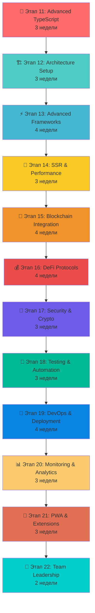

# 🚀 Crypto Learning Hub - ИПР Проект для Middle Frontend разработчика

## 📖 Описание проекта

**Crypto Learning Hub Advanced** - это продвинутый проект для индивидуального плана развития (ИПР) Middle Frontend разработчика. Проект представляет собой полнофункциональную платформу для обучения и торговли криптовалютами с продвинутой архитектурой, интеграцией с реальными блокчейн сетями и enterprise-уровнем технологий.

## 🎯 Цели ИПР

### Ключевые компетенции Middle разработчика:

- ✅ **Архитектурное мышление** - проектирование масштабируемых систем
- ✅ **Продвинутый TypeScript** - дженерики, утилитарные типы, декораторы
- ✅ **Enterprise фреймворки** - глубокое знание Vue.js/React + SSR
- ✅ **Современные инструменты** - Vite, Docker, CI/CD пайплайны
- ✅ **Блокчейн интеграция** - Web3, смарт-контракты, DeFi протоколы
- ✅ **Производительность** - оптимизация, мониторинг, профилирование
- ✅ **Безопасность** - криптография, аутентификация, защита данных
- ✅ **DevOps навыки** - контейнеризация, автоматизация развертывания
- ✅ **Тестирование** - E2E, интеграционные тесты, TDD практики
- ✅ **Командная работа** - код-ревью, техническое лидерство

## 📁 Структура проекта

```
crypto-learning-hub-advanced/
├── 📄 crypto-learning-hub-advanced-concept.md    # Концепция продвинутого проекта
├── 📄 stage-11-advanced-typescript.md             # ТЗ: Продвинутый TypeScript
├── 📄 stage-12-architecture-setup.md              # ТЗ: Архитектура и настройка проекта
├── 📄 stage-13-advanced-vue-react.md              # ТЗ: Продвинутые фреймворки
├── 📄 stage-14-ssr-performance.md                 # ТЗ: SSR и оптимизация
├── 📄 stage-15-blockchain-integration.md          # ТЗ: Интеграция с блокчейном
├── 📄 stage-16-defi-protocols.md                  # ТЗ: DeFi протоколы и торговля
├── 📄 stage-17-security-cryptography.md           # ТЗ: Безопасность и криптография
├── 📄 stage-18-testing-automation.md              # ТЗ: Тестирование и автоматизация
├── 📄 stage-19-devops-deployment.md               # ТЗ: DevOps и развертывание
├── 📄 stage-20-monitoring-analytics.md            # ТЗ: Мониторинг и аналитика
├── 📄 stage-21-pwa-extensions.md                  # ТЗ: PWA и браузерные расширения
├── 📄 stage-22-team-leadership.md                 # ТЗ: Техническое лидерство
├── 📄 learning-log-template.md                    # Шаблон дневника обучения
└── 📄 README.md                                   # Этот файл
```

## 🗺️ Карта развития (12 продвинутых этапов)

### 📊 Схема прогресса



### 📋 Детальный план этапов

| Этап                           | Технологии                                       | Время    | Основные задачи                               |
| ------------------------------ | ------------------------------------------------ | -------- | --------------------------------------------- |
| **11. Advanced TypeScript**    | Дженерики, Utility Types, Декораторы             | 3 недели | Продвинутая типизация, архитектурные паттерны |
| **12. Architecture Setup**     | Monorepo, Vite, ESLint, Prettier                 | 3 недели | Настройка enterprise-проекта с нуля           |
| **13. Advanced Frameworks**    | Vue 3 Composition API, Pinia, Nuxt 3             | 4 недели | Продвинутые паттерны состояния и компонентов  |
| **14. SSR & Performance**      | Nuxt SSR, Web Vitals, Bundle Analysis            | 3 недели | Серверный рендеринг и оптимизация             |
| **15. Blockchain Integration** | Web3, Ethers.js, MetaMask, WalletConnect         | 4 недели | Интеграция с реальными блокчейн сетями        |
| **16. DeFi Protocols**         | Uniswap, Compound, стейкинг                      | 4 недели | Реализация DeFi функционала                   |
| **17. Security & Crypto**      | JWT, OAuth, шифрование, аудит безопасности       | 3 недели | Комплексная система безопасности              |
| **18. Testing & Automation**   | Vitest, Playwright, CI/CD                        | 3 недели | Полное покрытие тестами                       |
| **19. DevOps & Deployment**    | Docker, Kubernetes, Vercel/Netlify               | 4 недели | Контейнеризация и автоматизация               |
| **20. Monitoring & Analytics** | Sentry, Google Analytics, Grafana                | 3 недели | Мониторинг и аналитика производительности     |
| **21. PWA & Extensions**       | Service Workers, Browser API                     | 3 недели | Создание PWA и расширения для браузера        |
| **22. Team Leadership**        | Code Review, Менторинг, Техническая документация | 2 недели | Навыки технического лидерства                 |

## 🚀 Быстрый старт

### 1. Подготовка к продвинутому уровню

```bash
# Убедитесь, что у вас есть базовый проект Junior уровня
cd crypto-learning-hub

# Создайте ветку для Middle уровня
git checkout -b feature/middle-advanced
```

### 2. Начало работы с этапом 11

```bash
# Изучите детальное техническое задание
cat stage-11-advanced-typescript.md

# Начните с обновления TypeScript конфигурации
touch tsconfig.advanced.json
```

### 3. Ведение дневника обучения

```bash
# Скопируйте шаблон дневника
cp learning-log-template.md my-middle-learning-log.md

# Заполните свою информацию и начните отслеживать прогресс
```

## 📚 Особенности системы ИПР для Middle

### ✨ Продвинутая архитектура

- Enterprise-паттерны проектирования
- Микрофронтенд архитектура
- Реальная интеграция с блокчейном
- Производственный уровень безопасности

### 🎯 Практическая направленность

- Реальные задачи enterprise уровня
- Интеграция с внешними API и сервисами
- Работа с большими объемами данных
- Оптимизация производительности

### 📊 Система оценки

- Баллы за каждый этап (150 баллов максимум)
- Минимум 100 баллов для перехода к следующему этапу
- Итоговая оценка уровня разработчика (1800 баллов максимум)

### 🤔 Глубокий анализ и рефлексия

- Архитектурные решения и их обоснование
- Анализ производительности и оптимизации
- Код-ревью и менторинг
- Техническое лидерство

## 📈 Система оценки уровня

| Общий балл    | Уровень    | Описание                                     |
| ------------- | ---------- | -------------------------------------------- |
| **1600-1800** | 🔥 Senior+ | Техническое лидерство и экспертиза           |
| **1400-1599** | 💎 Senior  | Архитектурное мышление и ментoring           |
| **1200-1399** | 💪 Middle+ | Уверенное владение продвинутыми технологиями |
| **1000-1199** | ⭐ Middle  | Готовность к самостоятельной работе          |
| **< 1000**    | 📚 Junior+ | Требуется дополнительное обучение            |

## 🛠️ Технологический стек

### Frontend Advanced

- **TypeScript Advanced** - дженерики, utility types, декораторы
- **Vue.js 3 Advanced** - Composition API, custom hooks, render functions
- **Nuxt.js 3** - SSR, ISR, edge-side rendering
- **State Management** - Pinia, VueUse, реактивные паттерны

### Backend & Integration

- **Nuxt Server API** - REST и GraphQL endpoints
- **Database** - PostgreSQL, Redis для кэширования
- **Authentication** - JWT, OAuth 2.0, двухфакторная аутентификация
- **External APIs** - CoinGecko, blockchain nodes, DeFi protocols

### Blockchain & Web3

- **Multi-chain Support** - Ethereum, BSC, Polygon, Arbitrum
- **DeFi Integration** - Uniswap, Compound, стейкинг протоколы
- **Smart Contracts** - взаимодействие с реальными контрактами
- **Web3 Libraries** - Ethers.js, Web3.js, Viem

### DevOps & Infrastructure

- **Containerization** - Docker, Docker Compose
- **CI/CD** - GitHub Actions, automated testing, deployment
- **Cloud Platforms** - Vercel, Netlify, AWS
- **Monitoring** - Sentry, Google Analytics, performance monitoring

### Testing & Quality

- **Unit Testing** - Vitest, Vue Test Utils
- **E2E Testing** - Playwright, Cypress
- **Performance Testing** - Lighthouse, Web Vitals
- **Security Testing** - OWASP, vulnerability scanning

## 🎓 Для наставников

### Как использовать эту систему:

1. **Техническое интервью** - оценка готовности к Middle уровню
2. **Архитектурные ревью** - обсуждение проектных решений
3. **Code Review Advanced** - фокус на архитектуру и производительность
4. **Менторинг** - развитие лидерских качеств
5. **Карьерное планирование** - подготовка к Senior роли

### Материалы для наставников:

- 📋 Архитектурные чек-листы
- 🎯 Критерии оценки enterprise уровня
- ❓ Вопросы для технических интервью
- 📊 Шаблоны performance review

## 🤝 Для разработчиков

### Рекомендации:

1. **Изучайте архитектуру** - понимание enterprise паттернов
2. **Практикуйте лидерство** - ментoring, код-ревью
3. **Фокус на производительность** - профилирование и оптимизация
4. **Безопасность превыше всего** - изучение лучших практик
5. **Следите за трендами** - новые технологии и подходы

### Критерии успеха:

- ✅ Способность спроектировать архитектуру с нуля
- ✅ Глубокое понимание производительности
- ✅ Навыки технического лидерства
- ✅ Экспертиза в области блокчейн
- ✅ Готовность к Senior роли

## 🔄 Связь с Junior уровнем

Этот проект является **продолжением** Crypto Learning Hub из Junior ИПР:

- **Этапы 1-10** - базовая функциональность (Junior)
- **Этапы 11-22** - продвинутые возможности (Middle)
- **Единый репозиторий** - эволюция одного проекта
- **Прогрессивное обучение** - от простого к сложному

### Переход с Junior на Middle:

```bash
# Клонируйте базовый проект
git clone your-junior-crypto-hub

# Создайте ветку для Middle уровня
git checkout -b feature/middle-upgrade

# Начните с этапа 11
```

## 💡 Дополнительные возможности

### 🌟 Advanced Features:

1. **Real-time Trading** - интеграция с DEX протоколами
2. **AI/ML Integration** - предсказание цен, анализ трендов
3. **Cross-chain Bridge** - обмен между различными блокчейнами
4. **Advanced Analytics** - dashboard с метриками
5. **Mobile App** - React Native или Flutter версия

### 🚀 Innovation Projects:

- **Browser Extension** - кошелек и трейдинг инструменты
- **Desktop App** - Electron приложение
- **API Platform** - публичное API для других разработчиков
- **White-label Solution** - платформа для других компаний

## 📖 Заключение

Данная система ИПР для Middle разработчика представляет собой комплексную программу развития, которая подготовит вас к роли Senior разработчика через практическую работу с enterprise-технологиями, реальными блокчейн интеграциями и развитием навыков технического лидерства.

**Общее время прохождения:** 39 недель (≈ 9 месяцев)  
**Уровень сложности:** Middle → Senior  
**Результат:** Готовность к роли Senior Frontend Developer
