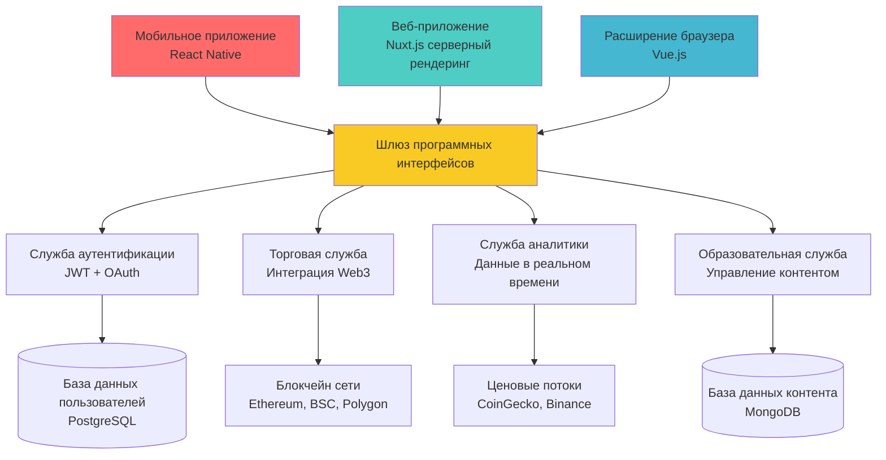
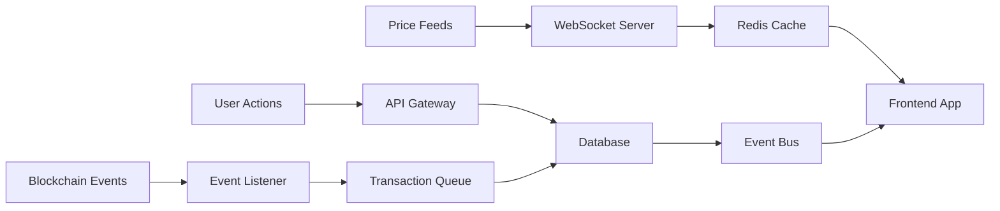

# 🚀 Crypto Learning Hub Advanced - Концепция проекта

## 📖 Обзор проекта

**Crypto Learning Hub Advanced** - это полнофункциональная корпоративная платформа для обучения, анализа и торговли криптовалютами. Проект представляет собой эволюцию базовой версии (Junior уровень) с добавлением продвинутых возможностей, современной архитектуры и интеграцией с реальными блокчейн сетями.

## 🎯 Бизнес-цели

### Основные функции платформы:

1. **📚 Образовательный центр** - интерактивные курсы и материалы по криптовалютам
2. **📊 Рыночная аналитика** - анализ рынка в реальном времени и торговые сигналы
3. **💰 Торговая платформа** - интеграция с протоколами децентрализованных бирж для торговли
4. **🔗 Поддержка нескольких сетей** - поддержка множественных блокчейн сетей
5. **🏛️ Интеграция децентрализованных финансов** - стейкинг, фермерство, протоколы кредитования
6. **👥 Функции сообщества** - социальные функции и обмен опытом
7. **🔐 Безопасность прежде всего** - продвинутые системы безопасности
8. **📱 Мобильное удобство** - прогрессивные веб-приложения и мобильные приложения

### Целевая аудитория:

- **Новички в криптовалютах** - обучающие материалы и безопасное введение
- **Опытные торговцы** - продвинутые инструменты анализа
- **Энтузиасты децентрализованных финансов** - интеграция с протоколами децентрализованных финансов
- **Разработчики** - программные интерфейсы и инструменты для создания собственных решений

## 🏗️ Техническая архитектура

### Архитектура интерфейсной части



### Технологический стек

#### Основа интерфейсной части

- **Nuxt.js 3** - каркас серверного/статического рендеринга с ТайпСкрипт
- **Vue.js 3** - композиционное программирование + `<script setup>`
- **Pinia** - управление состоянием с поддержкой ТайпСкрипт
- **VueUse** - утилиты композиции
- **Tailwind CSS** - каркас CSS, ориентированный на утилиты
- **Headless UI** - доступные компоненты

#### Инструменты разработки

- **Vite** - быстрый сборщик
- **TypeScript 5.0+** - строгая типизация
- **ESLint + Prettier** - проверка кода и форматирование
- **Vitest** - модульное тестирование
- **Playwright** - сквозное тестирование
- **Storybook** - документация компонентов

#### Web3 и Блокчейн

- **Ethers.js** - взаимодействие с Ethereum
- **Web3.js** - альтернативная библиотека Web3
- **WalletConnect** - подключение внешних кошельков
- **MetaMask SDK** - интеграция с MetaMask
- **Rainbow Kit** - пользовательский интерфейс подключения кошелька
- **Viem** - библиотека Web3, ориентированная на ТайпСкрипт

#### Серверная часть и программные интерфейсы

- **Серверные маршруты Nuxt** - конечные точки программных интерфейсов
- **PostgreSQL** - основная база данных
- **Redis** - кэширование и сессии
- **GraphQL** - типобезопасный слой программных интерфейсов
- **ВебСокеты** - обновления в реальном времени
- **Bull** - очередь заданий для фоновых задач

#### Эксплуатация и инфраструктура

- **Docker** - контейнеризация
- **Docker Compose** - локальная разработка
- **GitHub Actions** - конвейеры непрерывной интеграции/развертывания
- **Vercel/Netlify** - хостинг и развертывание
- **Sentry** - отслеживание ошибок
- **Grafana** - мониторинг производительности

## 🎨 UI/UX Design System

### Design Principles

1. **🎯 User-Centered** - интуитивно понятный интерфейс
2. **📱 Mobile-First** - адаптивный дизайн
3. **🌙 Dark Mode** - поддержка темной темы
4. **♿ Accessibility** - соответствие WCAG 2.1
5. **⚡ Performance** - быстрая загрузка и отзывчивость

### Компонентная система

```typescript
// Типизированная система компонентов
interface DesignToken {
  colors: {
    primary: string;
    secondary: string;
    accent: string;
    neutral: string;
    error: string;
    warning: string;
    success: string;
  };
  spacing: {
    xs: string;
    sm: string;
    md: string;
    lg: string;
    xl: string;
  };
  typography: {
    headings: Record<"h1" | "h2" | "h3" | "h4" | "h5" | "h6", string>;
    body: Record<"lg" | "md" | "sm" | "xs", string>;
  };
}

// Компонентные варианты
type ButtonVariant = "primary" | "secondary" | "outline" | "ghost";
type ButtonSize = "xs" | "sm" | "md" | "lg" | "xl";

interface BaseComponentProps {
  variant?: ButtonVariant;
  size?: ButtonSize;
  disabled?: boolean;
  loading?: boolean;
}
```

## 🔗 Blockchain Integration

### Поддерживаемые сети

| Сеть          | Цель использования  | Интеграция         |
| ------------- | ------------------- | ------------------ |
| **Ethereum**  | DeFi протоколы, NFT | Web3.js, Ethers.js |
| **BSC**       | Быстрые транзакции  | PancakeSwap API    |
| **Polygon**   | Низкие комиссии     | Polygon SDK        |
| **Arbitrum**  | L2 scaling          | Arbitrum SDK       |
| **Optimism**  | L2 alternative      | Optimism SDK       |
| **Avalanche** | High performance    | Avalanche.js       |

### Smart Contracts интеграция

```typescript
// Типизированные контракты
interface DEXContract {
  address: string;
  abi: any[];
  network: SupportedNetwork;
}

interface TokenContract extends DEXContract {
  symbol: string;
  decimals: number;
  totalSupply: BigNumber;
}

// Взаимодействие с контрактами
class ContractService {
  async swapTokens(
    fromToken: TokenContract,
    toToken: TokenContract,
    amount: BigNumber,
    slippage: number
  ): Promise<TransactionResponse> {
    // Реализация swap логики
  }

  async getTokenBalance(
    token: TokenContract,
    address: string
  ): Promise<BigNumber> {
    // Получение баланса токена
  }
}
```

### Протоколы децентрализованных финансов

1. **🔄 Торговля на децентрализованных биржах**

   - Интеграция с Uniswap V3
   - Поддержка PancakeSwap
   - Защита от проскальзывания цены
   - Защита от извлечения максимальной стоимости

2. **💰 Доходное фермерство**

   - Протокол Compound
   - Кредитование Aave
   - Автоматические стратегии
   - Перебалансировка портфеля

3. **🏦 Стейкинг**
   - Стейкинг Ethereum 2.0
   - Протоколы ликвидного стейкинга
   - Отслеживание вознаграждений
   - Автоматическое начисление процентов

## 📊 Data Architecture

### Real-time Data Flow



### Database Schema

```sql
-- Users и Authentication
CREATE TABLE users (
  id UUID PRIMARY KEY,
  email VARCHAR(255) UNIQUE NOT NULL,
  username VARCHAR(50) UNIQUE,
  wallet_address VARCHAR(42),
  created_at TIMESTAMP DEFAULT NOW(),
  updated_at TIMESTAMP DEFAULT NOW()
);

-- Портфолио и балансы
CREATE TABLE portfolios (
  id UUID PRIMARY KEY,
  user_id UUID REFERENCES users(id),
  network VARCHAR(20) NOT NULL,
  total_value DECIMAL(20,8),
  last_updated TIMESTAMP DEFAULT NOW()
);

-- Транзакции
CREATE TABLE transactions (
  id UUID PRIMARY KEY,
  user_id UUID REFERENCES users(id),
  type VARCHAR(20) NOT NULL, -- 'buy', 'sell', 'swap', 'stake'
  amount DECIMAL(20,8) NOT NULL,
  token_symbol VARCHAR(10) NOT NULL,
  price DECIMAL(20,8),
  fee DECIMAL(20,8),
  tx_hash VARCHAR(66),
  block_number BIGINT,
  created_at TIMESTAMP DEFAULT NOW()
);

-- Курсы и аналитика
CREATE TABLE course_progress (
  id UUID PRIMARY KEY,
  user_id UUID REFERENCES users(id),
  course_id VARCHAR(50) NOT NULL,
  lesson_id VARCHAR(50) NOT NULL,
  completed_at TIMESTAMP,
  score INTEGER DEFAULT 0
);
```

## 🔐 Security Architecture

### Многоуровневая защита

1. **🛡️ Frontend Security**

   - Content Security Policy (CSP)
   - XSS protection
   - CSRF tokens
   - Input validation

2. **🔒 API Security**

   - JWT токены с refresh
   - Rate limiting
   - Request signing
   - API key management

3. **🏦 Wallet Security**

   - Hardware wallet поддержка
   - Multi-sig интеграция
   - Transaction simulation
   - Phishing protection

4. **📡 Communication Security**
   - HTTPS everywhere
   - WebSocket security
   - End-to-end encryption
   - Secure headers

### Authentication Flow

```typescript
interface AuthService {
  // Обычная авторизация
  signIn(email: string, password: string): Promise<AuthResponse>;
  signUp(userData: SignUpData): Promise<AuthResponse>;

  // Web3 авторизация
  connectWallet(provider: WalletProvider): Promise<WalletConnection>;
  signMessage(message: string): Promise<string>;
  verifySignature(signature: string, message: string): Promise<boolean>;

  // 2FA
  enable2FA(): Promise<string>; // QR code
  verify2FA(token: string): Promise<boolean>;

  // OAuth
  oauthSignIn(provider: "google" | "github"): Promise<AuthResponse>;
}

interface AuthResponse {
  user: User;
  accessToken: string;
  refreshToken: string;
  expiresIn: number;
}
```

## 🚀 Performance Optimization

### Frontend Optimization

1. **⚡ Bundle Optimization**

   - Tree shaking
   - Code splitting
   - Dynamic imports
   - Bundle analysis

2. **🖼️ Asset Optimization**

   - Image optimization (WebP, AVIF)
   - Lazy loading
   - CDN integration
   - Progressive images

3. **📱 Runtime Performance**

   - Virtual scrolling
   - Intersection Observer
   - RequestAnimationFrame
   - Memory leak prevention

4. **🗄️ Caching Strategy**
   - Service Worker caching
   - HTTP caching headers
   - Local storage optimization
   - IndexedDB for large data

### Backend Performance

```typescript
// Кэширование с Redis
class CacheService {
  async get<T>(key: string): Promise<T | null> {
    const cached = await this.redis.get(key);
    return cached ? JSON.parse(cached) : null;
  }

  async set<T>(key: string, value: T, ttl: number = 300): Promise<void> {
    await this.redis.setex(key, ttl, JSON.stringify(value));
  }

  async invalidate(pattern: string): Promise<void> {
    const keys = await this.redis.keys(pattern);
    if (keys.length > 0) {
      await this.redis.del(...keys);
    }
  }
}

// Database optimization
class DatabaseService {
  // Connection pooling
  private pool = new Pool({
    host: process.env.DB_HOST,
    database: process.env.DB_NAME,
    user: process.env.DB_USER,
    password: process.env.DB_PASSWORD,
    max: 20, // максимум соединений
    idleTimeoutMillis: 30000,
    connectionTimeoutMillis: 2000,
  });

  // Prepared statements
  async findUserById(id: string): Promise<User | null> {
    const query = "SELECT * FROM users WHERE id = $1";
    const result = await this.pool.query(query, [id]);
    return result.rows[0] || null;
  }
}
```

## 📈 Analytics & Monitoring

### Metrics Tracking

1. **📊 Business Metrics**

   - User engagement
   - Course completion rates
   - Trading volume
   - Revenue tracking

2. **⚡ Performance Metrics**

   - Core Web Vitals
   - API response times
   - Error rates
   - Uptime monitoring

3. **🔍 User Analytics**
   - User journey tracking
   - Feature usage
   - A/B testing
   - Conversion funnels

### Monitoring Stack

```typescript
// Error tracking с Sentry
import * as Sentry from "@sentry/vue";

Sentry.init({
  app,
  dsn: process.env.SENTRY_DSN,
  environment: process.env.NODE_ENV,
  integrations: [new Sentry.BrowserTracing(), new Sentry.Replay()],
  tracesSampleRate: 1.0,
  replaysSessionSampleRate: 0.1,
  replaysOnErrorSampleRate: 1.0,
});

// Performance monitoring
class PerformanceService {
  trackPageLoad(route: string): void {
    const navigationEntry = performance.getEntriesByType("navigation")[0];
    const loadTime =
      navigationEntry.loadEventEnd - navigationEntry.loadEventStart;

    this.analytics.track("page_load", {
      route,
      loadTime,
      timestamp: Date.now(),
    });
  }

  trackAPICall(endpoint: string, duration: number, status: number): void {
    this.analytics.track("api_call", {
      endpoint,
      duration,
      status,
      timestamp: Date.now(),
    });
  }
}
```

## 🧪 Testing Strategy

### Тестовая пирамида

1. **🧩 Unit Tests (70%)**

   - Компонентная логика
   - Utility функции
   - Store mutations
   - API helpers

2. **🔗 Integration Tests (20%)**

   - API endpoints
   - Database queries
   - Component interactions
   - Store integration

3. **🎭 E2E Tests (10%)**
   - Critical user flows
   - Payment processes
   - Authentication flows
   - Cross-browser testing

### Testing Tools

```typescript
// Vitest для unit тестов
import { describe, it, expect, vi } from "vitest";
import { mount } from "@vue/test-utils";
import CryptoCard from "@/components/CryptoCard.vue";

describe("CryptoCard", () => {
  it("displays crypto information correctly", () => {
    const crypto = {
      symbol: "BTC",
      name: "Bitcoin",
      price: 45000,
      change24h: 2.5,
    };

    const wrapper = mount(CryptoCard, {
      props: { crypto },
    });

    expect(wrapper.text()).toContain("BTC");
    expect(wrapper.text()).toContain("Bitcoin");
    expect(wrapper.text()).toContain("$45,000");
  });
});

// Playwright для E2E тестов
import { test, expect } from "@playwright/test";

test("user can connect wallet and view portfolio", async ({ page }) => {
  await page.goto("/");
  await page.click('[data-testid="connect-wallet"]');
  await page.click('[data-testid="metamask-option"]');

  // Мокаем MetaMask
  await page.evaluate(() => {
    window.ethereum = {
      request: () => Promise.resolve(["0x1234...5678"]),
      on: () => {},
    };
  });

  await expect(page.locator('[data-testid="wallet-address"]')).toBeVisible();
  await expect(page.locator('[data-testid="portfolio-balance"]')).toBeVisible();
});
```

## 📱 Mobile & PWA

### Progressive Web App Features

1. **📱 Mobile Experience**

   - Responsive design
   - Touch-friendly interactions
   - Mobile-optimized layouts
   - Native app feel

2. **⚡ Performance**

   - Service Worker caching
   - Offline functionality
   - Background sync
   - Push notifications

3. **🔔 Engagement**
   - App install prompts
   - Home screen shortcuts
   - Notification system
   - Share API integration

### Service Worker Implementation

```typescript
// sw.ts
import { precacheAndRoute, cleanupOutdatedCaches } from "workbox-precaching";
import { registerRoute } from "workbox-routing";
import { StaleWhileRevalidate, CacheFirst } from "workbox-strategies";

// Прекэширование статических ресурсов
precacheAndRoute(self.__WB_MANIFEST);
cleanupOutdatedCaches();

// Кэширование API запросов
registerRoute(
  ({ url }) => url.pathname.startsWith("/api/"),
  new StaleWhileRevalidate({
    cacheName: "api-cache",
    plugins: [
      {
        cacheKeyWillBeUsed: async ({ request }) => {
          return `${request.url}?timestamp=${Math.floor(Date.now() / (5 * 60 * 1000))}`;
        },
      },
    ],
  })
);

// Кэширование изображений
registerRoute(
  ({ request }) => request.destination === "image",
  new CacheFirst({
    cacheName: "images-cache",
    plugins: [
      {
        cacheExpiration: {
          maxEntries: 100,
          maxAgeSeconds: 30 * 24 * 60 * 60, // 30 дней
        },
      },
    ],
  })
);
```

## 🚀 Deployment Strategy

### Multi-Environment Setup

1. **🏠 Development**

   - Docker Compose
   - Hot reload
   - Debug tools
   - Mock services

2. **🧪 Staging**

   - Production-like environment
   - E2E testing
   - Performance testing
   - Security scanning

3. **🌍 Production**
   - Auto-scaling
   - Load balancing
   - Health checks
   - Monitoring

### CI/CD Pipeline

```yaml
# .github/workflows/deploy.yml
name: Deploy to Production

on:
  push:
    branches: [main]

jobs:
  test:
    runs-on: ubuntu-latest
    steps:
      - uses: actions/checkout@v3
      - uses: actions/setup-node@v3
        with:
          node-version: "18"
          cache: "npm"

      - run: npm ci
      - run: npm run type-check
      - run: npm run lint
      - run: npm run test:unit
      - run: npm run test:e2e

  build:
    needs: test
    runs-on: ubuntu-latest
    steps:
      - uses: actions/checkout@v3
      - run: docker build -t crypto-hub .
      - run: docker push ${{ secrets.DOCKER_REGISTRY }}/crypto-hub

  deploy:
    needs: build
    runs-on: ubuntu-latest
    steps:
      - run: kubectl apply -f k8s/
      - run: kubectl rollout status deployment/crypto-hub
```

## 📖 Заключение

Crypto Learning Hub Advanced представляет собой комплексную корпоративную платформу, которая демонстрирует современные подходы к разработке frontend приложений с интеграцией блокчейн технологий. Проект охватывает все аспекты middle-уровня разработки: от продвинутого TypeScript до DevOps практик и технического лидерства.

### Ключевые достижения проекта:

- ✅ **Современная архитектура** с микросервисным подходом
- ✅ **Enterprise-уровень безопасности** и производительности
- ✅ **Real-world интеграции** с блокчейн протоколами
- ✅ **Комплексное тестирование** и мониторинг
- ✅ **Production-ready** deployment и масштабирование

Данный проект подготавливает middle разработчика к Senior роли через практическую работу с cutting-edge технологиями и решение реальных business задач.
