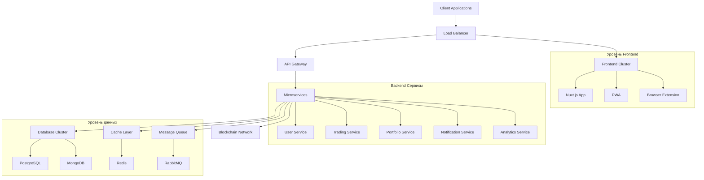
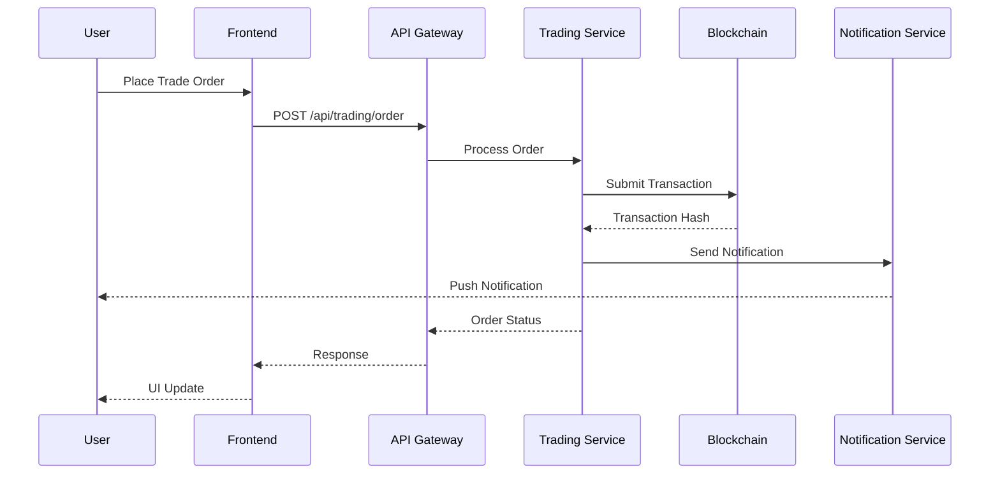
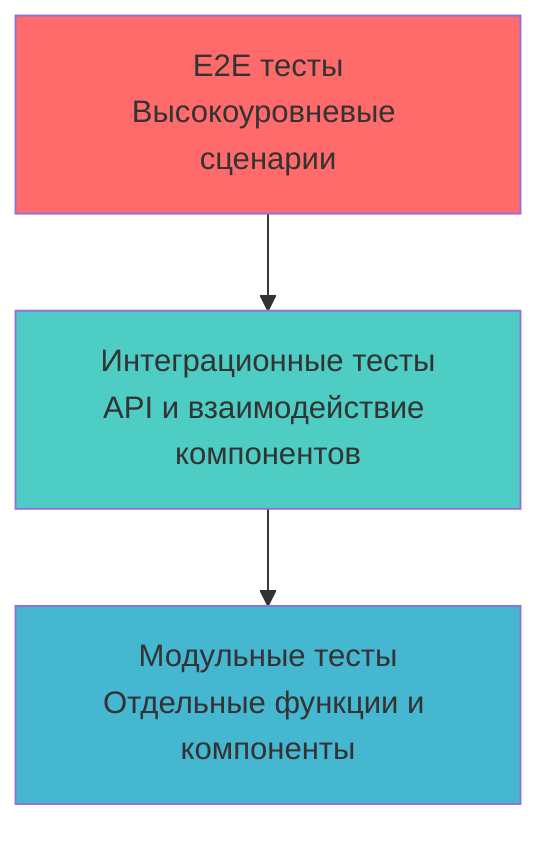
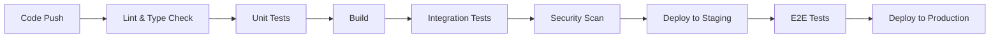

# 👥 Этап 22: Техническое лидерство - Техническое лидерство и менторинг

## 📋 Общая информация

**Продолжительность:** 2 недели  
**Сложность:** Высокая  
**Предварительные требования:** Завершенные этапы 11-21

## 🎯 Цели этапа

### Основные задачи:

- ✅ Создать комплексную техническую документацию проекта
- ✅ Разработать руководящие принципы и лучшие практики для команды
- ✅ Настроить процессы code review и контроля качества
- ✅ Создать программу адаптации для новых разработчиков
- ✅ Подготовить техническую презентацию и обмен знаниями
- ✅ Разработать дорожную карту и техническую стратегию
- ✅ Создать программу менторинга и материалы для Junior разработчиков

## 🛠️ Технологический стек

### Инструменты документации

- **GitBook / Notion** - техническая документация
- **Mermaid** - диаграммы и схемы
- **Storybook** - документация компонентов
- **TypeDoc** - автоматическая документация API

### Командное сотрудничество

- **GitHub / GitLab** - code review и совместная работа
- **Slack / Discord** - командная коммуникация
- **Figma** - дизайн-система и совместная работа
- **Linear / Jira** - управление задачами

### Обмен знаниями

- **Confluence** - база знаний
- **Loom** - видеодокументация
- **Miro** - совместные диаграммы
- **Инструменты презентаций** - для технических докладов

## 📚 Функциональные требования

### 📖 22.1 Техническая документация

# 📚 Crypto Learning Hub - Техническая документация

## 🏗️ Обзор архитектуры

### Системная архитектура



### Архитектура потока данных



## 🚀 Начало работы

### Предварительные требования

- Node.js 18+
- Docker & Docker Compose
- Git
- VS Code или аналогичная IDE

### Быстрая настройка

```bash
# Клонирование репозитория
git clone https://github.com/company/crypto-learning-hub.git
cd crypto-learning-hub

# Установка зависимостей
npm install

# Настройка окружения
cp .env.example .env.local

# Запуск среды разработки
docker-compose up -d
npm run dev
```

### Структура проекта

```
crypto-learning-hub/
├── 📁 apps/
│   ├── 📁 frontend/          # Nuxt.js приложение
│   ├── 📁 api/               # Node.js API
│   ├── 📁 extension/         # Браузерное расширение
│   └── 📁 pwa/               # PWA специфичный код
├── 📁 packages/
│   ├── 📁 shared/            # Общие утилиты
│   ├── 📁 ui/                # Библиотека UI компонентов
│   └── 📁 types/             # TypeScript определения
├── 📁 docs/                  # Документация
├── 📁 tools/                 # Инструменты сборки и скрипты
└── 📁 infrastructure/        # Docker, K8s, и т.д.
```

## 💻 Руководство по разработке

### Стиль кода

Мы используем ESLint и Prettier для единообразного форматирования кода:

```json
// .eslintrc.js
{
  "extends": [
    "@nuxtjs/eslint-config-typescript",
    "plugin:prettier/recommended"
  ],
  "rules": {
    "vue/multi-word-component-names": "off",
    "@typescript-eslint/no-unused-vars": "error",
    "prefer-const": "error"
  }
}
```

### Git Workflow

Мы следуем GitFlow со следующими ветками:

- `main` - производственный код
- `develop` - ветка интеграции
- `feature/*` - разработка функций
- `release/*` - подготовка релиза
- `hotfix/*` - исправления продакшена

### Соглашение о коммитах

Мы используем Conventional Commits:

```
type(scope): description

feat(auth): add OAuth2 integration
fix(trading): resolve order execution bug
docs(api): update endpoint documentation
```

### Руководство по TypeScript

```typescript
// ✅ Хорошо: Используйте явные типы
interface User {
  id: string;
  email: string;
  createdAt: Date;
}

const createUser = (userData: User): Promise<User> => {
  // Реализация
};

// ✅ Хорошо: Используйте утилитарные типы
type UserUpdate = Partial<Pick<User, "email">>;

// ❌ Плохо: Использование any
const processData = (data: any) => {
  // Избегайте этого
};
```

## 🧪 Стратегия тестирования

### Пирамида тестирования



### Категории тестов

- **Модульные тесты**: минимум 70% покрытия
- **Интеграционные тесты**: API эндпоинты и взаимодействие компонентов
- **E2E тесты**: критические пользовательские сценарии
- **Нагрузочные тесты**: тестирование нагрузки и оптимизация

### Написание хороших тестов

```typescript
// ✅ Хорошая структура теста
describe("CryptoCard Component", () => {
  it("should display crypto information correctly", () => {
    // Подготовка
    const mockCrypto = {
      id: "bitcoin",
      name: "Bitcoin",
      current_price: 45000,
    };

    // Действие
    const wrapper = mount(CryptoCard, {
      props: { crypto: mockCrypto },
    });

    // Проверка
    expect(wrapper.find('[data-testid="crypto-name"]').text()).toBe("Bitcoin");
    expect(wrapper.find('[data-testid="crypto-price"]').text()).toContain(
      "$45,000"
    );
  });
});
```

## 🔄 CI/CD конвейер

### Этапы конвейера



### Контрольные точки качества

Перед слиянием в main:

- ✅ Все тесты проходят
- ✅ Покрытие кода > 80%
- ✅ Нет уязвимостей безопасности
- ✅ Тесты производительности пройдены
- ✅ Code review одобрен

## 🏗️ Архитектурные решения

### ADR-001: Стратегия управления состоянием

**Статус**: Принято
**Дата**: 2024-01-15

**Контекст**: Необходимо выбрать решение для управления состоянием в сложном криптотрейдинговом приложении.

**Решение**: Использовать Pinia для управления состоянием Vue.js по следующим причинам:

- Типобезопасность с TypeScript
- Модульная структура хранилища
- Поддержка DevTools
- Совместимость с SSR

**Последствия**:

- Лучшая поддерживаемость
- Упрощенное тестирование
- Кривая обучения для команды

### ADR-002: Паттерн проектирования API

**Статус**: Принято
**Дата**: 2024-01-20

**Решение**: Реализовать паттерн Repository с валидацией DTO:

```typescript
// Интерфейс Repository
interface CryptoRepository {
  findById(id: string): Promise<Crypto>;
  findAll(filters: CryptoFilters): Promise<Crypto[]>;
  create(data: CreateCryptoDto): Promise<Crypto>;
}

// Реализация
export class ApiCryptoRepository implements CryptoRepository {
  async findById(id: string): Promise<Crypto> {
    const response = await $fetch<CryptoDto>(`/api/crypto/${id}`);
    return CryptoDto.toDomain(response);
  }
}
```

## 🚀 Руководство по развертыванию

### Environment Configuration

| Environment | URL                   | Purpose              |
| ----------- | --------------------- | -------------------- |
| Development | localhost:3000        | Локальная разработка |
| Staging     | staging.cryptohub.com | QA тестирование      |
| Production  | cryptohub.com         | Живое приложение     |

### Процесс развертывания

1. **Развертывание Staging**

   - Автоматическое при слиянии в `develop`
   - Запускается полный набор тестов
   - Доступно для QA тестирования

2. **Развертывание Production**
   - Требуется ручное одобрение
   - Стратегия blue-green развертывания
   - Автоматический откат при сбое

### Мониторинг и оповещения

- **Приложение**: Sentry для отслеживания ошибок
- **Инфраструктура**: Prometheus + Grafana
- **Логи**: ELK Stack
- **Время работы**: Интеграция StatusPage

## 🔧 Устранение неполадок

### Распространенные проблемы

**Проблема**: Сборка не удается из-за ошибок TypeScript

```bash
# Решение: Очистить кеш и переустановить
rm -rf node_modules package-lock.json
npm install
npm run type-check
```

**Проблема**: Тесты падают в CI, но проходят локально

```bash
# Решение: Обеспечить единообразную версию Node.js
nvm use 18
npm ci  # Использовать точные версии из lock файла
```

### Отладка производительности

```typescript
// Используйте performance API для отладки
const start = performance.now();
await heavyOperation();
const end = performance.now();
console.log(`Операция заняла ${end - start} миллисекунд`);
```

## 📞 Поддержка и ресурсы

- **Технический лидер**: @technical-lead
- **DevOps**: @devops-team
- **Документация**: [Внутренняя вики](https://wiki.company.com)
- **Архитектурные ревью**: Каждую пятницу в 14:00

````

### 👨‍🏫 22.2 Руководство по Code Review

```markdown
# 📋 Руководство по Code Review

## 🎯 Цели обзора

1. **Корректность**: Решает ли код проблему правильно?
2. **Поддерживаемость**: Легко ли понять и изменить код?
3. **Производительность**: Есть ли проблемы с производительностью?
4. **Безопасность**: Есть ли уязвимости безопасности?
5. **Тестирование**: Правильно ли протестирован код?

## ✅ Чек-лист обзора

### Общее качество кода

- [ ] Код следует установленным руководящим принципам стиля
- [ ] Функции и переменные имеют описательные имена
- [ ] Код правильно прокомментирован где необходимо
- [ ] Нет console.log или отладочного кода
- [ ] Обработка ошибок реализована соответствующе

### Специфично для TypeScript

- [ ] Использованы правильные определения типов
- [ ] Нет использования типа `any` без обоснования
- [ ] Интерфейсы и типы правильно экспортированы
- [ ] Обобщенные типы используются соответствующе

### Специфично для Vue.js/Nuxt.js

- [ ] Компоненты следуют паттернам composition API
- [ ] Правильное управление реактивным состоянием
- [ ] Lifecycle хуки используются корректно
- [ ] Props и события правильно типизированы

### Производительность

- [ ] Нет ненужных повторных рендеров или вычислений
- [ ] Правильное использование computed свойств
- [ ] Изображения и ресурсы оптимизированы
- [ ] Влияние на размер bundle рассмотрено

### Безопасность

- [ ] Пользовательский ввод правильно валидирован
- [ ] Нет чувствительных данных в клиентском коде
- [ ] Правильные проверки аутентификации
- [ ] Настроены заголовки CORS и CSP

### Тестирование

- [ ] Модульные тесты покрывают новую функциональность
- [ ] Интеграционные тесты для сложных функций
- [ ] Рассмотрены крайние случаи
- [ ] Мок данные реалистичны

## 💬 Коммуникация в обзоре

### Предоставление обратной связи

**✅ Хорошие примеры:**

Рассмотрите использование более описательного имени переменной:
`const data` → `const cryptoPrices`

Это можно оптимизировать мемоизацией дорогого вычисления:

```typescript
const expensiveValue = computed(() => heavyCalculation(props.data));
```

**❌ Плохие примеры:**

```
Это неправильно.
Измени это.
Плохой код.
```

### Получение обратной связи

- Рассматривайте обратную связь как возможность обучения
- Задавайте вопросы, если неясно
- Быстро внедряйте предложения
- Благодарите рецензентов за их время

## 🔄 Процесс обзора

1. **Самоанализ**: Сначала просмотрите свой собственный код
2. **Создание PR**: Включите четкое описание и контекст
3. **Запрос обзора**: Отметьте подходящих рецензентов
4. **Обработка обратной связи**: Внесите запрошенные изменения
5. **Повторный запрос обзора**: После значительных изменений
6. **Слияние**: После одобрения и прохождения CI

## 🚨 Красные флаги

Немедленно эскалируйте, если видите:

- Жестко закодированные учетные данные или секреты
- Прямые запросы к базе данных во frontend
- Невалидированный пользовательский ввод
- Деградацию производительности
- Ломающие изменения без миграции

````

### 🎓 22.3 Программа адаптации Junior разработчиков

```markdown
# 🚀 Программа адаптации Junior разработчиков

## Неделя 1: Основы и настройка

### День 1-2: Настройка окружения

- [ ] Доступ к аккаунтам (GitHub, Slack, и т.д.)
- [ ] Настройка среды разработки
- [ ] Запуск проекта локально
- [ ] Завершение задачи "Hello World"

### День 3-4: Изучение кодовой базы

- [ ] Чтение технической документации
- [ ] Изучение структуры проекта
- [ ] Запуск тестовых наборов
- [ ] Обзор недавних pull request'ов

### День 5: Первый вклад

- [ ] Исправление "good first issue"
- [ ] Создание первого pull request
- [ ] Прохождение процесса code review

## Неделя 2: Разработка функциональности

### Задачи:

1. **Простой компонент**: Создать переиспользуемый UI компонент
2. **Интеграция с API**: Получение и отображение данных из API
3. **Обработка форм**: Реализовать форму с валидацией
4. **Тестирование**: Написать модульные тесты для ваших компонентов

### Ресурсы для изучения:

- Документация Vue.js
- Руководство по TypeScript
- Стандарты кодирования компании
- Лучшие практики тестирования

## Неделя 3-4: Сложные функции

### Сессии менторинга:

- Ежедневные 30-минутные проверки
- Еженедельные 1-часовые углубленные сессии
- Прохождения code review
- Обсуждения архитектуры

### Проект-веха:

Создать небольшую функцию от начала до конца:

- Frontend компонент
- API эндпоинт
- Интеграция с базой данных
- Тесты
- Документация

## Критерии оценки

### Технические навыки (40%)

- Качество и консистентность кода
- Подход к решению проблем
- Понимание паттернов
- Практики тестирования

### Сотрудничество (30%)

- Навыки коммуникации
- Участие в code review
- Поведение при поиске помощи
- Интеграция в команду

### Установка на рост (30%)

- Скорость обучения
- Внедрение обратной связи
- Проявление инициативы
- Обмен знаниями

## Ресурсы для менторов

### Шаблон ежедневной проверки:
```

1. Над чем вы работали вчера?
2. Над чем вы работаете сегодня?
3. Есть ли блокеры или вопросы?
4. Что нового узнали?

```

### Шаблон еженедельного обзора:
```

1. Технический прогресс на этой неделе
2. Столкнувшиеся проблемы и решения
3. Обратная связь по процессу менторинга
4. Цели на следующую неделю

```

```

### 📊 22.4 Техническая дорожная карта и стратегия

```markdown
# 🗺️ Техническая дорожная карта 2024-2025

## Q1 2024: Укрепление фундамента

### Оптимизация производительности

- [ ] Оценка Core Web Vitals > 90
- [ ] Уменьшение размера bundle (30%)
- [ ] Оптимизация SSR
- [ ] Оптимизация запросов к базе данных

### Инфраструктура

- [ ] Миграция на Kubernetes
- [ ] Развертывание в нескольких регионах
- [ ] Реализация автомасштабирования
- [ ] Настройка аварийного восстановления

### Опыт разработчиков

- [ ] Улучшенная среда разработки
- [ ] Лучшие инструменты отладки
- [ ] Автоматизированный конвейер тестирования
- [ ] Улучшения документации

## Q2 2024: Расширение функциональности

### Продвинутые торговые функции

- [ ] Поддержка алгоритмической торговли
- [ ] Продвинутые инструменты графиков
- [ ] Оптимизация портфеля
- [ ] Инструменты управления рисками

### Мобильный опыт

- [ ] Нативные мобильные приложения
- [ ] Архитектура offline-first
- [ ] Система push-уведомлений
- [ ] Мобильный специфичный UI/UX

### Расширение интеграций

- [ ] Больше интеграций с биржами
- [ ] Поддержка DeFi протоколов
- [ ] Возможности межцепочечного взаимодействия
- [ ] API традиционных финансов

## Q3 2024: Масштабирование и надежность

### Масштабируемость

- [ ] Микросервисная архитектура
- [ ] Событийно-ориентированная архитектура
- [ ] Реализация CQRS
- [ ] Оптимизация глобального CDN

### Безопасность и соответствие

- [ ] Завершение аудита безопасности
- [ ] Фреймворк соответствия
- [ ] Продвинутая аутентификация
- [ ] Шифрование данных в состоянии покоя

### Интеграция AI/ML

- [ ] Модели предсказания цен
- [ ] Рекомендации портфеля
- [ ] AI для оценки рисков
- [ ] Автоматизированные торговые сигналы

## Q4 2024: Инновации и будущее

### Развивающиеся технологии

- [ ] Интеграция Web3 кошельков
- [ ] NFT маркетплейс
- [ ] Функции управления DAO
- [ ] Интеграция с метавселенной

### Продвинутая аналитика

- [ ] Аналитика в реальном времени
- [ ] Предиктивное моделирование
- [ ] Анализ поведения пользователей
- [ ] Анализ настроений рынка

## Управление техническим долгом

### Высокий приоритет

1. Рефакторинг устаревшего API
2. Оптимизация схемы базы данных
3. Оптимизация frontend bundle
4. Улучшение покрытия тестами

### Средний приоритет

1. Обновления документации
2. Консистентность стиля кода
3. Обновления зависимостей
4. Мониторинг производительности

### Цели технических метрик

| Метрика                   | Текущее | Цель Q2 | Цель Q4 |
| ------------------------- | ------- | ------- | ------- |
| Покрытие тестами          | 65%     | 80%     | 90%     |
| Оценка производительности | 75      | 85      | 95      |
| Размер Bundle             | 2.5MB   | 1.8MB   | 1.2MB   |
| Время ответа API          | 150ms   | 100ms   | 75ms    |
| Время работы              | 99.5%   | 99.8%   | 99.9%   |
```

### 🎤 22.5 Обмен знаниями и презентации

````markdown
# 📢 Технические презентации и обмен знаниями

## 🎯 Темы презентаций

### Глубокое погружение в архитектуру

**Продолжительность**: 45 минут  
**Аудитория**: Команда инженеров

#### План:

1. **Обзор системы** (10 мин)

   - Высокоуровневая архитектура
   - Ключевые компоненты
   - Поток данных

2. **Frontend архитектура** (15 мин)

   - Структура Nuxt.js
   - Управление состоянием
   - Паттерны компонентов
   - Реализация PWA

3. **Backend сервисы** (15 мин)

   - Дизайн микросервисов
   - Архитектура API
   - Дизайн базы данных
   - Стратегия кеширования

4. **Сессия Q&A** (5 мин)

#### Примеры кода:

```typescript
// Пример: Реализация паттерна Repository
interface CryptoRepository {
  findAll(filters: CryptoFilters): Promise<Crypto[]>;
  findById(id: string): Promise<Crypto | null>;
  create(data: CreateCryptoDto): Promise<Crypto>;
  update(id: string, data: UpdateCryptoDto): Promise<Crypto>;
  delete(id: string): Promise<void>;
}

export class ApiCryptoRepository implements CryptoRepository {
  constructor(
    private readonly httpClient: HttpClient,
    private readonly logger: Logger
  ) {}

  async findAll(filters: CryptoFilters): Promise<Crypto[]> {
    try {
      const response = await this.httpClient.get<CryptoDto[]>("/crypto", {
        params: filters,
      });
      return response.data.map(CryptoDto.toDomain);
    } catch (error) {
      this.logger.error("Не удалось получить криптовалюты", error);
      throw new RepositoryError("Невозможно получить данные криптовалют");
    }
  }
}
```
````

### Воркшоп по оптимизации производительности

**Продолжительность**: 2 часа  
**Аудитория**: Frontend разработчики

#### Темы:

1. Анализ и оптимизация bundle
2. Стратегии разделения кода
3. Оптимизация изображений
4. Стратегии кеширования
5. Core Web Vitals

#### Практические примеры:

```javascript
// Разделение кода с динамическими импортами
const CryptoTrading = defineAsyncComponent({
  loader: () => import("@/components/CryptoTrading.vue"),
  loadingComponent: LoadingSpinner,
  delay: 200,
  timeout: 3000,
});

// Оптимизация изображений
const optimizedImage = computed(() => {
  const baseUrl = "/images/crypto/";
  const format = supportsWebp ? "webp" : "jpg";
  const size = screenWidth.value > 768 ? "large" : "small";
  return `${baseUrl}${props.symbol}-${size}.${format}`;
});
```

### Лучшие практики Web3 интеграции

**Продолжительность**: 60 минут  
**Аудитория**: Full-stack разработчики

#### Демо приложение:

```typescript
// Управление Web3 подключением
export class Web3Manager {
  private provider: ethers.providers.Web3Provider | null = null;
  private signer: ethers.Signer | null = null;

  async connect(): Promise<void> {
    if (!window.ethereum) {
      throw new Error("MetaMask не установлен");
    }

    try {
      await window.ethereum.request({ method: "eth_requestAccounts" });
      this.provider = new ethers.providers.Web3Provider(window.ethereum);
      this.signer = this.provider.getSigner();

      // Слушаем изменения аккаунта
      window.ethereum.on(
        "accountsChanged",
        this.handleAccountChange.bind(this)
      );
      window.ethereum.on("chainChanged", this.handleChainChange.bind(this));
    } catch (error) {
      throw new Error("Не удалось подключиться к кошельку");
    }
  }

  async getBalance(): Promise<string> {
    if (!this.signer) throw new Error("Кошелек не подключен");

    const balance = await this.signer.getBalance();
    return ethers.utils.formatEther(balance);
  }
}
```

## 📚 Ресурсы для обучения

### Внутренние ресурсы

- Документация архитектуры
- Записи code review
- Записи технических решений
- Бенчмарки производительности

### Внешние ресурсы

- Продвинутые паттерны Vue.js
- Глубокое погружение в TypeScript
- Оптимизация веб-производительности
- Разработка блокчейна

### Рекомендуемые книги

1. "Чистая архитектура" от Роберта Мартина
2. "Проектирование приложений с интенсивной обработкой данных" от Мартина Клеппманна
3. "JavaScript: хорошие части" от Дугласа Крокфорда
4. "Веб-производительность в действии" от Джереми Вагнера

## 🎓 Руководство по менторингу

### Эффективные стратегии менторинга

#### 1. Сократический метод

Вместо прямых ответов задавайте направляющие вопросы:

- "Как вы думаете, что может вызывать эту проблему?"
- "Как бы вы подошли к решению этой проблемы?"
- "Каковы компромиссы этого решения?"

#### 2. Code Review как инструмент обучения

```typescript
// ❌ Вместо: "Измени это"
// ✅ Объясни: "Рассмотри извлечение этой логики в composable"

// Пример комментария для менторинга:
/*
Этот компонент становится довольно большим. Рассмотри его разбиение:

1. Извлеки логику формы в useFormValidation composable
2. Перенеси API вызовы в слой сервисов
3. Создай меньшие, сфокусированные под-компоненты

Это сделает код проще для тестирования и поддержки. Хочешь, чтобы я
показал пример того, как это можно отрефакторить?
*/
```

#### 3. Сессии парного программирования

- Делись экраном и программируй вместе
- Позволь стажеру вести, направляй вопросами
- Фокусируйся на процессе мышления, а не только на результате
- Делай перерывы для обсуждения концепций

### Создание возможностей для обучения

#### 1. Градация сложности

Начинай с простых задач и постепенно увеличивай сложность:

- Неделя 1: Исправление опечаток, обновление стилей
- Неделя 2: Добавление нового компонента
- Неделя 3: Реализация функции с API
- Неделя 4: Проектирование и реализация сложной функции

#### 2. Межфункциональное знакомство

- Frontend разработчики: Знакомство с backend концепциями
- Backend разработчики: Показ frontend вызовов
- Все: DevOps и процессы развертывания

#### 3. Технические обсуждения

Регулярные сессии по:

- Паттернам проектирования
- Архитектурным решениям
- Тенденциям индустрии
- Оценке инструментов

```

## 🎯 Критерии оценки

### ⭐ Обязательные требования (100 баллов)

1. **Техническая документация (25 баллов)**
   - Всеобъемлющая документация архитектуры
   - Документация API с примерами
   - Руководства по настройке и развертыванию
   - Руководства по устранению неполадок

2. **Руководящие принципы и стандарты команды (25 баллов)**
   - Руководящие принципы code review
   - Стандарты кодирования
   - Документация Git workflow
   - Стратегии тестирования

3. **Обмен знаниями (20 баллов)**
   - Техническая презентация
   - Материалы для обучения команды
   - Записи архитектурных решений
   - Документация лучших практик

4. **Программа менторинга (20 баллов)**
   - План адаптации Junior разработчиков
   - Руководящие принципы менторинга
   - Ресурсы для обучения
   - Система отслеживания прогресса

5. **Техническое лидерство (10 баллов)**
   - Техническая дорожная карта
   - Документация стратегии
   - Улучшения процессов
   - Координация команды

### 🚀 Дополнительные задания (50 баллов)

1. **Продвинутая документация (15 баллов)**
   - Интерактивная документация
   - Видео-уроки
   - Технические блог-посты
   - Вклады в open source

2. **Инновации в процессах (15 баллов)**
   - Автоматизированные ворота качества
   - Улучшенные рабочие процессы разработки
   - Рекомендации инструментов
   - Улучшения эффективности

3. **Внешнее взаимодействие (10 баллов)**
   - Презентации на конференциях
   - Написание технических блогов
   - Вклады в сообщество
   - Профессиональные связи

4. **Влияние лидерства (10 баллов)**
   - Улучшение производительности команды
   - Эффективность передачи знаний
   - Истории успеха менторинга
   - Культурные улучшения

## 📊 Процесс выполнения

### Неделя 1: Документация и руководящие принципы
- Создание технической документации
- Написание руководящих принципов команды
- Подготовка процессов code review
- Создание материалов для адаптации

### Неделя 2: Обмен знаниями и менторинг
- Подготовка технической презентации
- Проведение сессий обмена знаниями
- Запуск программы менторинга
- Создание дорожной карты и стратегии

## 🔍 Вопросы для изучения

1. **Техническое лидерство:**
   - Как балансировать техническое совершенство и бизнес-потребности?
   - Какие качества делают эффективного техлида?

2. **Управление командой:**
   - Как мотивировать junior разработчиков?
   - Как проводить эффективные code review?

3. **Передача знаний:**
   - Как структурировать техническую документацию?
   - Какие форматы обучения наиболее эффективны?

4. **Стратегическое мышление:**
   - Как планировать техническую дорожную карту?
   - Как оценивать технический долг и приоритеты?

## 📈 Ожидаемые результаты

По завершении этапа вы получите:

- 📚 **Всеобъемлющая документация** - полная техническая документация
- 👥 **Навыки командного лидерства** - навыки технического лидерства
- 🎓 **Экспертиза в менторинге** - опыт менторинга и обучения
- 🗺️ **Стратегическое мышление** - понимание технической стратегии
- 🤝 **Превосходство в сотрудничестве** - эффективные процессы командной работы

Этот финальный этап подготавливает вас к роли технического лидера и senior разработчика, способного вести команду и принимать архитектурные решения.
```
