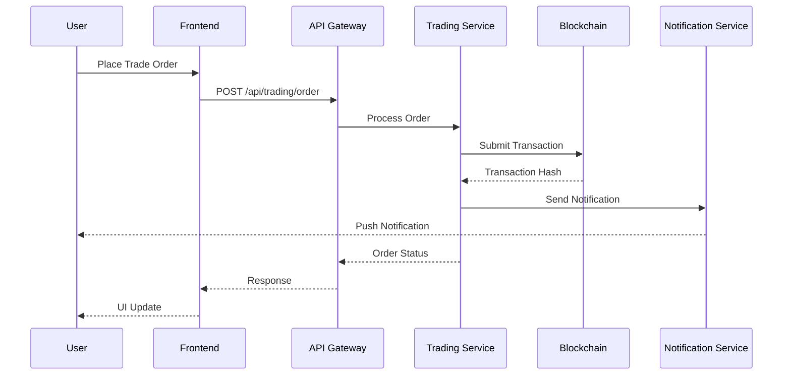
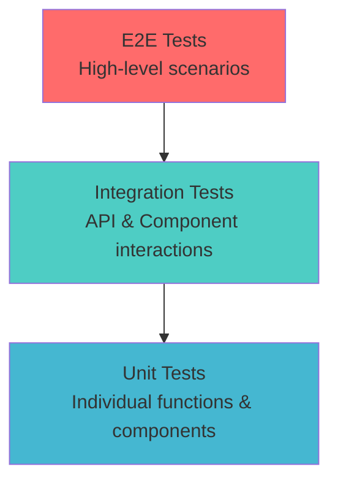
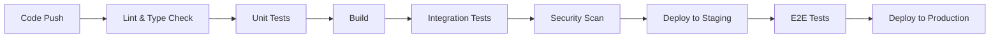

# 👥 Этап 22: Team Leadership - Техническое лидерство и менторинг

## 📋 Общая информация

**Продолжительность:** 2 недели  
**Сложность:** High  
**Предварительные требования:** Завершенные этапы 11-21

## 🎯 Цели этапа

### Основные задачи:

- ✅ Создать комплексную техническую документацию проекта
- ✅ Разработать guidelines и best practices для команды
- ✅ Настроить процессы code review и quality gates
- ✅ Создать onboarding программу для новых разработчиков
- ✅ Подготовить техническую презентацию и знание sharing
- ✅ Разработать roadmap и техническую стратегию
- ✅ Создать mentoring программу и материалы для Junior разработчиков

## 🛠️ Технологический стек

### Documentation Tools

- **GitBook / Notion** - техническая документация
- **Mermaid** - диаграммы и схемы
- **Storybook** - component documentation
- **TypeDoc** - автоматическая документация API

### Team Collaboration

- **GitHub / GitLab** - code review и collaboration
- **Slack / Discord** - командная коммуникация
- **Figma** - design system и collaboration
- **Linear / Jira** - task management

### Knowledge Sharing

- **Confluence** - knowledge base
- **Loom** - video documentation
- **Miro** - collaborative diagrams
- **Presentation tools** - для technical talks

## 📚 Функциональные требования

### 📖 22.1 Техническая документация

````markdown
# 📚 Crypto Learning Hub - Technical Documentation

## 🏗️ Architecture Overview

### System Architecture


````

### Data Flow Architecture



## 🚀 Getting Started

### Prerequisites

- Node.js 18+
- Docker & Docker Compose
- Git
- VS Code or similar IDE

### Quick Setup

```bash
# Clone repository
git clone https://github.com/company/crypto-learning-hub.git
cd crypto-learning-hub

# Install dependencies
npm install

# Setup environment
cp .env.example .env.local

# Start development environment
docker-compose up -d
npm run dev
```

### Project Structure

```
crypto-learning-hub/
├── 📁 apps/
│   ├── 📁 frontend/          # Nuxt.js application
│   ├── 📁 api/               # Node.js API
│   ├── 📁 extension/         # Browser extension
│   └── 📁 pwa/               # PWA specific code
├── 📁 packages/
│   ├── 📁 shared/            # Shared utilities
│   ├── 📁 ui/                # UI components library
│   └── 📁 types/             # TypeScript definitions
├── 📁 docs/                  # Documentation
├── 📁 tools/                 # Build tools and scripts
└── 📁 infrastructure/        # Docker, K8s, etc.
```

## 💻 Development Guidelines

### Code Style

We use ESLint and Prettier for consistent code formatting:

```json
// .eslintrc.js
{
  "extends": [
    "@nuxtjs/eslint-config-typescript",
    "plugin:prettier/recommended"
  ],
  "rules": {
    "vue/multi-word-component-names": "off",
    "@typescript-eslint/no-unused-vars": "error",
    "prefer-const": "error"
  }
}
```

### Git Workflow

We follow GitFlow with the following branches:

- `main` - production code
- `develop` - integration branch
- `feature/*` - feature development
- `release/*` - release preparation
- `hotfix/*` - production fixes

### Commit Convention

We use Conventional Commits:

```
type(scope): description

feat(auth): add OAuth2 integration
fix(trading): resolve order execution bug
docs(api): update endpoint documentation
```

### TypeScript Guidelines

```typescript
// ✅ Good: Use explicit types
interface User {
  id: string;
  email: string;
  createdAt: Date;
}

const createUser = (userData: User): Promise<User> => {
  // Implementation
};

// ✅ Good: Use utility types
type UserUpdate = Partial<Pick<User, "email">>;

// ❌ Bad: Using any
const processData = (data: any) => {
  // Avoid this
};
```

## 🧪 Testing Strategy

### Testing Pyramid



### Test Categories

- **Unit Tests**: 70% coverage minimum
- **Integration Tests**: API endpoints and component interactions
- **E2E Tests**: Critical user journeys
- **Performance Tests**: Load testing and optimization

### Writing Good Tests

```typescript
// ✅ Good test structure
describe("CryptoCard Component", () => {
  it("should display crypto information correctly", () => {
    // Arrange
    const mockCrypto = {
      id: "bitcoin",
      name: "Bitcoin",
      current_price: 45000,
    };

    // Act
    const wrapper = mount(CryptoCard, {
      props: { crypto: mockCrypto },
    });

    // Assert
    expect(wrapper.find('[data-testid="crypto-name"]').text()).toBe("Bitcoin");
    expect(wrapper.find('[data-testid="crypto-price"]').text()).toContain(
      "$45,000"
    );
  });
});
```

## 🔄 CI/CD Pipeline

### Pipeline Stages



### Quality Gates

Before merging to main:

- ✅ All tests pass
- ✅ Code coverage > 80%
- ✅ No security vulnerabilities
- ✅ Performance benchmarks met
- ✅ Code review approved

## 🏗️ Architecture Decisions

### ADR-001: State Management Strategy

**Status**: Accepted  
**Date**: 2024-01-15

**Context**: Need to choose state management solution for complex crypto trading application.

**Decision**: Use Pinia for Vue.js state management with the following rationale:

- Type-safe with TypeScript
- Modular store structure
- DevTools support
- SSR compatibility

**Consequences**:

- Better maintainability
- Easier testing
- Learning curve for team

### ADR-002: API Design Pattern

**Status**: Accepted  
**Date**: 2024-01-20

**Decision**: Implement Repository pattern with DTO validation:

```typescript
// Repository interface
interface CryptoRepository {
  findById(id: string): Promise<Crypto>;
  findAll(filters: CryptoFilters): Promise<Crypto[]>;
  create(data: CreateCryptoDto): Promise<Crypto>;
}

// Implementation
export class ApiCryptoRepository implements CryptoRepository {
  async findById(id: string): Promise<Crypto> {
    const response = await $fetch<CryptoDto>(`/api/crypto/${id}`);
    return CryptoDto.toDomain(response);
  }
}
```

## 🚀 Deployment Guide

### Environment Configuration

| Environment | URL                   | Purpose           |
| ----------- | --------------------- | ----------------- |
| Development | localhost:3000        | Local development |
| Staging     | staging.cryptohub.com | QA testing        |
| Production  | cryptohub.com         | Live application  |

### Deployment Process

1. **Staging Deployment**

   - Automatic on merge to `develop`
   - Runs full test suite
   - Available for QA testing

2. **Production Deployment**
   - Manual approval required
   - Blue-green deployment strategy
   - Automatic rollback on failure

### Monitoring & Alerting

- **Application**: Sentry for error tracking
- **Infrastructure**: Prometheus + Grafana
- **Logs**: ELK Stack
- **Uptime**: StatusPage integration

## 🔧 Troubleshooting

### Common Issues

**Issue**: Build fails with TypeScript errors

```bash
# Solution: Clear cache and reinstall
rm -rf node_modules package-lock.json
npm install
npm run type-check
```

**Issue**: Tests failing in CI but passing locally

```bash
# Solution: Ensure consistent Node.js version
nvm use 18
npm ci  # Use exact versions from lock file
```

### Performance Debugging

```typescript
// Use performance API for debugging
const start = performance.now();
await heavyOperation();
const end = performance.now();
console.log(`Operation took ${end - start} milliseconds`);
```

## 📞 Support & Resources

- **Technical Lead**: @technical-lead
- **DevOps**: @devops-team
- **Documentation**: [Internal Wiki](https://wiki.company.com)
- **Architecture Reviews**: Every Friday 2PM

````

### 👨‍🏫 22.2 Code Review Guidelines

```markdown
# 📋 Code Review Guidelines

## 🎯 Review Objectives

1. **Correctness**: Does the code solve the problem correctly?
2. **Maintainability**: Is the code easy to understand and modify?
3. **Performance**: Are there any performance concerns?
4. **Security**: Are there security vulnerabilities?
5. **Testing**: Is the code properly tested?

## ✅ Review Checklist

### General Code Quality

- [ ] Code follows established style guidelines
- [ ] Functions and variables have descriptive names
- [ ] Code is properly commented where necessary
- [ ] No console.log or debug code left behind
- [ ] Error handling is implemented appropriately

### TypeScript Specific

- [ ] Proper type definitions used
- [ ] No use of `any` type without justification
- [ ] Interfaces and types are properly exported
- [ ] Generic types used appropriately

### Vue.js/Nuxt.js Specific

- [ ] Components follow composition API patterns
- [ ] Proper reactive state management
- [ ] Lifecycle hooks used correctly
- [ ] Props and events properly typed

### Performance

- [ ] No unnecessary re-renders or computations
- [ ] Proper use of computed properties
- [ ] Images and assets optimized
- [ ] Bundle size impact considered

### Security

- [ ] User input properly validated
- [ ] No sensitive data in client-side code
- [ ] Proper authentication checks
- [ ] CORS and CSP headers configured

### Testing

- [ ] Unit tests cover new functionality
- [ ] Integration tests for complex features
- [ ] Edge cases considered
- [ ] Mock data is realistic

## 💬 Review Communication

### Giving Feedback

**✅ Good Examples:**

````

Consider using a more descriptive variable name here:
`const data` → `const cryptoPrices`

This could be optimized by memoizing the expensive calculation:

```typescript
const expensiveValue = computed(() => heavyCalculation(props.data));
```

**❌ Bad Examples:**

```
This is wrong.
Change this.
Bad code.
```

### Receiving Feedback

- View feedback as learning opportunity
- Ask questions if unclear
- Implement suggestions promptly
- Thank reviewers for their time

## 🔄 Review Process

1. **Self-Review**: Review your own code first
2. **Create PR**: Include clear description and context
3. **Request Review**: Tag appropriate reviewers
4. **Address Feedback**: Make requested changes
5. **Re-request Review**: After significant changes
6. **Merge**: After approval and CI passes

## 🚨 Red Flags

Immediately escalate if you see:

- Hardcoded credentials or secrets
- Direct database queries in frontend
- Unvalidated user input
- Performance degradation
- Breaking changes without migration

````

### 🎓 22.3 Junior Developer Onboarding Program

```markdown
# 🚀 Junior Developer Onboarding Program

## Week 1: Foundation & Setup

### Day 1-2: Environment Setup
- [ ] Account access (GitHub, Slack, etc.)
- [ ] Development environment setup
- [ ] Run project locally
- [ ] Complete "Hello World" task

### Day 3-4: Codebase Exploration
- [ ] Read technical documentation
- [ ] Explore project structure
- [ ] Run test suites
- [ ] Review recent pull requests

### Day 5: First Contribution
- [ ] Fix a "good first issue"
- [ ] Create first pull request
- [ ] Go through code review process

## Week 2: Feature Development

### Tasks:
1. **Simple Component**: Create a reusable UI component
2. **API Integration**: Fetch and display data from API
3. **Form Handling**: Implement form with validation
4. **Testing**: Write unit tests for your components

### Learning Resources:
- Vue.js documentation
- TypeScript handbook
- Company coding standards
- Testing best practices

## Week 3-4: Complex Features

### Mentoring Sessions:
- Daily 30-minute check-ins
- Weekly 1-hour deep dive sessions
- Code review walkthroughs
- Architecture discussions

### Milestone Project:
Build a small feature end-to-end:
- Frontend component
- API endpoint
- Database integration
- Tests
- Documentation

## Evaluation Criteria

### Technical Skills (40%)
- Code quality and consistency
- Problem-solving approach
- Understanding of patterns
- Testing practices

### Collaboration (30%)
- Communication skills
- Code review participation
- Help-seeking behavior
- Team integration

### Growth Mindset (30%)
- Learning velocity
- Feedback incorporation
- Initiative taking
- Knowledge sharing

## Resources for Mentors

### Daily Check-in Template:
````

1. What did you work on yesterday?
2. What are you working on today?
3. Any blockers or questions?
4. One thing you learned?

```

### Weekly Review Template:
```

1. Technical progress this week
2. Challenges faced and solutions
3. Feedback on mentoring process
4. Goals for next week

```

```

### 📊 22.4 Technical Roadmap & Strategy

```markdown
# 🗺️ Technical Roadmap 2024-2025

## Q1 2024: Foundation Strengthening

### Performance Optimization

- [ ] Core Web Vitals score > 90
- [ ] Bundle size reduction (30%)
- [ ] SSR optimization
- [ ] Database query optimization

### Infrastructure

- [ ] Kubernetes migration
- [ ] Multi-region deployment
- [ ] Auto-scaling implementation
- [ ] Disaster recovery setup

### Developer Experience

- [ ] Improved development environment
- [ ] Better debugging tools
- [ ] Automated testing pipeline
- [ ] Documentation improvements

## Q2 2024: Feature Expansion

### Advanced Trading Features

- [ ] Algorithmic trading support
- [ ] Advanced charting tools
- [ ] Portfolio optimization
- [ ] Risk management tools

### Mobile Experience

- [ ] Native mobile apps
- [ ] Offline-first architecture
- [ ] Push notification system
- [ ] Mobile-specific UI/UX

### Integration Expansion

- [ ] More exchange integrations
- [ ] DeFi protocol support
- [ ] Cross-chain capabilities
- [ ] Traditional finance APIs

## Q3 2024: Scale & Reliability

### Scalability

- [ ] Microservices architecture
- [ ] Event-driven architecture
- [ ] CQRS implementation
- [ ] Global CDN optimization

### Security & Compliance

- [ ] Security audit completion
- [ ] Compliance framework
- [ ] Advanced authentication
- [ ] Data encryption at rest

### AI/ML Integration

- [ ] Price prediction models
- [ ] Portfolio recommendations
- [ ] Risk assessment AI
- [ ] Automated trading signals

## Q4 2024: Innovation & Future

### Emerging Technologies

- [ ] Web3 wallet integration
- [ ] NFT marketplace
- [ ] DAO governance features
- [ ] Metaverse integration

### Advanced Analytics

- [ ] Real-time analytics
- [ ] Predictive modeling
- [ ] User behavior analysis
- [ ] Market sentiment analysis

## Technical Debt Management

### High Priority

1. Legacy API refactoring
2. Database schema optimization
3. Frontend bundle optimization
4. Test coverage improvement

### Medium Priority

1. Documentation updates
2. Code style consistency
3. Dependency updates
4. Performance monitoring

### Technical Metrics Goals

| Metric            | Current | Q2 Target | Q4 Target |
| ----------------- | ------- | --------- | --------- |
| Test Coverage     | 65%     | 80%       | 90%       |
| Performance Score | 75      | 85        | 95        |
| Bundle Size       | 2.5MB   | 1.8MB     | 1.2MB     |
| API Response Time | 150ms   | 100ms     | 75ms      |
| Uptime            | 99.5%   | 99.8%     | 99.9%     |
```

### 🎤 22.5 Knowledge Sharing & Presentations

````markdown
# 📢 Technical Presentations & Knowledge Sharing

## 🎯 Presentation Topics

### Architecture Deep Dive

**Duration**: 45 minutes  
**Audience**: Engineering team

#### Outline:

1. **System Overview** (10 min)

   - High-level architecture
   - Key components
   - Data flow

2. **Frontend Architecture** (15 min)

   - Nuxt.js structure
   - State management
   - Component patterns
   - PWA implementation

3. **Backend Services** (15 min)

   - Microservices design
   - API architecture
   - Database design
   - Caching strategy

4. **Q&A Session** (5 min)

#### Code Examples:

```typescript
// Example: Repository Pattern Implementation
interface CryptoRepository {
  findAll(filters: CryptoFilters): Promise<Crypto[]>;
  findById(id: string): Promise<Crypto | null>;
  create(data: CreateCryptoDto): Promise<Crypto>;
  update(id: string, data: UpdateCryptoDto): Promise<Crypto>;
  delete(id: string): Promise<void>;
}

export class ApiCryptoRepository implements CryptoRepository {
  constructor(
    private readonly httpClient: HttpClient,
    private readonly logger: Logger
  ) {}

  async findAll(filters: CryptoFilters): Promise<Crypto[]> {
    try {
      const response = await this.httpClient.get<CryptoDto[]>("/crypto", {
        params: filters,
      });
      return response.data.map(CryptoDto.toDomain);
    } catch (error) {
      this.logger.error("Failed to fetch cryptos", error);
      throw new RepositoryError("Unable to fetch crypto data");
    }
  }
}
```
````

### Performance Optimization Workshop

**Duration**: 2 hours  
**Audience**: Frontend developers

#### Topics:

1. Bundle analysis and optimization
2. Code splitting strategies
3. Image optimization
4. Caching strategies
5. Core Web Vitals

#### Hands-on Examples:

```javascript
// Code splitting with dynamic imports
const CryptoTrading = defineAsyncComponent({
  loader: () => import("@/components/CryptoTrading.vue"),
  loadingComponent: LoadingSpinner,
  delay: 200,
  timeout: 3000,
});

// Image optimization
const optimizedImage = computed(() => {
  const baseUrl = "/images/crypto/";
  const format = supportsWebp ? "webp" : "jpg";
  const size = screenWidth.value > 768 ? "large" : "small";
  return `${baseUrl}${props.symbol}-${size}.${format}`;
});
```

### Web3 Integration Best Practices

**Duration**: 60 minutes  
**Audience**: Full-stack developers

#### Demo Application:

```typescript
// Web3 connection management
export class Web3Manager {
  private provider: ethers.providers.Web3Provider | null = null;
  private signer: ethers.Signer | null = null;

  async connect(): Promise<void> {
    if (!window.ethereum) {
      throw new Error("MetaMask not installed");
    }

    try {
      await window.ethereum.request({ method: "eth_requestAccounts" });
      this.provider = new ethers.providers.Web3Provider(window.ethereum);
      this.signer = this.provider.getSigner();

      // Listen for account changes
      window.ethereum.on(
        "accountsChanged",
        this.handleAccountChange.bind(this)
      );
      window.ethereum.on("chainChanged", this.handleChainChange.bind(this));
    } catch (error) {
      throw new Error("Failed to connect to wallet");
    }
  }

  async getBalance(): Promise<string> {
    if (!this.signer) throw new Error("Wallet not connected");

    const balance = await this.signer.getBalance();
    return ethers.utils.formatEther(balance);
  }
}
```

## 📚 Learning Resources

### Internal Resources

- Architecture documentation
- Code review recordings
- Technical decision records
- Performance benchmarks

### External Resources

- Vue.js Advanced Patterns
- TypeScript Deep Dive
- Web Performance Optimization
- Blockchain Development

### Recommended Books

1. "Clean Architecture" by Robert C. Martin
2. "Designing Data-Intensive Applications" by Martin Kleppmann
3. "JavaScript: The Good Parts" by Douglas Crockford
4. "Web Performance in Action" by Jeremy Wagner

## 🎓 Mentoring Guidelines

### Effective Mentoring Strategies

#### 1. Socratic Method

Instead of giving direct answers, ask guiding questions:

- "What do you think might be causing this issue?"
- "How would you approach solving this problem?"
- "What are the trade-offs of this solution?"

#### 2. Code Review as Teaching Tool

```typescript
// ❌ Instead of: "Change this"
// ✅ Explain: "Consider extracting this logic into a composable"

// Example mentoring comment:
/*
This component is getting quite large. Consider breaking it down:

1. Extract form logic into useFormValidation composable
2. Move API calls to a service layer
3. Create smaller, focused sub-components

This will make it easier to test and maintain. Would you like me to 
show an example of how to refactor this?
*/
```

#### 3. Pair Programming Sessions

- Share screen and code together
- Let mentee drive, guide with questions
- Focus on thought process, not just outcome
- Take breaks to discuss concepts

### Creating Learning Opportunities

#### 1. Graduated Complexity

Start with simple tasks and gradually increase difficulty:

- Week 1: Fix typos, update styles
- Week 2: Add new component
- Week 3: Implement feature with API
- Week 4: Design and implement complex feature

#### 2. Cross-functional Exposure

- Frontend developers: Expose to backend concepts
- Backend developers: Show frontend challenges
- Everyone: DevOps and deployment processes

#### 3. Technical Discussions

Regular sessions on:

- Design patterns
- Architecture decisions
- Industry trends
- Tool evaluations

```

## 🎯 Критерии оценки

### ⭐ Обязательные требования (100 баллов)

1. **Technical Documentation (25 баллов)**
   - Comprehensive architecture documentation
   - API documentation with examples
   - Setup and deployment guides
   - Troubleshooting guides

2. **Team Guidelines & Standards (25 баллов)**
   - Code review guidelines
   - Coding standards
   - Git workflow documentation
   - Testing strategies

3. **Knowledge Sharing (20 баллов)**
   - Technical presentation
   - Team training materials
   - Architecture decision records
   - Best practices documentation

4. **Mentoring Program (20 баллов)**
   - Junior developer onboarding plan
   - Mentoring guidelines
   - Learning resources
   - Progress tracking system

5. **Technical Leadership (10 баллов)**
   - Technical roadmap
   - Strategy documentation
   - Process improvements
   - Team coordination

### 🚀 Дополнительные задания (50 баллов)

1. **Advanced Documentation (15 баллов)**
   - Interactive documentation
   - Video tutorials
   - Technical blog posts
   - Open source contributions

2. **Process Innovation (15 баллов)**
   - Automated quality gates
   - Improved development workflows
   - Tool recommendations
   - Efficiency improvements

3. **External Engagement (10 баллов)**
   - Conference presentations
   - Technical blog writing
   - Community contributions
   - Industry networking

4. **Leadership Impact (10 баллов)**
   - Team performance improvement
   - Knowledge transfer effectiveness
   - Mentoring success stories
   - Cultural improvements

## 📊 Процесс выполнения

### Неделя 1: Documentation & Guidelines
- Создание технической документации
- Написание team guidelines
- Подготовка code review процессов
- Создание onboarding материалов

### Неделя 2: Knowledge Sharing & Mentoring
- Подготовка технической презентации
- Проведение knowledge sharing сессий
- Запуск mentoring программы
- Создание roadmap и стратегии

## 🔍 Вопросы для изучения

1. **Technical Leadership:**
   - Как балансировать техническое совершенство и бизнес-потребности?
   - Какие качества делают эффективного tech lead?

2. **Team Management:**
   - Как мотивировать junior разработчиков?
   - Как проводить эффективные code review?

3. **Knowledge Transfer:**
   - Как структурировать техническую документацию?
   - Какие форматы обучения наиболее эффективны?

4. **Strategic Thinking:**
   - Как планировать техническую roadmap?
   - Как оценивать technical debt и приоритеты?

## 📈 Ожидаемые результаты

По завершении этапа вы получите:

- 📚 **Comprehensive documentation** - полная техническая документация
- 👥 **Team leadership skills** - навыки технического лидерства
- 🎓 **Mentoring expertise** - опыт mentoring и обучения
- 🗺️ **Strategic thinking** - понимание технической стратегии
- 🤝 **Collaboration excellence** - эффективные процессы командной работы

Этот финальный этап подготавливает вас к роли технического лидера и senior разработчика, способного вести команду и принимать архитектурные решения.
```
