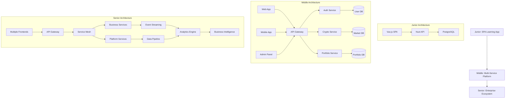
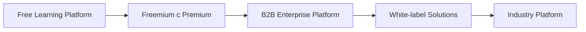

# Senior Crypto Learning Hub - Концепция Enterprise Экосистемы

## 🎯 Видение Senior проекта

**От образовательной платформы к enterprise-экосистеме криптовалютного финтеха**

Senior трек трансформирует Crypto Learning Hub из учебного приложения в полноценную enterprise-платформу, демонстрирующую навыки архитектурного лидерства, стратегического мышления и бизнес-влияния.

## 🚀 Эволюция архитектуры

### Junior → Middle → Senior Transformation

## 📋 Senior Этапы в деталях

### Этап 23: Enterprise Architecture 🏗️

**Цель**: Создать микросервисную архитектуру enterprise уровня

**Что строим**:

- Service Mesh с Istio
- Event-Driven Architecture с Kafka
- CQRS + Event Sourcing
- API Gateway с rate limiting и circuit breakers
- Distributed caching с Redis Cluster

**Технологии**: Kubernetes, Istio, Apache Kafka, Redis, Docker Compose

**Бизнес-кейс**: Масштабирование до 1M+ пользователей с высокой доступностью

---

### Этап 24: Platform Engineering 🔧

**Цель**: Создать платформу для developer experience

**Что строим**:

- Internal Developer Portal (Backstage)
- CI/CD platform с GitOps
- Infrastructure as Code
- Service catalog и templates
- Developer productivity metrics

**Технологии**: Backstage, ArgoCD, Terraform, Helm, Prometheus

**Бизнес-кейс**: Ускорение разработки новых features на 40%

---

### Этап 25: Data Engineering 📊

**Цель**: Построить data platform для аналитики

**Что строим**:

- Data Lake архитектура
- ETL pipelines с Apache Airflow
- Real-time streaming analytics
- Data warehouse с ClickHouse
- ML feature store

**Технологии**: Apache Airflow, ClickHouse, Apache Kafka, dbt, Great Expectations

**Бизнес-кейс**: Data-driven решения для увеличения retention на 25%

---

### Этап 26: AI/ML Integration 🤖

**Цель**: Интегрировать машинное обучение в продукт

**Что строим**:

- Recommendation engine для криптовалют
- Fraud detection система
- Price prediction models
- Personalization engine
- A/B testing framework для ML

**Технологии**: TensorFlow.js, Python ML stack, MLflow, Kubeflow

**Бизнес-кейс**: Повышение user engagement на 35% через персонализацию

---

### Этап 27: Research & Innovation 🔬

**Цель**: Создать innovation lab для emerging технологий

**Что строим**:

- Proof of Concepts лаборатория
- Blockchain research initiatives
- Web3 integration experiments
- AR/VR crypto experience
- Innovation metrics framework

**Технологии**: Emerging tech stack, research tools, prototype frameworks

**Бизнес-кейс**: Создание competitive advantage через early adoption

---

### Этап 28: Business Metrics & Analytics 📈

**Цель**: Построить business intelligence систему

**Что строим**:

- KPI dashboards для всех stakeholders
- Revenue analytics и forecasting
- User journey analytics
- Product metrics framework
- Business health monitoring

**Технологии**: Metabase, Grafana, Google Analytics 4, Custom dashboards

**Бизнес-кейс**: Увеличение revenue на 30% через data insights

---

### Этап 29: Team Platform & Developer Tools 👥

**Цель**: Создать platform для team productivity

**Что строим**:

- Internal tools ecosystem
- Developer onboarding automation
- Code quality gates
- Performance monitoring tools
- Team collaboration platform

**Технологии**: Custom internal tools, Slack integrations, GitHub tooling

**Бизнес-кейс**: Reduction в onboarding time с 2 недель до 3 дней

---

### Этап 30: Strategic Planning & Architecture Governance 📋

**Цель**: Создать фреймворк для технических решений

**Что строим**:

- Architecture Decision Records system
- Technical roadmap framework
- Technology radar
- Architecture governance process
- Technical debt tracking

**Технологии**: ADR tools, Confluence, Architecture documentation

**Бизнес-кейс**: Снижение technical debt на 50% через систематический подход

---

### Этап 31: Industry Impact & Open Source 🌍

**Цель**: Создать industry влияние через open source

**Что строим**:

- Open source crypto tools
- Industry standard proposals
- Technical blog и thought leadership
- Conference talks и presentations
- Community building initiatives

**Технологии**: OSS tools, blogging platforms, conference tech

**Бизнес-кейс**: Brand awareness и talent attraction

---

### Этап 32: Thought Leadership & Knowledge Platform 🎓

**Цель**: Создать платформу для knowledge sharing

**Что строим**:

- Technical education platform
- Mentoring program automation
- Knowledge base с AI search
- Learning path recommendations
- Expertise mapping система

**Технологии**: Custom LMS, AI/ML, Knowledge graphs

**Бизнес-кейс**: Становление industry leader в crypto education

## 🏢 Enterprise Контекст

### Масштаб и сложность

**Пользователи**: 1M+ активных пользователей
**Команды**: 10+ cross-functional команд
**Services**: 50+ микросервисов
**Data Volume**: TB-уровень daily data processing
**Global Scale**: Multi-region deployment

### Compliance и Security

- **GDPR/CCPA** compliance
- **SOC 2 Type II** certification
- **ISO 27001** security standards
- **PCI DSS** для payment processing
- **AML/KYC** для crypto compliance

### Business Model Evolution

## 🎯 Senior Компетенции

### Technical Leadership

- **System Design**: Ability to design systems для enterprise scale
- **Architecture Decisions**: Making trade-offs between competing priorities
- **Technology Strategy**: Choosing right tech stack для long-term success
- **Performance Engineering**: Optimizing systems для scale и efficiency

### Product & Business

- **Product Thinking**: Understanding user needs и business goals
- **Data-Driven Decisions**: Using metrics для product improvements
- **ROI Analysis**: Measuring business impact технических инициатив
- **Market Understanding**: Industry trends и competitive landscape

### People & Process

- **Technical Mentoring**: Developing junior и middle engineers
- **Cross-functional Collaboration**: Working с Product, Design, Data teams
- **Process Improvement**: Optimizing development workflows
- **Knowledge Sharing**: Creating documentation и best practices

### Innovation & Research

- **Emerging Technology**: Evaluating и adopting new tech
- **Proof of Concepts**: Rapid prototyping для validation
- **Industry Contributions**: Open source и thought leadership
- **Strategic Innovation**: Long-term technology vision

## 📊 Измерение успеха

### Technical KPIs

- **System Reliability**: 99.99% uptime
- **Performance**: < 100ms API response time
- **Security**: Zero critical security incidents
- **Scalability**: Support для 10x user growth

### Business KPIs

- **User Engagement**: 40%+ DAU/MAU ratio
- **Revenue Growth**: 100%+ YoY growth
- **Customer Satisfaction**: 4.8+ app store rating
- **Market Position**: Top 3 в crypto education

### Innovation KPIs

- **Technology Adoption**: 50%+ team adoption новых tools
- **Patent Applications**: 3+ patents в process
- **Industry Recognition**: Speaking на 5+ conferences
- **Open Source Impact**: 1000+ GitHub stars

### Team KPIs

- **Developer Productivity**: 30% reduction в feature delivery time
- **Team Growth**: Successfully onboard 20+ engineers
- **Knowledge Sharing**: 100% team participation в tech talks
- **Career Development**: 80% internal promotion rate

## 🔄 Continuous Evolution

Senior трек не является final destination, но foundation для:

### Principal Engineer Track

- **Organizational Impact**: Architecture decisions на company level
- **Industry Leadership**: Setting standards в crypto/fintech
- **Strategic Technology**: CTO-level technology strategy
- **Ecosystem Building**: Creating platforms для других developers

### Staff Engineer Track

- **Cross-team Impact**: Leading technical initiatives across multiple teams
- **Technology Vision**: Long-term (3-5 year) technology roadmap
- **Technical Due Diligence**: M&A technology assessments
- **Platform Thinking**: Building systems that enable other systems

### Distinguished Engineer Track

- **Industry Recognition**: Widely recognized expertise
- **Innovation Leadership**: Breakthrough technological innovations
- **Technical Standards**: Contributing к industry standards
- **Thought Leadership**: Shaping future технических направлений

---

_"Senior разработчик thinks in systems, decides with data, и leads through influence."_
